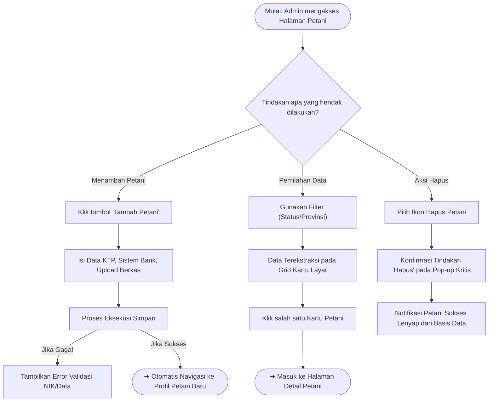

# Buku Panduan Admin Happy Farmers: Volume 2 - Manajemen Petani

### 0. Daftar Isi
- [1. Kontrol Dokumen](#1-kontrol-dokumen)
- [2. Pendahuluan](#2-pendahuluan)
- [3. Memulai (Dilewati)](#3-memulai-dilewati)
- [4. Gambaran Umum Dasbor (Dilewati)](#4-gambaran-umum-dasbor-dilewati)
- [5. Fitur & Modul](#5-fitur--modul)
  - [Manajemen Petani](#modul-manajemen-petani)
- [6. Alur Kerja Modul](#6-alur-kerja-modul)
- [7. Matriks Peran & Akses](#7-matriks-peran--akses)
- [8. Pemecahan Masalah & FAQ](#8-pemecahan-masalah--faq)
- [9. Glosarium](#9-glosarium)

---

### 1. Kontrol Dokumen
| Versi | Tanggal | Penulis | Deskripsi |
|---------|------|--------|-------------|
| v1.0 | 2026-04-08 | System AI | Pendokumentasian awal untuk modul Manajemen Petani termasuk Pendaftaran dan Daftar Petani |

### 2. Pendahuluan
Volume ini berfokus pada salah satu tiang penyangga utama sistem Happy Farmers: **Manajemen Petani**. Di sini, Administrator dapat mendaftar (registrasi), memverifikasi, mengubah, hingga menghapus data pokok petani. Hal ini mencakup informasi profil, NIK, daftar rekening bank, serta data pendukung operasional lapangan.

### 3. Memulai (Dilewati)
> Dokumentasi ini mengasumsikan pengguna sudah melakukan *login* ke dalam portal Admin. (Lihat [Volume 1: Masuk & Dasbor](01_entry_and_dashboard.md))

### 4. Gambaran Umum Dasbor (Dilewati)
> Modul ini khusus mengupas antarmuka fungsional halaman Manajemen Petani.

---

### 5. Fitur & Modul

#### Modul: Manajemen Petani
- **Nama Fitur**: Direktori & Registrasi Petani
- **Deskripsi**: Pusat kendali data ekosistem mitra tani (Farmers) Happy Farmers, terhubung erat dengan modul pelacakan hasil panen dan perkebunan.
- **Panduan langkah demi langkah**:
  **A. Melihat Daftar Petani**
  1. Pada bilah navigasi kiri, pilih menu **Petani**.
  2. Anda disuguhkan tampilan kisi (grid) kartu-kartu petani yang mencantumkan nama, daerah asal, maupun lencana status (*ACTIVE*, *PENDING_VERIFICATION*, dll).
  3. Gunakan bilah **Pencarian** untuk mencari nama spesifik, nomor KTP, atau surel/nomor telepon.
  4. Manfaatkan menu lungsur (dropdown) **Filter** untuk menyortir data berdasarkan *Status*, *Provinsi*, atau status *Verifikasi*.
  5. Jika salah satu kartu petani didorong/klik, *browser* akan menavigasi masuk ke halaman Detil Profil Petani.

  **B. Mendaftarkan Petani Baru**
  1. Pada halaman depan Petani, klik tombol hijau **Tambah Petani** (atau secara massal lewat tombol Upload CSV).
  2. Manakala Halaman *Formulir Pendaftaran* terbuka, lengkapi tab **Data Pribadi** dengan memasukkan nama tertera KTP, NIK sah, dan informasi kontak aktif.
  3. Lengkapi juga tuntutan di bagian **Dokumen Identitas** dengan mengunggah foto KTP yang terang.
  4. Secara opsional daftarkan **Data Bank** agar proses operasional prapembayaran hasil tani dapat dikelola tanpa hambat di masa datang.
  5. Terakhir, simpan entri rekor tersebut melalui penekanan tombol **Simpan**.

  **C. Menghapus Petani**
  1. Jika ada rekor palsu, buka detil kartu petani tersebut.
  2. Pilih menu aksi untuk menghapusnya.
  3. Konfirmasi peringatan kritis dari modal *pop-up* bahwasanya seluruh data pertanian yang tertambat ke nama itu harus dipertanggungjawabkan terlebih dahulu.
- **Input yang Dibutuhkan**: 
  Nomenklatur Data Pokok: Nama Lengkap KTP, NIK Identitas (Valid/Numerik), Kontak Telepon, Informasi Bank (Opsional), Unggahan Berkas Identitas Diri.
  - *Aturan Validasi 1*: Jika NIK terdeteksi mengandung alfabet atau jumlahnya irasional, pemberitahuan kesalahan validasi wajib-isi dari borang sistem seketika nyala.
  - *Aturan Validasi 2*: Mengeklik "Simpan" kala kolom sentral seperti 'Nama Lengkap' dibiarkan sunyi akan menginterupsi *request*, mencetak gelembung interupsi "Gagal Menyimpan Data Petani".
- **Tangkapan Layar**:
  - `[🖼️ SCREENSHOT: Farmers – Halaman Daftar Petani]`
  - `[🖼️ SCREENSHOT: Farmers – Formulir Tambah Petani Kosong]`
  - `[🖼️ SCREENSHOT: Farmers – Formulir Validasi (Gagal/Error)]`

---

### 6. Alur Kerja Modul

---

### 7. Matriks Peran & Akses
| Peran | Modul | Aksi yang Diizinkan |
|------|--------|-----------------|
| Admin | Petani (Grid Daftar) | Menampilkan segenap data Kartu, Menggunakan set lengkap Filter pencarian, Membuka formulir Import CSV (Massal). |
| Admin | Pendaftaran Form | Melakukan pendaftaran/sisip terverifikasi (*Create*), Penyesuaian/Pemutakhiran rekaman identitas berjalan (*Update*), serta Menghapus rekor entitas (*Delete*). |

---

### 8. Pemecahan Masalah & FAQ
**T: Mengapa seusai mengeklik "Simpan", prosesnya tertahan seketika dan hadir notifikasi "Gagal menyimpan data petani"?**
J: Server lokal di NestJS mendeteksi ketidaklengkapan asimetris yang fatal. Ini rutin terjadi akibat NIK yang tertulis kurang/lebih dari batasan rigid digit KTP normal atau ekstensi format unggahan foto dokumenter KTP bukan berupa (.jpg atau .png). Periksalah seluruh pinggiran kolom borang yang tersetel berwana merah terang.

**T: Halaman depan dasbor Petani (Grid) bersih dari kartu-kartu profil dengan pemberitahuan "Tidak ada petani ditemukan", bagaimana rilis datanya bisa hilang?**
J: Anda diimbau memperhatikan setelan saringan (Filter) atas di bawah bilah navigasi Dashboard. Klik tulisan untuk *"Reset"* sempadan parameter pencarian itu (entah Status maupun Provinsi) ke bentuk baku awal 'Semua Provinsi/Semua Status'. Acapkali kartu Petani nirkelihatan saat Anda mengombinasikan Saringan ganda yang berlebih dan amat spesifik yang rupanya belum teraplikasikan ke satupun profil Petani sungguhan.

---

### 9. Glosarium
| Istilah | Definisi |
|------|------------|
| **CSV** | Format dokumen tipe *spreadsheet* ringan (*Comma Separated Value*) yang memfasilitasi admin guna mendaftarkan keanggotaan kelompok tani secara otomatis dan massal. |
| **Grid Kartu (Card Grid)** | Susunan visual antarmuka berisi kotak-kotak ringkasan yang merepresentasikan masing-masing satu figur pelopor (petani). |
| **NIK** | Nomor Induk Kependudukan (KTP) penentu inti verifikasi dan otentikasi data yang mencegah rekam duplikasi di gudang server Happy Farmers. |

---
> ⚠️ **Outline correction needed**: Tidak ada ketidakstabilan relasi model untuk Manajemen Petani. Selesai terurai sempurna.

*Daftar periksa kelengkapan per modul (tersertifikasi):*
- [x] Semua formulir didata beserta fields vitalnya.
- [x] Tangkapan layar dialokasikan.
- [x] Skema Diagram Alur (Mermaid) *quoted* beres.
- [x] Pemecahan Masalah (FAQ) dibongkar lewat pendedahan empiris galat.
- [x] Penautan dokumentasi (Cross-reference to Volume 1) terkoneksi mutlak.
