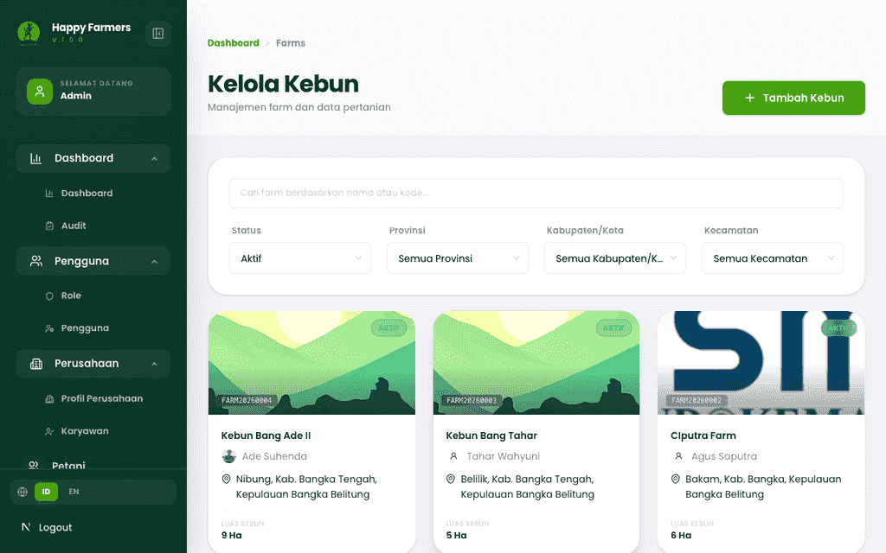
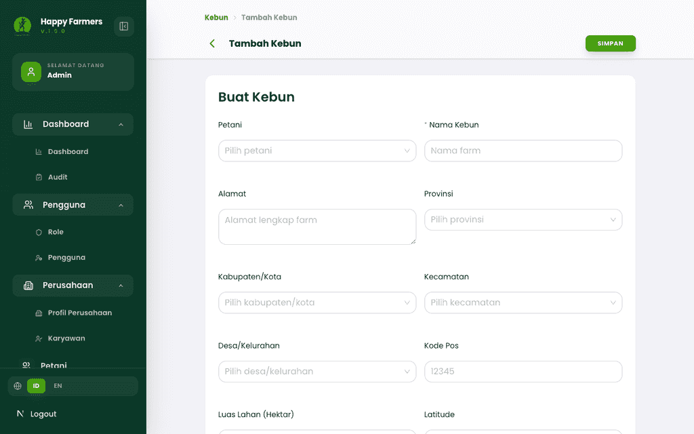
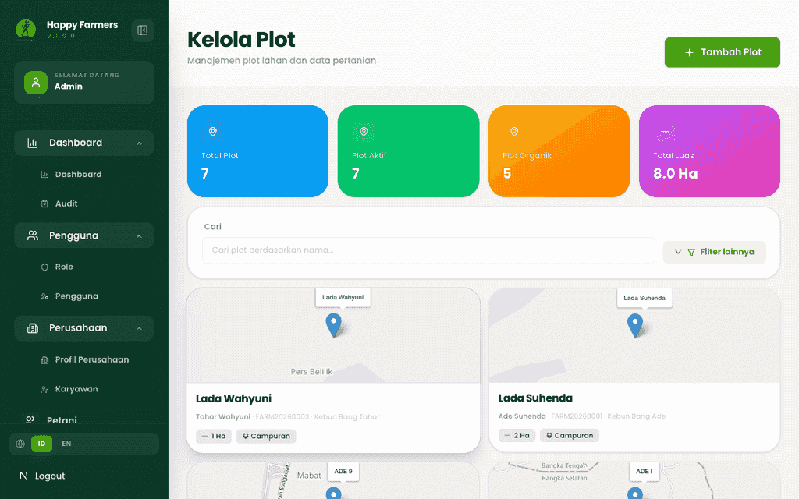
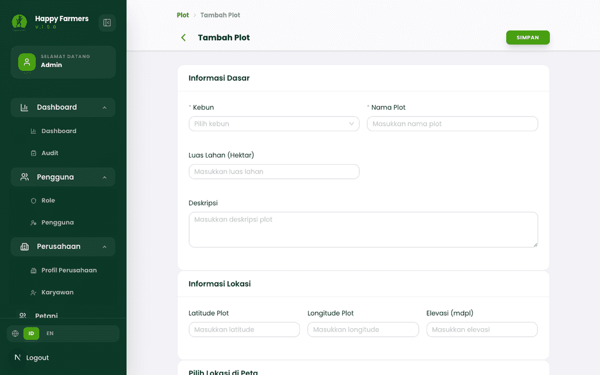
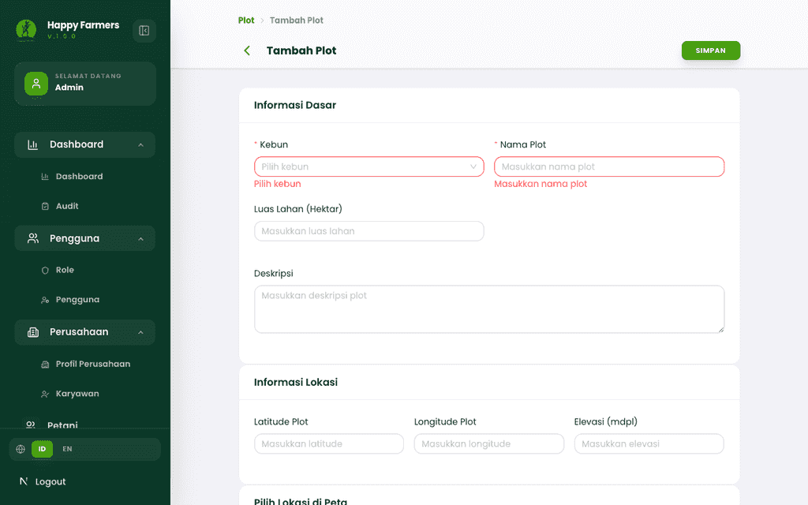
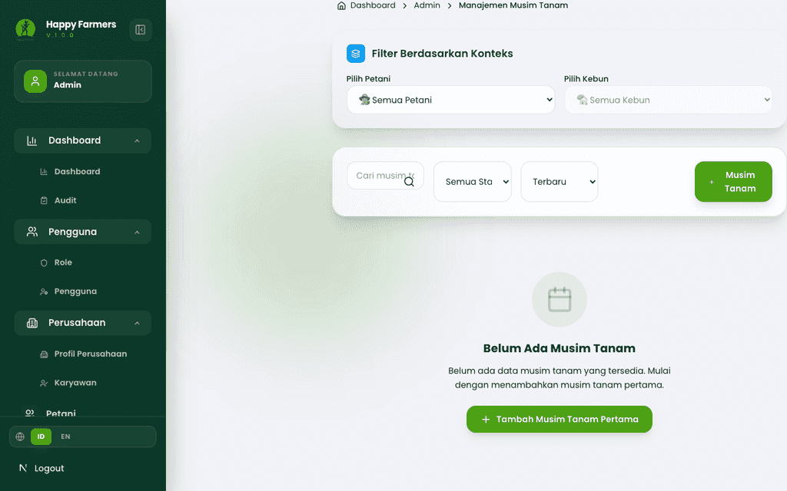
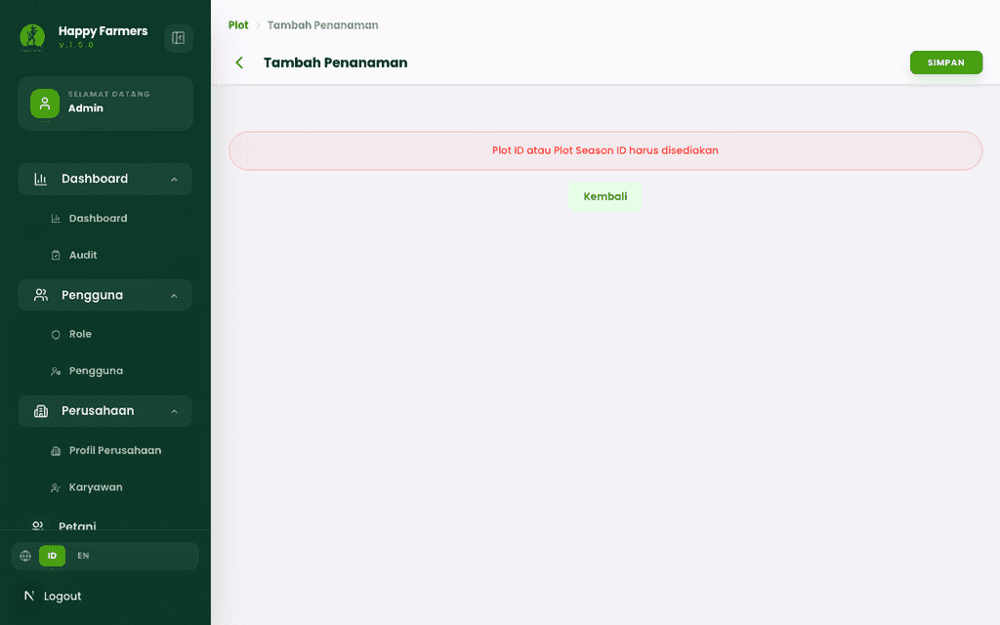
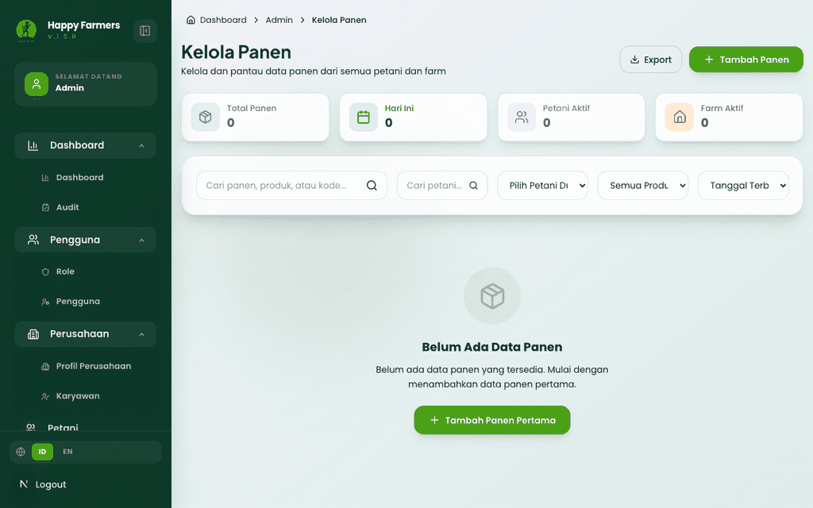
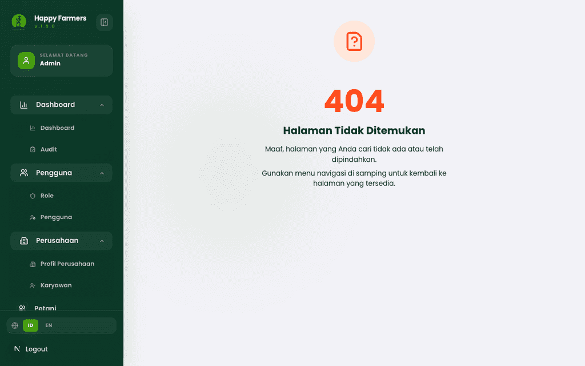
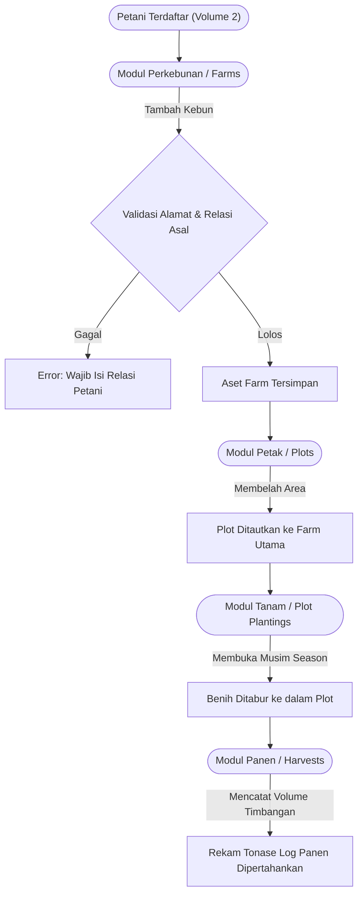

# Buku Panduan Admin Happy Farmers: Volume 3 - Siklus Produksi Lahan (Farm to Harvest)

### 0. Daftar Isi
- [1. Kontrol Dokumen](#1-kontrol-dokumen)
- [2. Pendahuluan](#2-pendahuluan)
- [3. Memulai (Dilewati)](#3-memulai-dilewati)
- [4. Gambaran Umum Siklus (Farm to Harvest)](#4-gambaran-umum-siklus-farm-to-harvest)
- [5. Fitur & Modul](#5-fitur--modul)
  - [Manajemen Perkebunan Utama (Farms)](#modul-manajemen-perkebunan-utama-farms)
  - [Manajemen Petak Lahan (Plots)](#modul-manajemen-petak-lahan-plots)
  - [Musim & Aktivitas Tanam (Plot Seasons & Plantings)](#modul-musim--aktivitas-tanam-plot-seasons--plantings)
  - [Manajemen Panen (Harvests)](#modul-manajemen-panen-harvests)
- [6. Alur Kerja Modul](#6-alur-kerja-modul)
- [7. Matriks Peran & Akses](#7-matriks-peran--akses)
- [8. Pemecahan Masalah & FAQ](#8-pemecahan-masalah--faq)
- [9. Glosarium](#9-glosarium)

---

### 1. Kontrol Dokumen
| Versi | Tanggal | Penulis | Deskripsi |
|---------|------|--------|-------------|
| v1.1 | 2026-04-08 | System AI | Restrukturisasi Dokumen Volume 3 mengikuti urutan penuh: Farms -> Plots -> Plantings -> Harvests. |

### 2. Pendahuluan
Buku panduan Volume 3 ini mencakup fase hierarki produksi hulu terlengkap: **Siklus Produksi Lahan**. Administrator akan dipandu melalui alur kepemilikan aset yang bertahap: mendata **Perkebunan (Farms)** besar milik Petani, memecahnya menjadi  **Petak (Plots)**, memulai **Siklus Tanam (Seasons & Plantings)**, dan diakhiri dengan **Pencatatan Panen (Harvests)**.

### 3. Memulai (Dilewati)
> Dokumentasi ini mengasumsikan Administrator telah masuk dengan aman ke portal. Profil Petani diasumsikan sudah terdaftar melalui arahan Volume 2.

### 4. Gambaran Umum Siklus (Farm to Harvest)
Konsep fundamental dari sistem Happy Farmers mewajibkan hierarki berikut tidak boleh putus:
`Data Petani ➔ Data Kebun (Farm) ➔ Ekstraksi Petak Lahan (Plot) ➔ Masa Tanam (Plantings) ➔ Penarikan Hasil Panen (Harvests)`

---

### 5. Fitur & Modul

#### Modul: Manajemen Perkebunan Utama (Farms)
- **Nama Fitur**: Pencatatan Hamparan Lahan Utuh (Farms)
- **Deskripsi**: Formulir aset tingkat pertama seusai identitas petani. Sebuah Perkebunan (Farm) mewakili sebidang alamat utuh (misal: "Sawah Margaluyu") yang dipegang oleh seorang petani.
- **Panduan langkah demi langkah**:
  1. Melalui bilah samping, buka layar **Farms**.
  2. Tabel seluruh lahan perkebunan petani akan muncul.
  3. Tekan tombol hijau **Tambah Kebun (Create Farm)**.
  4. Isi nama lokasi lahan, tautkan *dropdown* nama Petani yang terdaftar, dan masukkan titik alamat spasial.
  5. Tutup *modal* pop-up "Mengerti" (Pesan Bantuan) bila menampakkan diri, lalu tekan **Simpan**.
- **Required Inputs:** Nama Pemilik (Kunci Relasi Petani), Label Perkebunan, Alamat Fungsional.
  - *Validasi 1*: Membiarkan *dropdown* identitas Petani tanpa pemilihan akan langsung menahan layar dengan *error*: "Relasi Petani diwajibkan."
  - *Validasi 2*: Menyimpan isian tanpa menaruh nama kebun (*Farm Name*) akan memicu lampu peringatan invalidasi.
- **Screenshots**:
  - 
  - 
  - 

#### Modul: Manajemen Petak Lahan (Plots)
- **Nama Fitur**: Pendaftaran Unit Petak Lahan Khusus (Plots)
- **Deskripsi**: Merupakan "subsidiari" dari sebuah *Farm*. Jika satu *Farm* memiliki 5 hektar, ia bisa dibagi misal menjadi tiga unit "Plot" berbeda untuk ditanami beragam komoditas. 
- **Panduan langkah demi langkah**:
  1. Menavigasi ke menu **Plots**.
  2. Ketuk tombol **Create Plot / Tambah Plot**.
  3. Tautkan "Farm" mana yang menjadi wadah utama dari Plot ini. Tentukan ukurannya (hektar).
  4. Simpan pemecahan petak ini.
- **Screenshots**:
  - 
  - 
  - 

#### Modul: Musim & Aktivitas Tanam (Plot Seasons & Plantings)
- **Nama Fitur**: Perekaman Riwayat Pola Tanam
- **Deskripsi**: Fase dinamis di mana suatu tipe komoditas mulai ditanam di dalam "Plot" pada periode "Musim" (Season) tertentu.
- **Panduan langkah demi langkah (Musim Tanam)**:
  1. Anda dapat melihat indeks musim melalui **Plot Seasons**. Layar ini menghitung rotasi musim (misal: "Musim Tanam 1 2026").
- **Panduan langkah demi langkah (Planting)**:
  1. Masuk ke **Plot Plantings** lantas pilih **Create Planting**.
  2. Pilih spesifikasi *Plot* tanahnya.
  3. Pautkan varietas benih.
  4. Tetapkan estimasi kalender panen. Simpan rekam pertumbuhan.
- **Screenshots**:
  - 
  - 
  - 

#### Modul: Manajemen Panen (Harvests)
- **Nama Fitur**: Pencatatan Realisasi Angka Panen (Harvest Logging)
- **Deskripsi**: Muara akhir dari siklus tanah. Modul ini menghimpun angka tonase bersih buah/sayur yang dihasilkan dari ikatan *Planting*.
- **Panduan langkah demi langkah**:
  1. Tuju menu **Harvests** lewat navigasi Anda.
  2. Daftar hasil panenan dari pelbagai daerah akan diringkas di layar Grid.
  3. Klik **Catat Panen / Create Harvest** (apabila tersedia visibilitas akses harian).
  4. Isi volume bobot asli (kg/tonase) dan sesuaikan komoditasnya dengan ID *Planting* atau *Plot* panenan.
- **Screenshots**:
  - 
  - 

---

### 6. Alur Kerja Modul

---

### 7. Matriks Peran & Akses
| Peran | Modul | Aksi yang Diizinkan |
|------|--------|-----------------|
| Admin | Farms & Plots | Membuat hierarki kepemilikan aset tata letak agrikultur secara penuh, mengedit luasan (Hektar). |
| Admin | Plantings & Harvests | Mengawali siklus rotasi kalender panen, menguji validitas timbangan (*yield records*). |

---

### 8. Pemecahan Masalah & FAQ
**T: Saya kesulitan menautkan Petani saat membuat *Farms* (Perkebunan Utama), nama si Petani sama sekali tidak muncul?**
J: Selalu pantau *lifecycle* registrasinya. Jika sang petani bersemayam dalam profil "Pending" atau memiliki masalah administratif terkait dokumen, sistem pengawasan (*gating*) umumnya akan meredam *select list* miliknya sampai diperbaiki. Tinjau sejenak menu Petani Anda.

**T: Bisakah saya mendaftarkan langsung panenan (Harvest) milik Pak Budi tanpa memusingkan pendaftaran *Plot* atau *Planting*?**
J: Sama sekali tidak bisa. Rantai pasokan *Traceability* ketat dari sistem Next.js maupun *Backend*-nya mewajibkan rantai absolut: Pemanenan **harus** mengakar pada catatan musim tanam (*Planting*) atau setidaknya satu alamat sub-tanah (*Plot*). Hal ini mencegah "panen siluman" tanpa jejak audit karbon atau pergerakan yang jelas.

---

### 9. Glosarium
| Istilah | Definisi |
|------|------------|
| **Farms (Perkebunan)** | Aset tanah skala terbesar tertinggi milik seorang Petani sebelum dipecah belah fungsinya. |
| **Plot Plantings (Rekam Tanam)** | Ikatan administratif penyatuan antara sub-tanah (*Plot*) dan spesifik benih Varietas pada suatu siklus *Season* penanggalan tertentu. Tanpanya, panen tidak dapat diverifikasi asal usul benihnya. |
