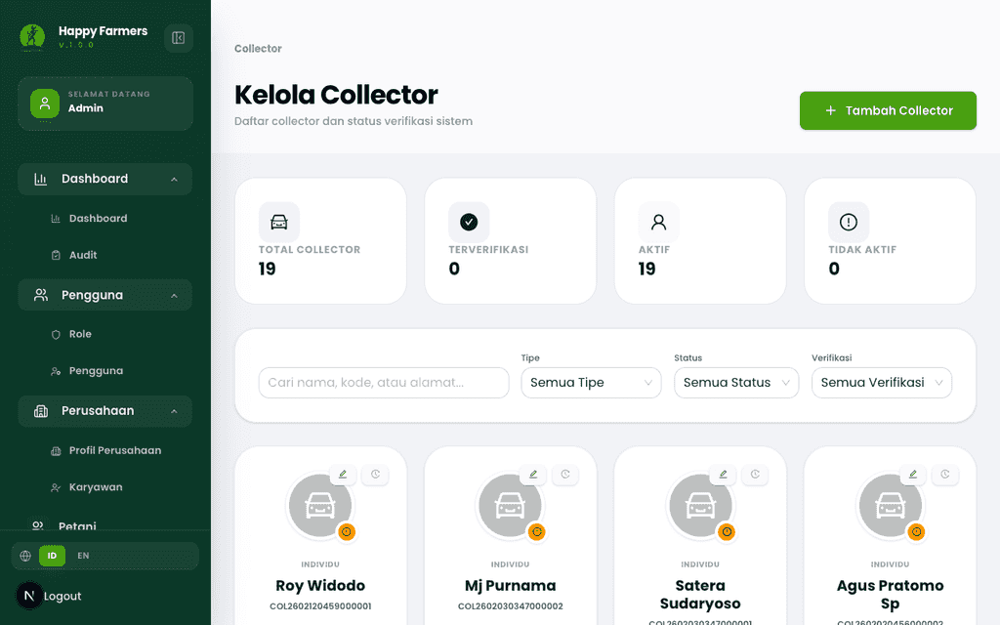
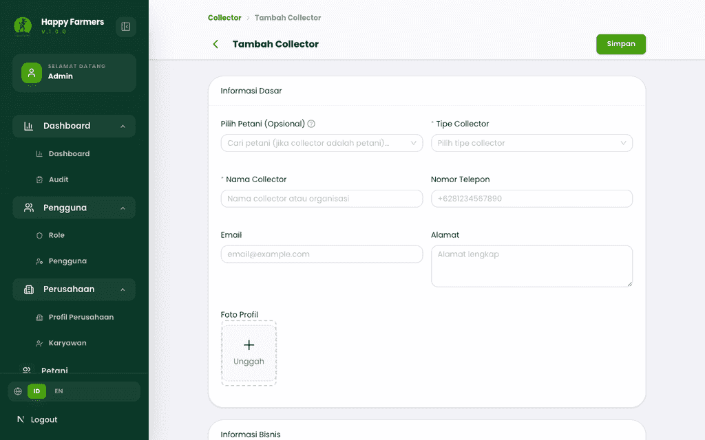
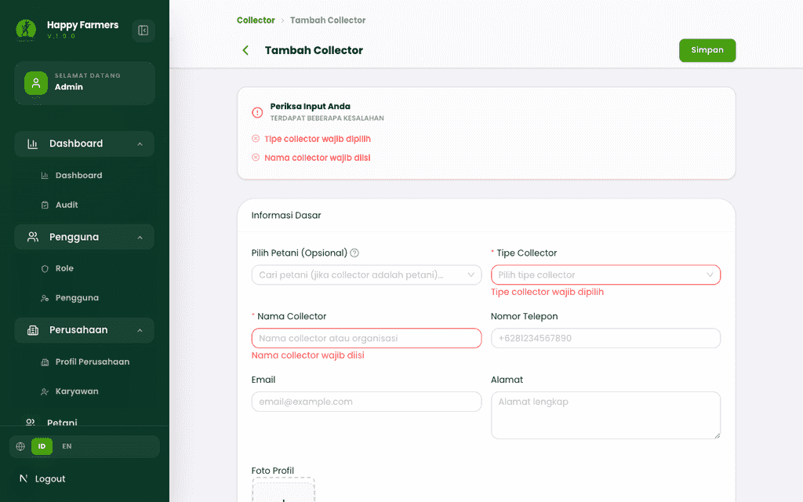
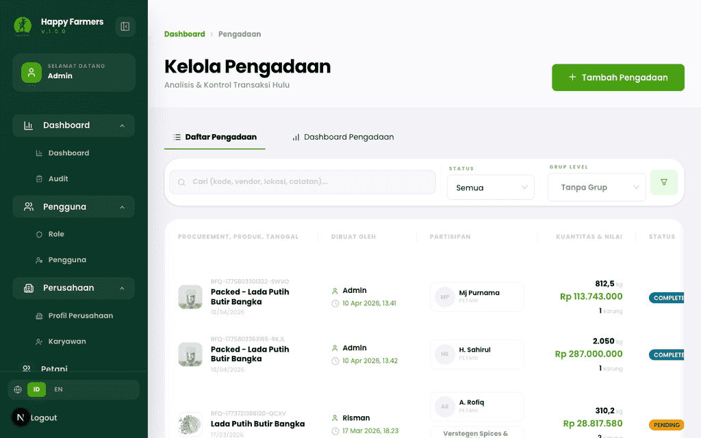
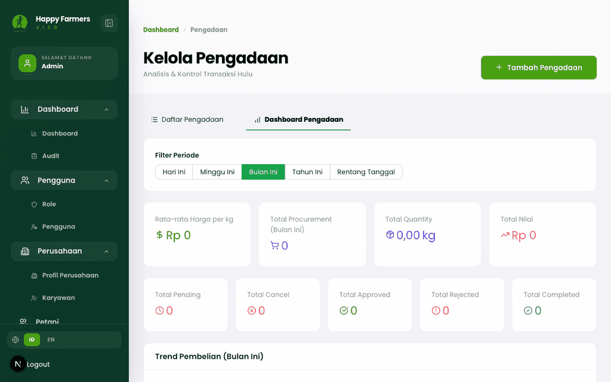
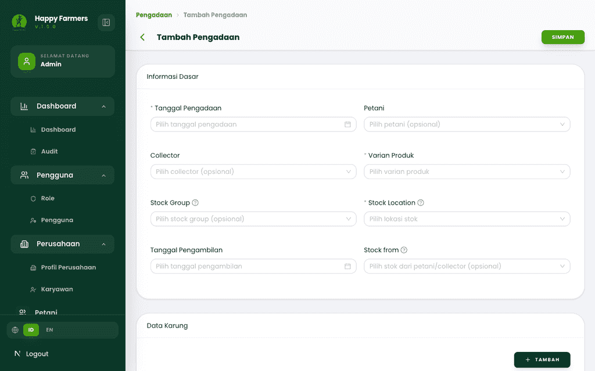
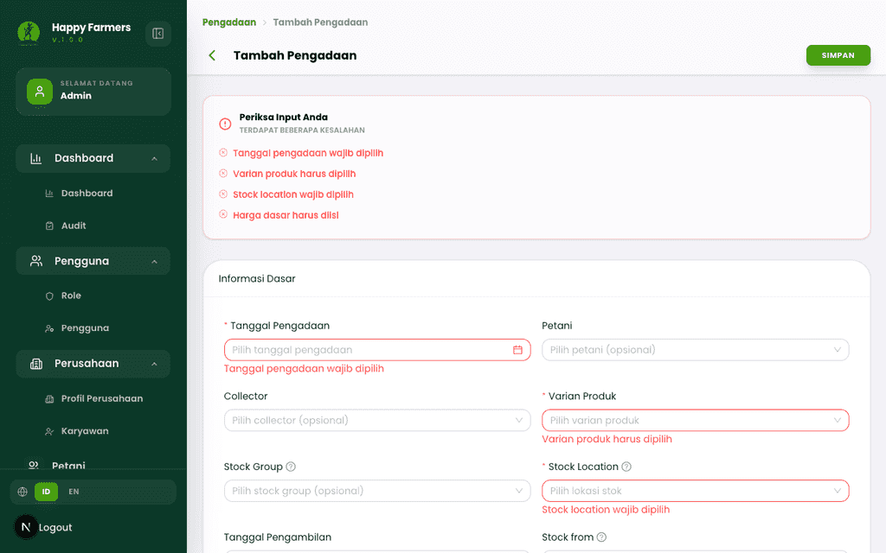
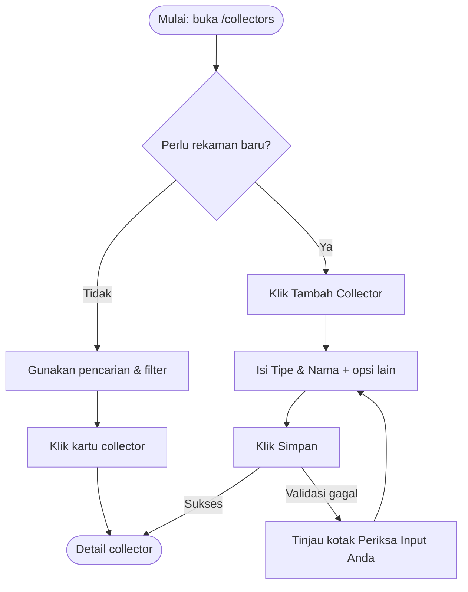
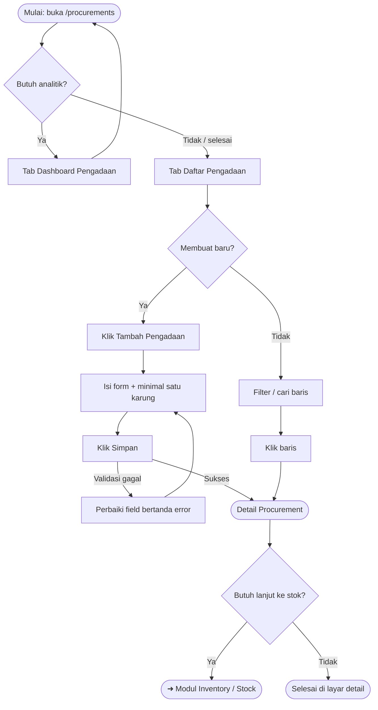

# Buku Panduan Admin Happy Farmers: Volume 4 — Procurement & Sourcing (Pengadaan & Sumber)

### 0. Daftar Isi
- [1. Kontrol Dokumen](#1-kontrol-dokumen)
- [2. Pendahuluan](#2-pendahuluan)
- [3. Memulai (Dilewati)](#3-memulai-dilewati)
- [4. Gambaran Umum Dasbor (Dilewati)](#4-gambaran-umum-dasbor-dilewati)
- [5. Fitur & Modul](#5-fitur--modul)
  - [Collector (Pengepul)](#modul-collector-pengepul)
  - [Procurement (Pengadaan)](#modul-procurement-pengadaan)
- [6. Alur Kerja Modul](#6-alur-kerja-modul)
- [7. Matriks Peran & Akses](#7-matriks-peran--akses)
- [8. Pemecahan Masalah & FAQ](#8-pemecahan-masalah--faq)
- [9. Glosarium](#9-glosarium)

---

### 1. Kontrol Dokumen
| Versi | Tanggal | Penulis | Deskripsi |
|------|---------|---------|-----------|
| v1.0 | 2026-04-13 | System AI | Volume awal modul **Procurement & Sourcing**: **Collector** dan **Procurement** pada antarmuka Next.js |
| v1.1 | 2026-04-13 | System AI | Menyelaraskan tangkapan layar dengan UI sesungguhnya (`scripts/screenshot-script/capture-module4.js`: asersi halaman, tunggu tab *Dashboard*, validasi form). |

> [!NOTE] Updated in v1.1: Berkas `./assets/*.png` untuk modul ini dihasilkan ulang agar cocok dengan teks panduan (sebelumnya beberapa berkas tampak identik / bukan layar yang dimaksud).

---

### 2. Pendahuluan
Volume ini menjelaskan fase **sourcing** setelah produksi di lapangan: mencatat mitra **Collector** (pengepul/agregator) dan mengelola transaksi **Procurement** (pengadaan) dari **vendor** (petani) menuju **Stock Group** / **Stock Location** yang Anda tentukan.

Panduan ini ditulis untuk peran **Admin** (akses penuh antarmuka), dengan narasi bahasa Indonesia dan **istilah teknis dalam bahasa Inggris** (misalnya *Procurement*, *Collector*, *Stock Group*) bila istilah tersebut memang dipakai di UI atau domain sistem.

> [!NOTE] Registrasi akun pengguna (*user registration*) tidak termasuk cakupan modul ini; gunakan *login* seperti di [Volume 1: Masuk & Dasbor](01_entry_and_dashboard.md).

**Prasyarat konteks data:** alur pengadaan sering berjalan lebih mulus jika **Farmer** (petani), **Product Variant**, **Stock Location**, dan **Stock Group** sudah tersedia. Lihat [Volume 2: Manajemen Petani](02_farmer_management.md) dan [Volume 3: Perencanaan Lahan & Panen](03_plot_planning_and_harvest.md) untuk konteks hulu.

---

### 3. Memulai (Dilewati)
> Dokumentasi ini mengasumsikan Anda sudah masuk ke portal Admin. Prosedur *login* ada di [Volume 1: Masuk & Dasbor](01_entry_and_dashboard.md).

---

### 4. Gambaran Umum Dasbor (Dilewati)
> Modul ini membahas halaman **Collector** (`/collectors`) dan **Procurement** (`/procurements`).

---

### 5. Fitur & Modul

#### Modul: Collector (Pengepul)
- **Nama fitur**: Direktori & pendaftaran **Collector**
- **Deskripsi**: Mengelola mitra pengumpulan hasil (individu, koperasi, perusahaan, atau agregator) beserta status **aktif** dan **verifikasi** (*verified*).
- **Panduan langkah demi langkah**
  1. Di navigasi sisi, buka halaman **Collector** (URL `/collectors`).
  2. Pada bagian atas, tinjau ringkasan kartu statistik (**Total Collector**, **Terverifikasi**, **Aktif**, **Tidak Aktif**).
  3. Gunakan **ListToolbar**: kotak pencarian untuk nama, kode, atau alamat; lalu filter **Tipe** (misalnya *INDIVIDUAL*, *COOPERATIVE*), **Status** (*Aktif* / *Tidak Aktif*), dan **Verifikasi** (*Terverifikasi* / *Belum Verifikasi*).
  4. Klik kartu collector untuk membuka **detail** di `/collectors/view/[id]`.
  5. Untuk data baru, klik **Tambah Collector** — Anda diarahkan ke `/collectors/create`.
  6. Pada formulir, isi minimal **Tipe Collector** dan **Nama Collector**. Opsional: **Pilih Petani** untuk mengisi otomatis beberapa field dari data **Farmer** yang sudah ada.
  7. Unggah **Foto Profil** (gambar, maks. 5 MB) atau **Dokumen Izin Usaha** (gambar/PDF, maks. 10 MB) bila diperlukan.
  8. Tekan **Simpan** di header halaman untuk menyimpan rekaman.
- **Input utama & validasi (cuplikan UI)**
  - **Tipe Collector** — wajib; pesan: *"Tipe collector wajib dipilih"*.
  - **Nama Collector** — wajib; pesan: *"Nama collector wajib diisi"*.
  - **Email** — jika diisi harus format email; pesan: *"Email tidak valid"*.
  - **Latitude** / **Longitude** — jika diisi sebagai angka, harus dalam rentang geografis; pesan: *"Latitude harus antara -90 dan 90"* / *"Longitude harus antara -180 dan 180"*.
- **Tangkapan layar**
  - 
  - 
  - 
- **Perilaku responsif**
  > [!NOTE] Mobile: grid kartu collector akan bertumpuk vertikal; tombol aksi cepat tetap di sudut kartu — beri jarak tap yang cukup agar tidak memicu kartu di bawahnya.

---

#### Modul: Procurement (Pengadaan)
- **Nama fitur**: Daftar, analitik, dan pencatatan **Procurement**
- **Deskripsi**: Mencatat transaksi pembelian hasil dari **vendor** (petani), opsional melalui **Collector**, dengan **Product Variant**, **quantity**, harga, **Payment Method**, **Stock Location**, **Stock Group**, **sacks** (karung), lampiran, hingga alur status hingga pembayaran dan penerimaan ke stok.
- **Panduan langkah demi langkah**
  **A. Daftar & filter**
  1. Buka **Pengadaan** (`/procurements`).
  2. Tab **Daftar Pengadaan** menampilkan tabel dengan kolom antara lain: kode **Procurement**, produk & tanggal, **Dibuat Oleh**, partisipan (**PETANI** / **PENGEPUL** / **PEMBELI** bila ada), kuantitas & nilai, **Status**, **Status Pembayaran**, dan **Stock Group**.
  3. Gunakan kotak **Cari** (placeholder: pencarian kode, vendor, lokasi, catatan).
  4. Filter **Status** (*Menunggu*, *Disetujui*, *Dalam Perjalanan*, *Selesai*, dll.) dan **Grup Level** (*Vendor/Petani*, *Produk*, *Status*, *Stock Group*, *Status Pembayaran*) untuk pengelompokan baris.
  5. Tombol ikon **Filter** membuka panel lanjutan: **Periode Transaksi**, **Vendor (Petani)**, **Produk** (*variant*), dan **Lokasi** (*Stock Location*).
  6. Klik baris tabel untuk membuka **Detail Pengadaan** (`/procurements/view/[id]`).

  **B. Dashboard analitik**
  1. Pada halaman yang sama, pilih tab **Dashboard Pengadaan** untuk ringkasan grafik/metrik agregat (baca-only).

  **C. Membuat Procurement baru**
  1. Klik **Tambah Pengadaan** — menuju `/procurements/create` (jika Anda datang dari konteks stok, query `stockLocationId` dapat terbawa otomatis).
  2. Isi bagian **Informasi Dasar** (tanggal pengadaan, opsional petani & collector, **Product Variant**, **Stock Location**, **Stock Group**, dan field terkait).
  3. Atur **sacks** (minimal satu entri karung dengan berat); sistem memvalidasi berat karung.
  4. Lengkapi harga (**Harga dasar** wajib), **modifiers** produk bila ada, **Payment Method**, dan lampiran bila wajib menurut konfigurasi form.
  5. Tinjau **Ringkasan Pengadaan** di bagian bawah, lalu klik **Simpan** pada header halaman.

  **D. Detail & tindakan lanjutan (ringkas)**
  1. Pada **Detail Pengadaan**, tinjau ringkasan finansial, logistik, dan riwayat.
  2. Sesuai **status** transaksi, tombol aksi yang tersedia dapat meliputi antara lain **Setujui**, **Tolak**, **Minta Revisi**, **Batalkan**, serta alur **pembayaran** (*payment*) dengan tipe seperti *Farmer payment*, *Collector fee*, *Transport cost*, dll.
  3. Gunakan **Print Receipt** bila Anda perlu bukti cetak/digital untuk transaksi tersebut.
  4. Setelah barang diterima di gudang, ikuti alur **Goods receipt** / stok sesuai petunjuk di layar (terminologi pada UI dapat menyebut stok atau pergerakan stok).
- **Input utama & validasi (cuplikan UI)**
  - **Tanggal Pengadaan** — wajib; *"Tanggal pengadaan wajib dipilih"*.
  - **Varian produk** — wajib; *"Varian produk harus dipilih"*.
  - **Stock location** — wajib; *"Stock location wajib dipilih"*.
  - **Harga dasar** — wajib; *"Harga dasar harus diisi"*.
  - **Berat** pada karung — wajib; *"Berat wajib diisi"*.
  - **Modifier** wajib (jika produk mendefinisikan *modifier* required): *"{nama modifier} wajib diisi"* / *"… wajib dipilih"*.
  - **Lampiran**: jenis, judul, dan unggahan file — pesan ringkas *"Wajib"* atau *"File wajib diunggah"* pada baris lampiran.
- **Tangkapan layar**
  - 
  - 
  - 
  - 
- **Callout integrasi**
  > [!TIP] Menyaring daftar berdasarkan **Stock Location** membantu rekonsiliasi dengan modul **Inventory** (*stock*) di gudang yang sama — lihat [Volume 5: Inventori & Logistik](05_inventory_and_logistics.md).

> [!WARNING] Mengubah **Procurement** yang sudah maju statusnya dapat dibatasi oleh aturan *workflow*; jika field tampak non-aktif, selesaikan langkah status sebelumnya (persetujuan, pembayaran, atau penerimaan) sesuai yang ditampilkan di layar.

---

### 6. Alur Kerja Modul

#### 6.1 Collector — perjalanan pengguna

#### 6.2 Procurement — perjalanan pengguna

---

### 7. Matriks Peran & Akses

| Peran | Area | Aksi yang dijelaskan di volume ini |
|------|------|-------------------------------------|
| Admin | Collector | Melihat daftar & statistik, menambah/mengubah/menghapus (sesuai tombol yang aktif), membuka *audit timeline* dari kartu, membuka detail. |
| Admin | Procurement | Melihat daftar & *dashboard*, membuat **Procurement** baru, membuka detail, menjalankan aksi *workflow* (setujui/tolak/revisi/batalkan), mencatat **payment**, mencetak *receipt*. |

> [!NOTE] Visible to: **Admin** — dokumentasi ini tidak membahas pembatasan peran lain pada modul yang sama.

---

### 8. Pemecahan Masalah & FAQ

1. **Mengapa daftar Procurement saya tampak “kosong” padahal ada data?**  
   Pada filter **Status** = *Semua*, antarmuka menyembunyikan transaksi berstatus **Dibatalkan** atau **Ditolak** secara bawaan. Pilih status tersebut secara eksplisit di dropdown jika Anda perlu meninjaunya.

2. **Saya menekan Simpan pada formulir Procurement tetapi muncul banyak pesan merah sekaligus.**  
   Itu adalah validasi **form** yang normal. Baca panel **Periksa Input Anda** di atas form — kerjakan item pertama (tanggal, **variant**, **stock location**, karung, harga, lampiran) lalu simpan lagi.

3. **Field latitude/longitude pada Collector tidak bisa diisi.**  
   Jika Anda memilih **Pilih Petani** yang mengisi otomatis dari **Farmer**, beberapa field (termasuk koordinat) dapat dikunci (*disabled*) sampai Anda menghapus pemilihan petani.

4. **Email pada Collector sudah saya isi tetapi ditolak.**  
   Pastikan format standar email (ada `@` dan domain). Pesan UI: *"Email tidak valid"*.

5. **Setelah login, halaman Procurement tidak memuat data dan menampilkan pesan error.**  
   Periksa koneksi jaringan Anda, lalu segarkan halaman. Jika pesan tetap muncul, sesi mungkin kedaluwarsa — keluar dan masuk kembali seperti di FAQ Volume 1.

---

### 9. Glosarium

| Istilah | Definisi |
|--------|-----------|
| **Procurement** | Transaksi pengadaan hasil tani yang menghubungkan vendor, produk, kuantitas, harga, dan tujuan stok. |
| **Collector** | Mitra pengepul/pengumpul hasil yang dapat dikaitkan ke sebuah **Procurement**. |
| **Vendor** | Pada UI filter, merujuk pada **Farmer** sebagai penjual hasil. |
| **Stock Group** | Kelompok logistik stok tempat barang dari pengadaan akan dicatat. |
| **Stock Location** | Lokasi fisik/gudang (*warehouse location*) untuk penerimaan stok. |
| **Product Variant** | Varian SKU produk yang menjadi subjek kuantitas dan harga pada **Procurement**. |
| **Sack** | Satuan karung beserta beratnya pada satu baris **Procurement**. |
| **Payment Method** | Cara pembayaran yang dipilih untuk transaksi (tunai, transfer, dompet digital, dll. sesi opsi di layar). |

---

> ⚠️ **Outline correction needed:**  
> - Pada `DOCUMENT_OUTLINE.md`, modul **Procurement & Sourcing** bernomor baris tabel **6**, sedangkan urutan dokumentasi bisnis yang Anda pakai menempatkannya sebagai **langkah ke-4**. Pertimbangkan menyelaraskan penomoran tabel dengan **Suggested Documentation Order** agar tidak membingungkan pembaca roadmap.
