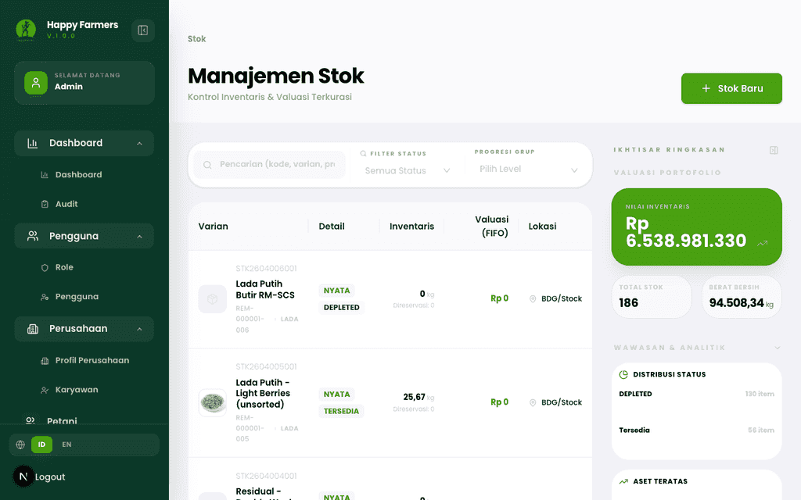
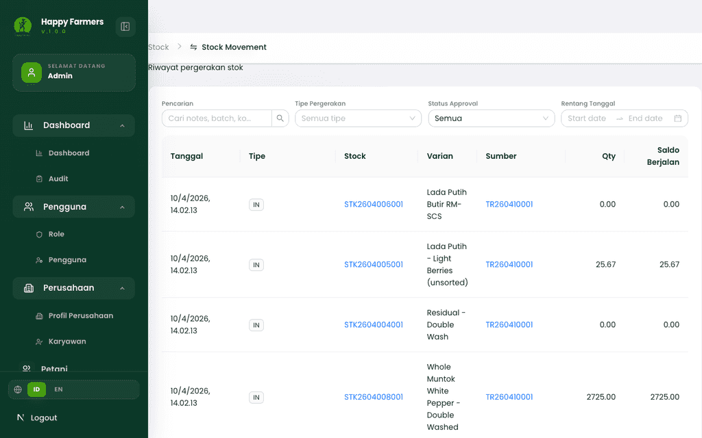
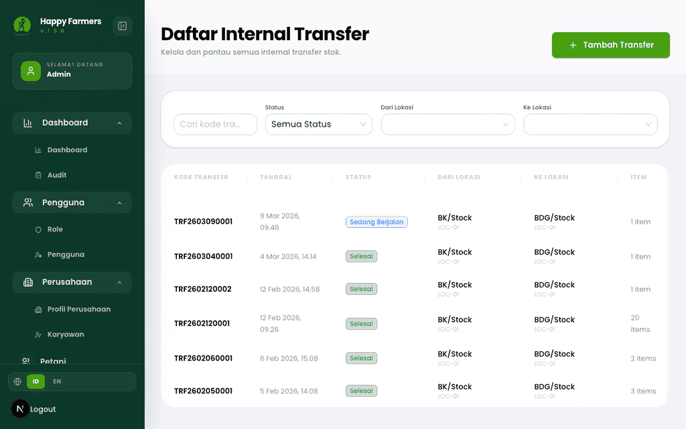
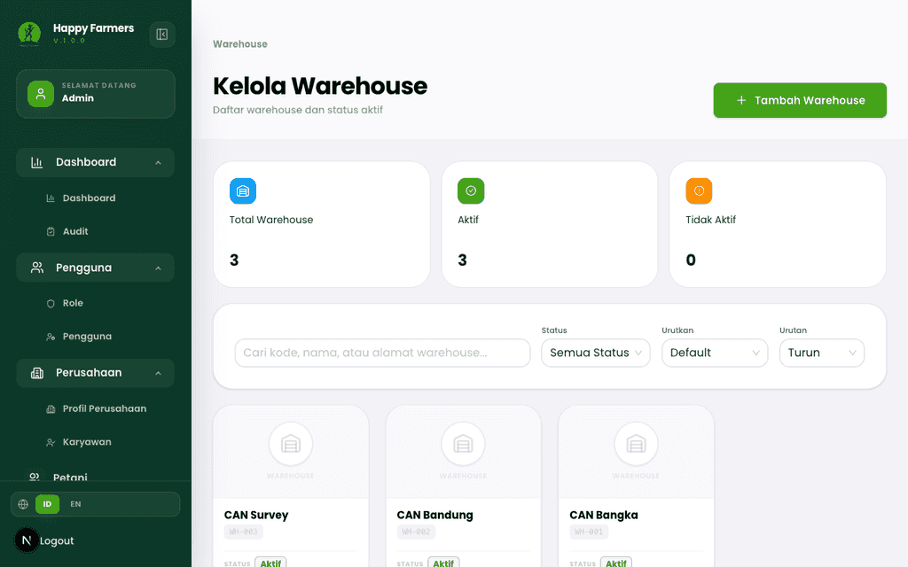
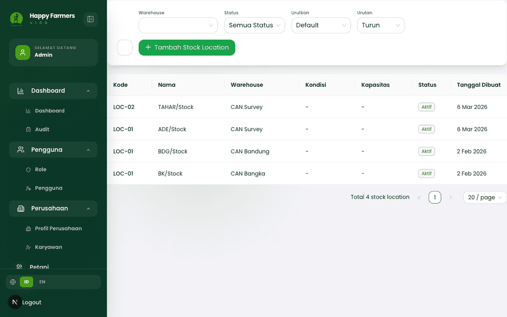
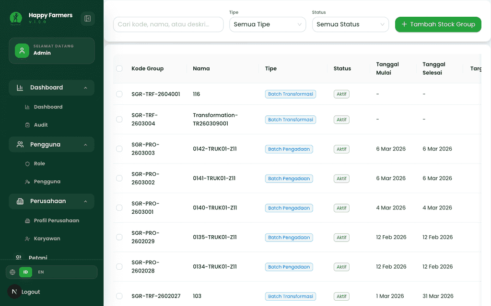
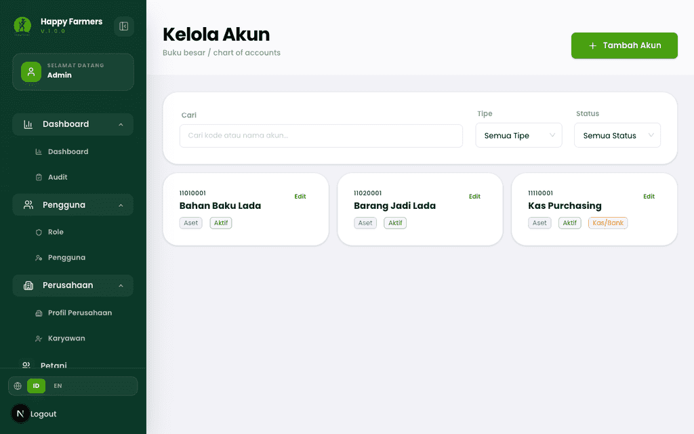
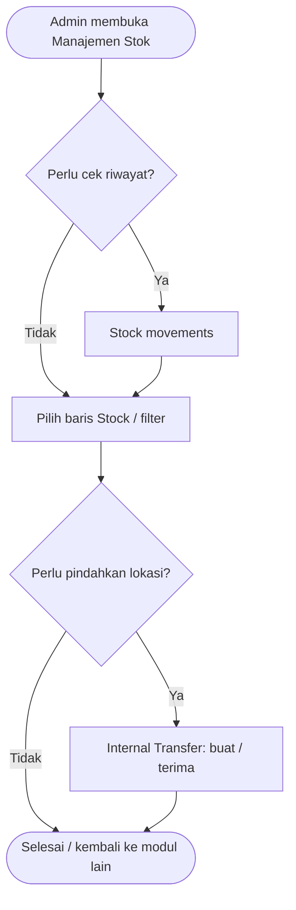
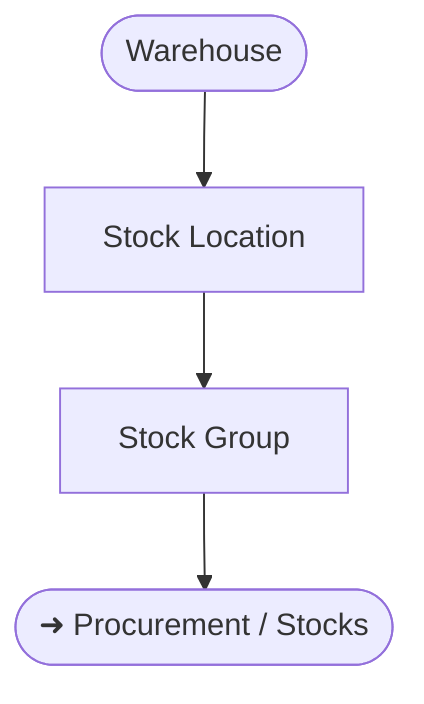

# Buku Panduan Admin Happy Farmers: Volume 5 — Inventory & Logistics (Inventori & Logistik)

### 0. Daftar Isi
- [1. Kontrol Dokumen](#1-kontrol-dokumen)
- [2. Pendahuluan](#2-pendahuluan)
- [3. Memulai (Dilewati)](#3-memulai-dilewati)
- [4. Gambaran Umum (Dilewati)](#4-gambaran-umum-dilewati)
- [5. Fitur & Modul](#5-fitur--modul)
  - [Stocks (Manajemen Stok)](#modul-stocks-manajemen-stok)
  - [Stock movements](#modul-stock-movements)
  - [Internal transfer](#modul-internal-transfer)
  - [Warehouses](#modul-warehouses)
  - [Stock locations](#modul-stock-locations)
  - [Stock groups](#modul-stock-groups)
  - [Accounts (Chart of accounts)](#modul-accounts-chart-of-accounts)
- [6. Alur Kerja Modul](#6-alur-kerja-modul)
- [7. Matriks Peran & Akses](#7-matriks-peran--akses)
- [8. Pemecahan Masalah & FAQ](#8-pemecahan-masalah--faq)
- [9. Glosarium](#9-glosarium)

---

### 1. Kontrol Dokumen
| Versi | Tanggal | Penulis | Deskripsi |
|------|---------|---------|-----------|
| v1.0 | 2026-04-13 | System AI | Volume awal **Inventory & logistics**: **Stock**, **Stock Movement**, **Internal Transfer**, **Warehouse**, **Stock Location**, **Stock Group**, **Account** |

---

### 2. Pendahuluan
Volume ini menjelaskan bagaimana Admin mengelola **inventory** fisik dan logistik internal: dari posisi **Stock** per **Product Variant**, riwayat **Stock Movement**, pemindahan antar lokasi lewat **Internal Transfer**, struktur **Warehouse** dan **Stock Location**, pengelompokan **Stock Group**, hingga **Account** (*chart of accounts*) yang mendukung pencatatan keuangan di UI.

Narasi berbahasa Indonesia; istilah domain seperti *Stock*, *Warehouse*, *Internal Transfer* tetap dipakai seperti di antarmuka. Referensi **Produk** dan **Varietas** di seluruh modul: [Volume 10: Master Produk](10_product_master_data.md).

**Prasyarat:** setelah [Volume 4: Pengadaan & Sourcing](04_procurement_and_sourcing.md), barang dari **Procurement** dapat masuk ke **Stock** — dokumentasi silang disarankan saat menjelaskan penerimaan barang. Lanjutan alur setelah stok tersedia: [Volume 6: Pengolahan / Factory](06_processing_factory.md). Untuk pengiriman ke pembeli: [Volume 7: Penjualan & Pemenuhan](07_sales_and_fulfillment.md). Laporan valuasi stok dan **COGS** (FIFO): [Volume 9: Keuangan & Laporan](09_finance_and_reports.md).

---

### 3. Memulai (Dilewati)
> Mengasumsikan Anda sudah *login*. Lihat [Volume 1: Masuk & Dasbor](01_entry_and_dashboard.md).

---

### 4. Gambaran Umum (Dilewati)
> Modul ini mencakup rute di bawah menu inventori / master gudang sesuai sidebar aplikasi.

---

### 5. Fitur & Modul

#### Modul: Stocks (Manajemen Stok)
- **Nama fitur**: Daftar & analisis **Stock**
- **Deskripsi**: Melihat saldo, status, valuasi, dan filter **Stock** di seluruh sistem; membuka detail per baris untuk konteks lebih dalam (termasuk tautan ke **Procurement** atau **Product transformation** bila tersedia di UI).
- **Langkah ringkas**
  1. Buka **Stok** / `/stocks`.
  2. Gunakan pencarian, filter, dan opsi tampilan ringkasan sesuai layar.
  3. Klik baris atau aksi **detail** untuk membuka `/stocks/view/[id]`.
  4. Untuk stok baru, gunakan alur **Tambah** menuju `/stocks/create` bila tombol tersedia.
- **Validasi (contoh form tambah / sunting)**
  - **Product Variant** wajib: *"Product Variant harus dipilih"*.
  - **Tipe Stock** wajib: *"Tipe Stock harus dipilih"*.
  - **Status** wajib: *"Status harus dipilih"*.
- **Tangkapan layar**
  - 

---

#### Modul: Stock movements
- **Nama fitur**: Riwayat **Stock Movement**
- **Deskripsi**: Mencatat pergerakan masuk/keluar/adjustment yang memengaruhi saldo; mendukung filter tipe, tanggal, dan pencarian teks.
- **Langkah ringkas**
  1. Buka `/stock-movements`.
  2. Atur **Pencarian**, **Tipe Pergerakan**, **Rentang tanggal**, dan filter lain di kartu filter.
  3. Tinjau kolom kuantitas dan **Saldo Berjalan** pada tabel.
- **Tangkapan layar**
  - 

---

#### Modul: Internal transfer
- **Nama fitur**: **Internal Transfer** antar lokasi/stok
- **Deskripsi**: Membuat dan memantau transfer internal (pengiriman/penerimaan) antar entitas stok sesuai aturan *workflow* di layar.
- **Langkah ringkas**
  1. Buka `/internal-transfer`.
  2. Gunakan daftar untuk status transfer; buka detail atau buat lewat **Tambah** (`/internal-transfer/create`).
  3. Ikuti langkah **dispatch / receive** (penamaan tombol mengikuti UI saat itu).
- **Tangkapan layar**
  - 

---

#### Modul: Warehouses
- **Nama fitur**: **Warehouse** (gudang induk)
- **Deskripsi**: Mendaftarkan dan mengelola **Warehouse** beserta kapasitas/status aktif; menjadi referensi untuk **Stock Location**.
- **Langkah ringkas**
  1. Buka `/warehouses`.
  2. Cari atau saring daftar; buka detail atau **Tambah Warehouse**.
- **Tangkapan layar**
  - 

---

#### Modul: Stock locations
- **Nama fitur**: **Stock Location** (bin/lokasi dalam gudang)
- **Deskripsi**: Lokasi penyimpanan di bawah **Warehouse**; dipakai di **Procurement** dan **Stock** sebagai tujuan fisik.
- **Langkah ringkas**
  1. Buka `/stock-locations`.
  2. Filter menurut **Warehouse** atau status **Aktif**.
  3. Tambah lokasi lewat **Tambah Stock Location** bila diperlukan.
- **Tangkapan layar**
  - 

---

#### Modul: Stock groups
- **Nama fitur**: **Stock Group**
- **Deskripsi**: Mengelompokkan stok untuk keperluan logistik atau bisnis (misalnya batch pengiriman); terhubung dengan alur **Procurement** di modul sebelumnya.
- **Langkah ringkas**
  1. Buka `/stock-groups`.
  2. Saring menurut **Tipe** dan **Status**; buka detail atau **Tambah Stock Group**.
- **Tangkapan layar**
  - 

---

#### Modul: Accounts (Chart of accounts)
- **Nama fitur**: **Kelola Akun** (*chart of accounts*)
- **Deskripsi**: Pemeliharaan rekening untuk jurnal/pembayaran yang tampil di modul keuangan terkait.
- **Langkah ringkas**
  1. Buka `/accounts`.
  2. Telusuri hierarki atau daftar rekening; tambah/sunting sesuai tombol yang aktif untuk peran Anda.
- **Tangkapan layar**
  - 

> [!TIP] Urutan operasional yang umum: **Warehouse** → **Stock Location** → **Stock Group** → **Stock** / **Procurement**, agar referensi dropdown di form terisi konsisten.

> [!NOTE] Mobile: tabel lebar pada **Stock** dan **Stock movements** dapat di-*scroll* horizontal; gunakan perangkat dengan layar lebar untuk tugas review massal.

---

### 6. Alur Kerja Modul

#### 6.1 Alur inventori tingkat tinggi

#### 6.2 Penyiapan master gudang

---

### 7. Matriks Peran & Akses

| Peran | Area | Aksi yang dijelaskan di volume ini |
|------|------|-----------------------------------|
| Admin | Stocks, movements, transfer | Melihat daftar, filter, membuka detail, membuat/mengubah sesuai tombol aktif. |
| Admin | Warehouses, locations, groups | CRUD sesuai UI; menghapus hanya jika sistem mengizinkan. |
| Admin | Accounts | Mengelola daftar akun yang dipakai transaksi. |

> [!NOTE] Visible to: **Admin** — panduan ini tidak membahas pembatasan peran lain.

---

### 8. Pemecahan Masalah & FAQ

1. **Daftar stok kosong padahal ada pengadaan.**  
   Pastikan **Procurement** sudah pada status yang membuat **Goods receipt** / stok terbentuk; cek filter **Status** atau **Stock Group** di halaman **Stok** tidak menyembunyikan semua baris.

2. **Stock movement tidak muncul setelah transaksi.**  
   Segarkan halaman; periksa filter **Rentang tanggal** dan **Tipe Pergerakan**. Beberapa jenis mutasi hanya tampil setelah persetujuan di modul sumber (misalnya **Internal transfer**).

3. **Tidak bisa memilih Stock Location di form lain.**  
   Pastikan **Warehouse** induk aktif dan **Stock Location** sudah dibuat di `/stock-locations`.

4. **Internal transfer tertahan di status menunggu.**  
   Lihat detail transfer: sering kali perlu langkah **kirim** lalu **terima** oleh peran yang sama atau berbeda sesuai konfigurasi *workflow* pada layar.

---

### 9. Glosarium

| Istilah | Definisi |
|--------|-----------|
| **Stock** | Rekam jejak kuantitas dan nilai untuk suatu **Product Variant** (dan konteks lokasi/grup sesuai data). |
| **Stock movement** | Baris riwayat perubahan kuantitas/saldo. |
| **Internal transfer** | Pemindahan stok antar lokasi/tanpa penjualan eksternal, melalui alur UI khusus. |
| **Warehouse** | Entitas gudang fisik/logis tingkat atas. |
| **Stock location** | Sub-lokasi penyimpanan di dalam **Warehouse**. |
| **Stock group** | Pengelompokan stok untuk operasi atau pelacakan. |
| **Account** | Rekening pada *chart of accounts* untuk keperluan akuntansi di aplikasi. |

---

> ⚠️ **Outline correction needed:** Tidak ada; modul ini selaras dengan **#7 Inventory & logistics** pada `happy-farmer-manual/plan/DOCUMENT_OUTLINE.md`.
