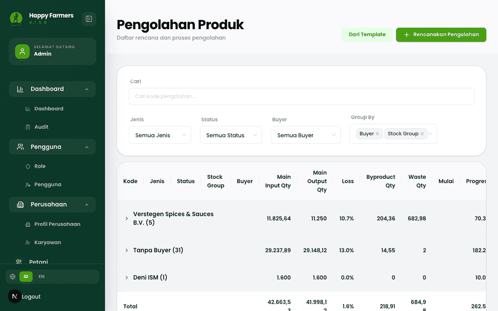
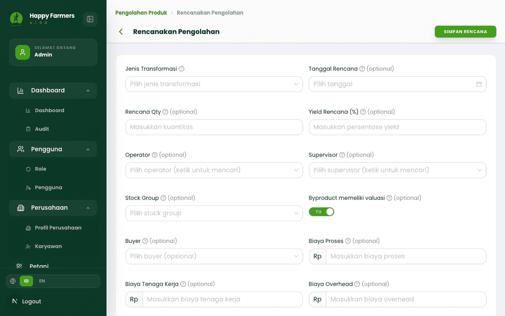
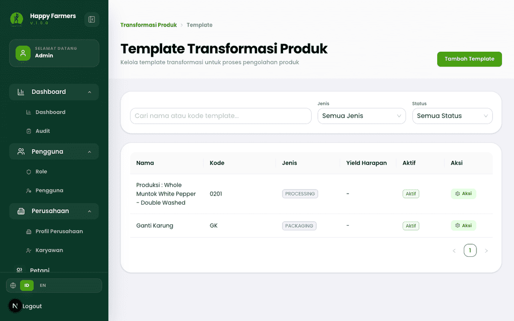
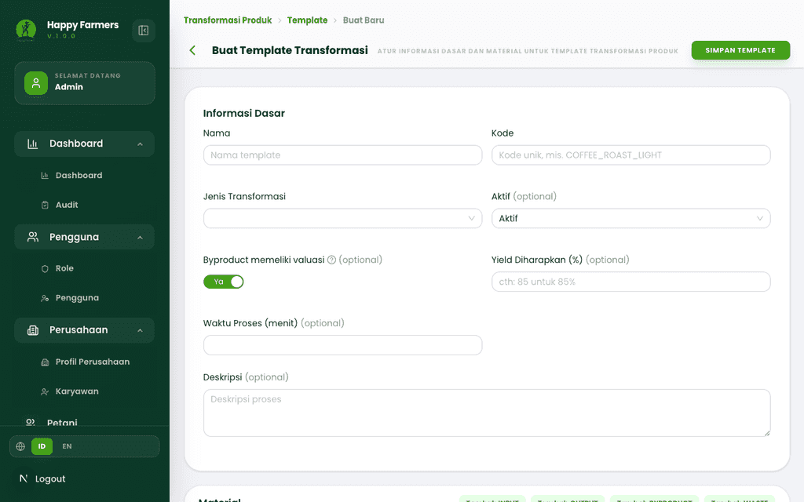
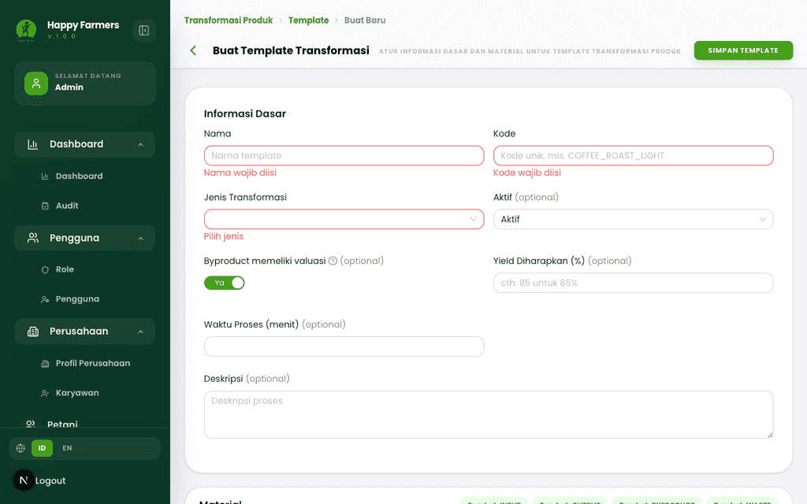
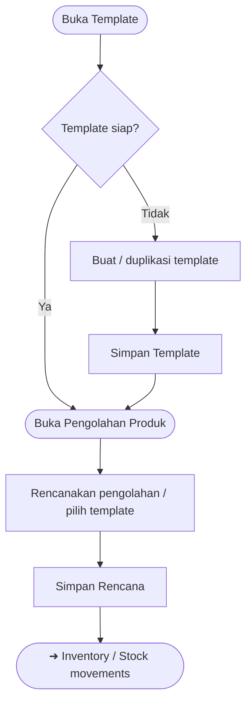

# Buku Panduan Admin Happy Farmers: Volume 6 — Processing / Factory (Pengolahan Produk)

### 0. Daftar Isi
- [1. Kontrol Dokumen](#1-kontrol-dokumen)
- [2. Pendahuluan](#2-pendahuluan)
- [3. Memulai (Dilewati)](#3-memulai-dilewati)
- [4. Gambaran Umum (Dilewati)](#4-gambaran-umum-dilewati)
- [5. Fitur & Modul](#5-fitur--modul)
  - [Transform / Pengolahan (Transforms)](#modul-transform--pengolahan-transforms)
  - [Template transformasi](#modul-template-transformasi)
- [6. Alur Kerja Modul](#6-alur-kerja-modul)
- [7. Matriks Peran & Akses](#7-matriks-peran--akses)
- [8. Pemecahan Masalah & FAQ](#8-pemecahan-masalah--faq)
- [9. Glosarium](#9-glosarium)

---

### 1. Kontrol Dokumen
| Versi | Tanggal | Penulis | Deskripsi |
|------|---------|---------|-----------|
| v1.0 | 2026-04-13 | System AI | Volume **Processing**: **Product transformation** — daftar *transform*, *template*, dan form pembuatan |

---

### 2. Pendahuluan
Modul **Product transformation** mencatat bagaimana bahan baku (**input stock** / **Product Variant**) diolah menjadi produk jadi atau sampingan sesuai **Template** yang telah didefinisikan. Ini menjembatani **Inventory** ([Volume 5](05_inventory_and_logistics.md)) dengan kebutuhan manufaktur ringan di dalam aplikasi. Definisi **produk** dan **varietas** di katalog: [Volume 10: Master Produk](10_product_master_data.md). Lanjutan hilir: [Volume 7: Penjualan & Pemenuhan](07_sales_and_fulfillment.md).

Istilah teknis seperti *Transform*, *Template*, dan *Material* mengikuti teks yang tampil di UI.

---

### 3. Memulai (Dilewati)
> Anda sudah masuk sebagai Admin. Lihat [Volume 1: Masuk & Dasbor](01_entry_and_dashboard.md).

---

### 4. Gambaran Umum (Dilewati)
> Rute utama berada di bawah **`/product-transformation`** (subpath **`transforms`** dan **`templates`**).

---

### 5. Fitur & Modul

#### Modul: Transform / Pengolahan (Transforms)
- **Nama fitur**: **Pengolahan Produk** — daftar dan eksekusi rencana pengolahan
- **Deskripsi**: Melihat rencana/proses pengolahan, membuat entri baru, membuka detail, serta memilih **Template** saat alur UI memintanya.
- **Langkah ringkas**
  1. Buka **`/product-transformation/transforms`**.
  2. Tinjau daftar; gunakan filter/pencarian sesuai kartu atau bilah di layar.
  3. Untuk rencana baru, buka **`/product-transformation/transforms/create`** (atau alur dari **Template** dengan query `templateId` bila ditawarkan).
  4. Isi **Form** (material **INPUT**/**OUTPUT**, lokasi, kuantitas, dll.) lalu simpan dengan tombol **Simpan Rencana** pada header.
- **Tangkapan layar**
  - 
  - 

---

#### Modul: Template transformasi
- **Nama fitur**: **Template Transformasi Produk**
- **Deskripsi**: Mendefinisikan aturan bahan dan hasil yang dapat dipakai berulang oleh **Transform**; mendukung duplikasi template (`duplicate` query) bila tersedia.
- **Langkah ringkas**
  1. Buka **`/product-transformation/templates`**.
  2. Kelola daftar template; tambah lewat **`/product-transformation/templates/create`**.
  3. Atur informasi dasar dan baris **material**; simpan dengan **Simpan Template**.
- **Validasi (contoh)**
  - Mengirim form kosong memunculkan ringkasan **Periksa Input Anda** dan pesan field wajib (lihat tangkapan validasi).
- **Tangkapan layar**
  - 
  - 
  - 

> [!TIP] Menyiapkan **Template** sebelum rencana harian mengurangi kesalahan konfigurasi material pada **Transform**.

> [!NOTE] Mobile: form **Transform** dan **Template** memakai lebar penuh; scroll vertikal dan horizontal mungkin diperlukan pada layar sempit.

---

### 6. Alur Kerja Modul

---

### 7. Matriks Peran & Akses

| Peran | Area | Aksi |
|------|------|------|
| Admin | Transforms & templates | Membuat, mengubah, melihat detail sesuai tombol aktif pada UI. |

> [!NOTE] Visible to: **Admin** untuk volume ini.

---

### 8. Pemecahan Masalah & FAQ

1. **Tombol simpan tidak tersedia atau abu-abu.**  
   Periksa apakah masih ada proses *loading* (dropdown stok/pengguna); tunggu hingga selesai. Pastikan juga tidak ada modal validasi yang menutupi layar.

2. **Daftar transform kosong.**  
   Belum ada rencana yang dibuat, atau filter menyembunyikan semua baris — kosongkan filter dan segarkan halaman.

3. **Error setelah memilih stock input.**  
   Pastikan **Stock** memenuhi syarat status/kuantitas yang dipersyaratkan form; baca pesan merah pada kartu **Alert** di atas form.

---

### 9. Glosarium

| Istilah | Definisi |
|--------|-----------|
| **Transform** | Satu rencana/eksekusi pengolahan produk berdasarkan aturan dan material yang diisi. |
| **Template** | Pola transformasi yang dapat dipakai ulang untuk mempercepat input **Transform**. |
| **Material** | Baris bahan baku atau hasil (peran seperti input/output/sampingan) pada template atau transform. |

---

> ⚠️ **Outline correction needed:** Tidak ada; selaras dengan modul **#8 Processing** pada `DOCUMENT_OUTLINE.md`.
