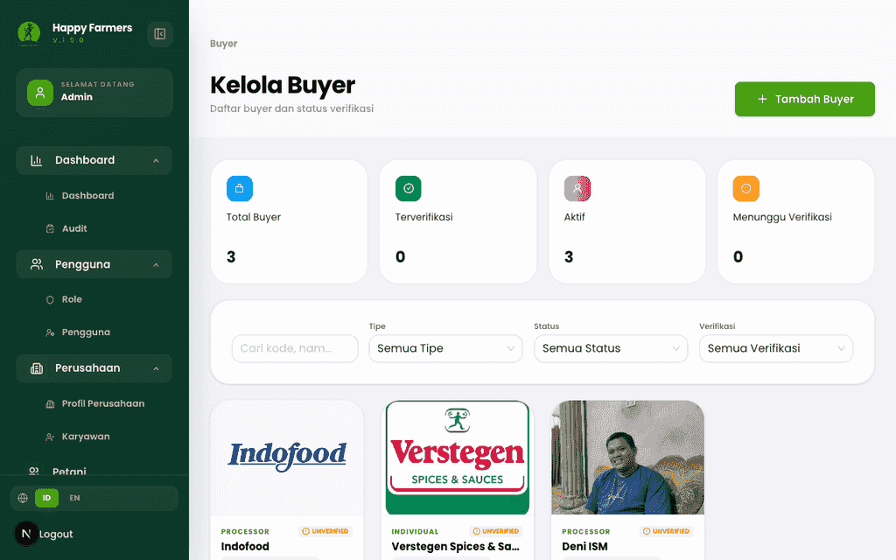
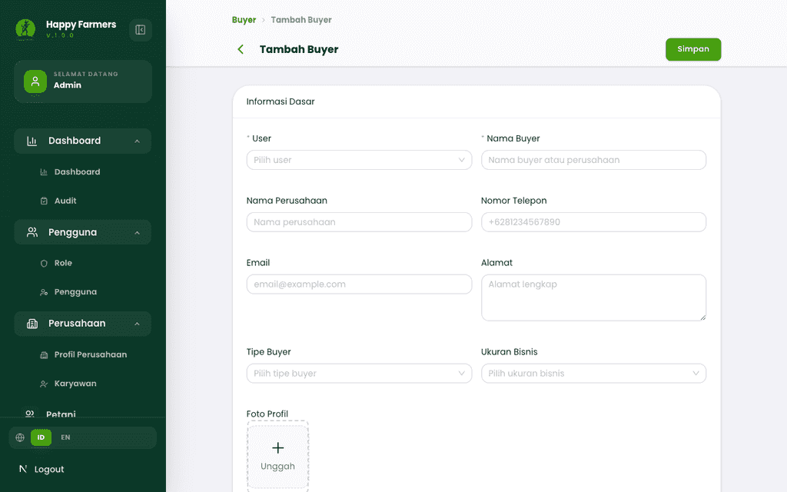
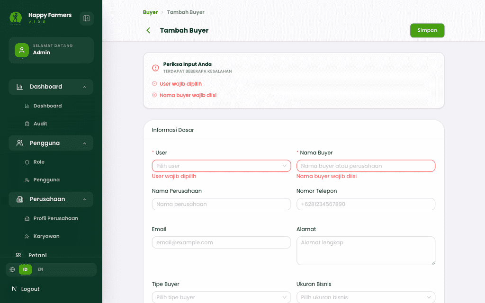
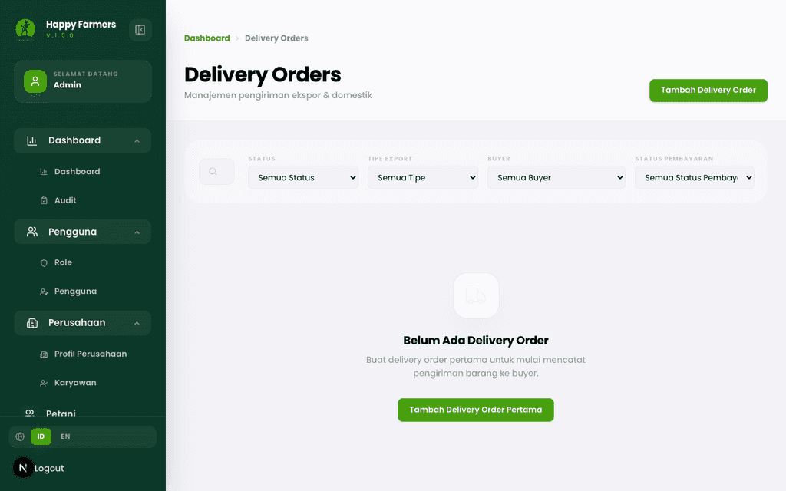
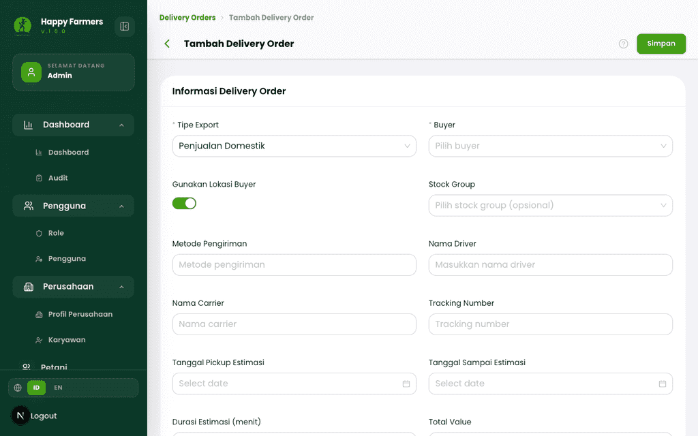
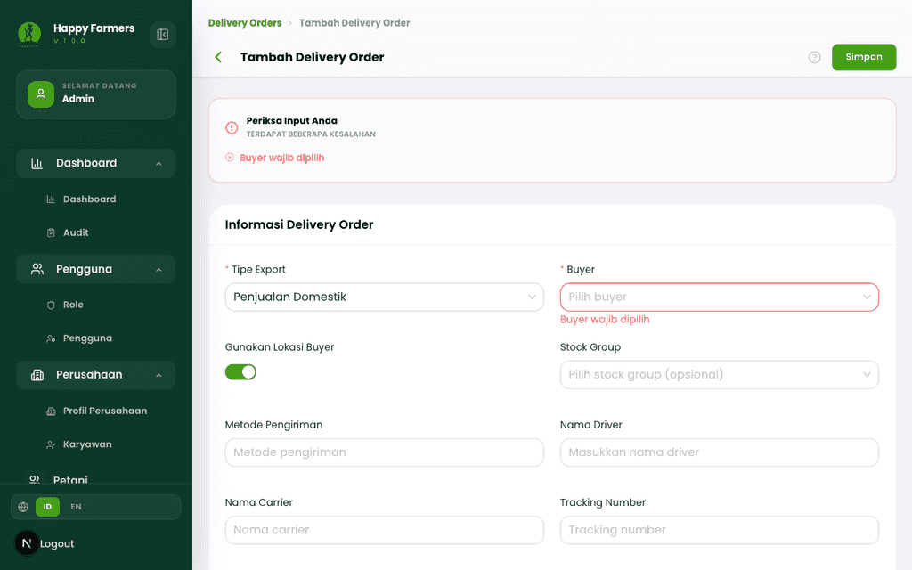
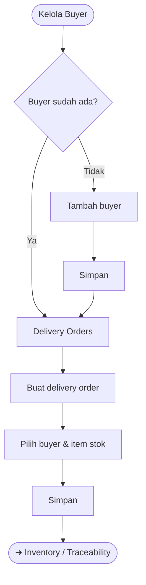

# Buku Panduan Admin Happy Farmers: Volume 7 — Sales & Fulfillment (Penjualan & Pemenuhan)

### 0. Daftar Isi
- [1. Kontrol Dokumen](#1-kontrol-dokumen)
- [2. Pendahuluan](#2-pendahuluan)
- [3. Memulai (Dilewati)](#3-memulai-dilewati)
- [4. Gambaran Umum (Dilewati)](#4-gambaran-umum-dilewati)
- [5. Fitur & Modul](#5-fitur--modul)
  - [Buyer](#modul-buyer)
  - [Delivery order](#modul-delivery-order)
- [6. Alur Kerja Modul](#6-alur-kerja-modul)
- [7. Matriks Peran & Akses](#7-matriks-peran--akses)
- [8. Pemecahan Masalah & FAQ](#8-pemecahan-masalah--faq)
- [9. Glosarium](#9-glosarium)

---

### 1. Kontrol Dokumen
| Versi | Tanggal | Penulis | Deskripsi |
|------|---------|---------|-----------|
| v1.0 | 2026-04-13 | System AI | Volume **Sales & fulfillment**: **Buyer** dan **Delivery Order** |

---

### 2. Pendahuluan
Volume ini menjelaskan sisi hilir: mencatat **Buyer** (pembeli) dan menerbitkan **Delivery Order** (*DO*) untuk pengiriman domestik atau ekspor. Data **Stock** dan **Stock Group** dari [Volume 5: Inventori & Logistik](05_inventory_and_logistics.md) sering dipakai saat memilih item pada **Delivery Order**.

Setelah barang diolah, alur dapat bersambung dari [Volume 6: Pengolahan / Factory](06_processing_factory.md) menuju penjualan dan pengiriman.

Untuk pelacakan publik berdasarkan **kode stok** setelah barang beredar, lihat [Volume 8: Traceability](08_traceability.md).

Analisis **HPP (COGS)** dan ringkasan nilai inventori berbasis FIFO: [Volume 9: Keuangan & Laporan](09_finance_and_reports.md).

---

### 3. Memulai (Dilewati)
> Sudah *login* sebagai Admin — lihat [Volume 1](01_entry_and_dashboard.md).

---

### 4. Gambaran Umum (Dilewati)
> Rute utama: `/buyers`, `/delivery-orders`.

---

### 5. Fitur & Modul

#### Modul: Buyer
- **Nama fitur**: **Kelola Buyer**
- **Deskripsi**: Direktori pembeli dengan status verifikasi/aktif (pola mirip **Collector**).
- **Langkah ringkas**
  1. Buka `/buyers`.
  2. Cari dan saring daftar; buka kartu untuk detail atau **Tambah Buyer** → `/buyers/create`.
  3. Hubungkan ke **User** sistem bila diperlukan; isi **Nama buyer** dan kontak.
  4. Simpan lewat tombol **Simpan** di header.
- **Validasi (contoh)**
  - **User** wajib jika aturan form memintanya: *"User wajib dipilih"*.
  - **Nama buyer** wajib: *"Nama buyer wajib diisi"*.
  - **Email** harus valid bila diisi: *"Email tidak valid"*.
- **Tangkapan layar**
  - 
  - 
  - 

---

#### Modul: Delivery order
- **Nama fitur**: **Delivery Orders**
- **Deskripsi**: Manajemen pengiriman; memilih **Buyer**, tipe (domestik/ekspor), item (**Product Variant** + **Stock** + kuantitas), opsi **Stock Group**, dan tujuan pengiriman.
- **Langkah ringkas**
  1. Buka `/delivery-orders`.
  2. Tinjau daftar status pengiriman; buat baru lewat **`/delivery-orders/create`**.
  3. Baca **Petunjuk Pembuatan Delivery Order** (modal bantuan) bila muncul, lalu klik **Mengerti** untuk melanjutkan.
  4. Lengkapi form dan **Simpan**.
- **Tangkapan layar**
  - 
  - 
  - 

> [!TIP] Pilih **Stock Group** pada **Delivery Order** hanya jika ingin membatasi pilihan **Stock** ke grup tertentu (sesuai petunjuk di layar).

---

### 6. Alur Kerja Modul

---

### 7. Matriks Peran & Akses

| Peran | Area | Aksi |
|------|------|------|
| Admin | Buyers, delivery orders | CRUD sesuai tombol yang aktif di UI. |

---

### 8. Pemecahan Masalah & FAQ

1. **Modal petunjuk menutupi form Delivery Order.**  
   Klik **Mengerti** untuk menutup panel bantuan, lalu lanjutkan pengisian.

2. **Tidak bisa memilih stock untuk baris item.**  
   Pastikan **Stock** statusnya memenuhi syarat; coba kosongkan filter **Stock Group** atau pilih grup yang benar.

3. **Buyer tidak muncul di dropdown DO.**  
   Pastikan buyer **aktif** dan memenuhi filter pencarian di field tersebut.

---

### 9. Glosarium

| Istilah | Definisi |
|--------|-----------|
| **Buyer** | Entitas pembeli penerima barang. |
| **Delivery order (DO)** | Dokumen pengiriman yang merujuk buyer, item, dan logistik. |
| **Stock group** (pada DO) | Filter opsional untuk membatasi stok yang dapat dialokasikan. |
