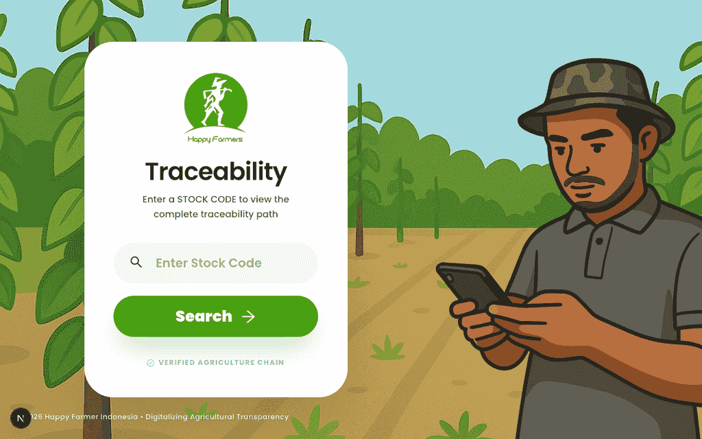
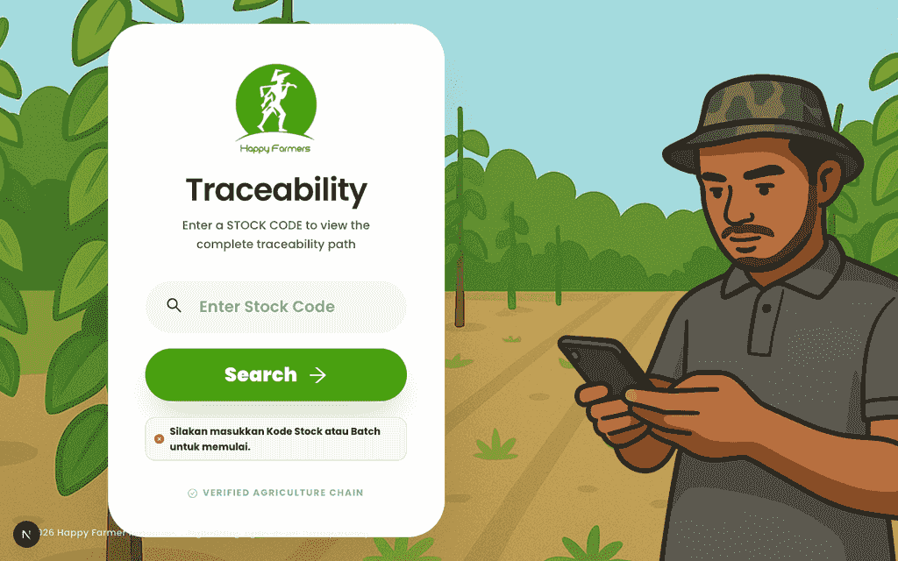
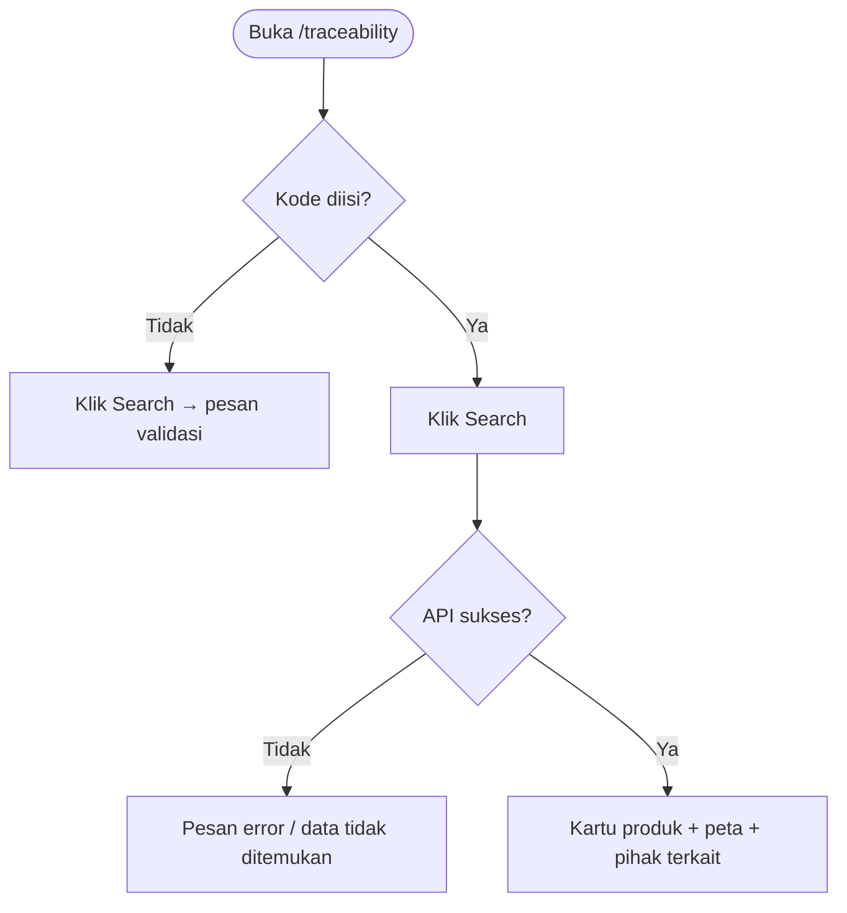

# Buku Panduan Admin Happy Farmers: Volume 8 — Traceability (Pelacakan Rantai)

### 0. Daftar Isi
- [1. Kontrol Dokumen](#1-kontrol-dokumen)
- [2. Pendahuluan](#2-pendahuluan)
- [3. Memulai (Dilewati)](#3-memulai-dilewati)
- [4. Gambaran Umum (Dilewati)](#4-gambaran-umum-dilewati)
- [5. Fitur & Modul](#5-fitur--modul)
  - [Pencarian kode stok / batch](#modul-pencarian-kode-stok--batch)
- [6. Alur Kerja Modul](#6-alur-kerja-modul)
- [7. Matriks Peran & Akses](#7-matriks-peran--akses)
- [8. Pemecahan Masalah & FAQ](#8-pemecahan-masalah--faq)
- [9. Glosarium](#9-glosarium)

---

### 1. Kontrol Dokumen
| Versi | Tanggal | Penulis | Deskripsi |
|------|---------|---------|-----------|
| v1.0 | 2026-04-13 | System AI | Volume **Traceability**: halaman mandiri **`/traceability`** — pencarian **kode stock** / batch dan tampilan hasil |

---

### 2. Pendahuluan
**Traceability** memungkinkan pengguna memasukkan **kode stok** (atau batch, sesuai kebijakan backend) untuk melihat rangkuman perjalanan komoditas: informasi produk, pihak terkait, dan visualisasi distribusi. Halaman ini berdiri sendiri di luar menu modul `(modules)` utama, namun mengacu pada data yang sama dengan **Inventory** ([Volume 5](05_inventory_and_logistics.md)) dan dapat dihubungkan dari alur **Pengolahan** (misalnya tautan QR dari transformasi). Agregasi keuangan dan laporan FIFO terkait stok dibahas di [Volume 9: Keuangan & Laporan](09_finance_and_reports.md).

Teks antarmuka campuran **Inggris** (*Traceability*, *Search*, *Enter Stock Code*) mengikuti UI saat ini.

---

### 3. Memulai (Dilewati)
> Anda sudah masuk sebagai pengguna aplikasi. Lihat [Volume 1: Masuk & Dasbor](01_entry_and_dashboard.md).

---

### 4. Gambaran Umum (Dilewati)
> Rute utama: **`/traceability`**. Pencarian dapat juga dimulai dengan query **`?code=...`** di URL.

---

### 5. Fitur & Modul

#### Modul: Pencarian kode stok / batch
- **Nama fitur**: **Traceability** — pelacakan berdasarkan kode
- **Deskripsi**: Memasukkan kode di field **Enter Stock Code**, lalu menekan **Search**. Sistem memanggil API traceability; jika berhasil, tampilan beralih ke kartu produk, **Pihak Terkait**, dan **Peta Distribusi** (*Peta Distribusi* / *Visualisasi Jalur*).
- **Langkah ringkas**
  1. Buka **`/traceability`** (atau tautan dengan `?code=`).
  2. Isi kode stok atau batch yang valid.
  3. Klik **Search** dan tunggu hasil; gunakan kontrol “kembali” pada header hasil bila ingin mencari ulang.
- **Validasi (contoh)**
  - Menekan **Search** tanpa mengisi field menampilkan pesan **Silakan masukkan Kode Stock atau Batch untuk memulai.**
- **Tangkapan layar**
  - 
  - 

> [!TIP] Untuk dokumentasi tangkapan layar **halaman hasil** dengan data nyata, skrip `capture-module8.js` mendukung variabel opsional **`HF_TRACEABILITY_STOCK_CODE`** di `fe-hf-nextjs/.env` (kode yang pasti ada di lingkungan API Anda).

> [!NOTE] Mobile: kartu pencarian dan peta dapat memerlukan scroll; lebar layar kecil dapat menumpuk kolom menjadi satu kolom.

---

### 6. Alur Kerja Modul

---

### 7. Matriks Peran & Akses

| Peran | Area | Aksi |
|------|------|------|
| Admin (dan pengguna terautentikasi lain sesuai kebijakan produk) | `/traceability` | Mencari kode; melihat hasil bila tersedia. |

> [!NOTE] Hak akses pasti mengikuti konfigurasi backend; volume ini mendeskripsikan perilaku UI.

---

### 8. Pemecahan Masalah & FAQ

1. **Hasil tidak muncul meskipun kode benar di gudang.**  
   Pastikan API **`/traceability/v2/...`** mengembalikan data untuk kode tersebut; perbedaan format batch vs kode stok dapat mempengaruhi hasil.

2. **Ingin membuka langsung dari tautan eksternal.**  
   Gunakan **`/traceability?code=KODE_ANDA`** agar pencarian dijalankan setelah halaman termuat.

---

### 9. Glosarium

| Istilah | Definisi |
|--------|-----------|
| **Stock code** | Identifikasi stok/batch yang dipakai sebagai kunci pelacakan di UI ini. |
| **Traceability** | Fitur pelacakan rantai dari kode ke visualisasi dan metadata terkait. |
