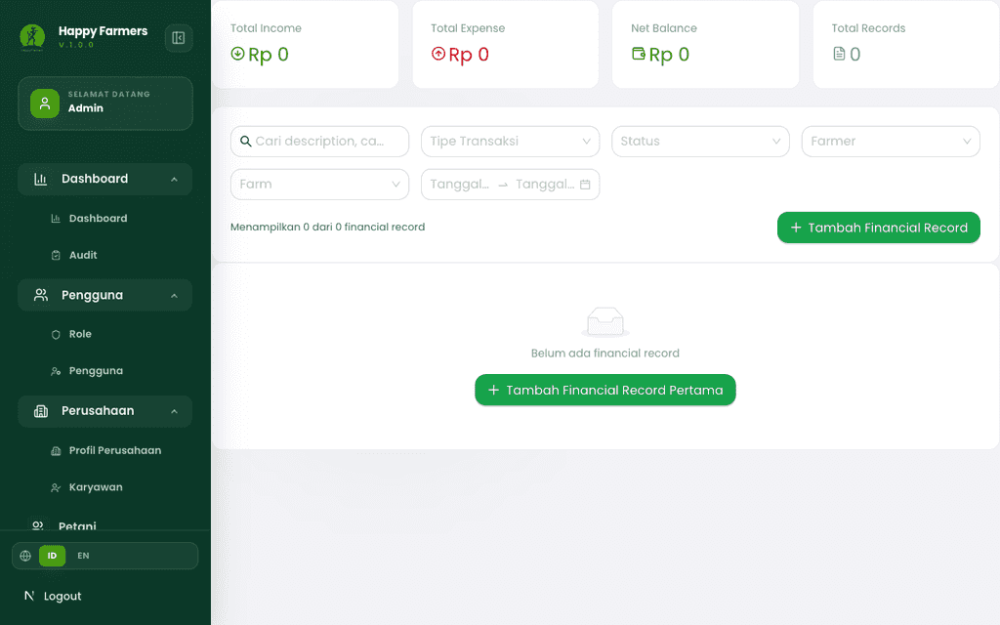
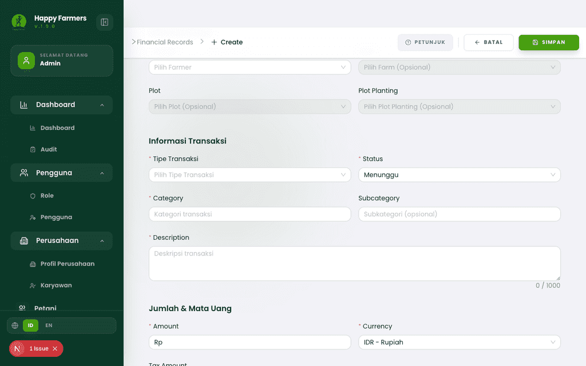
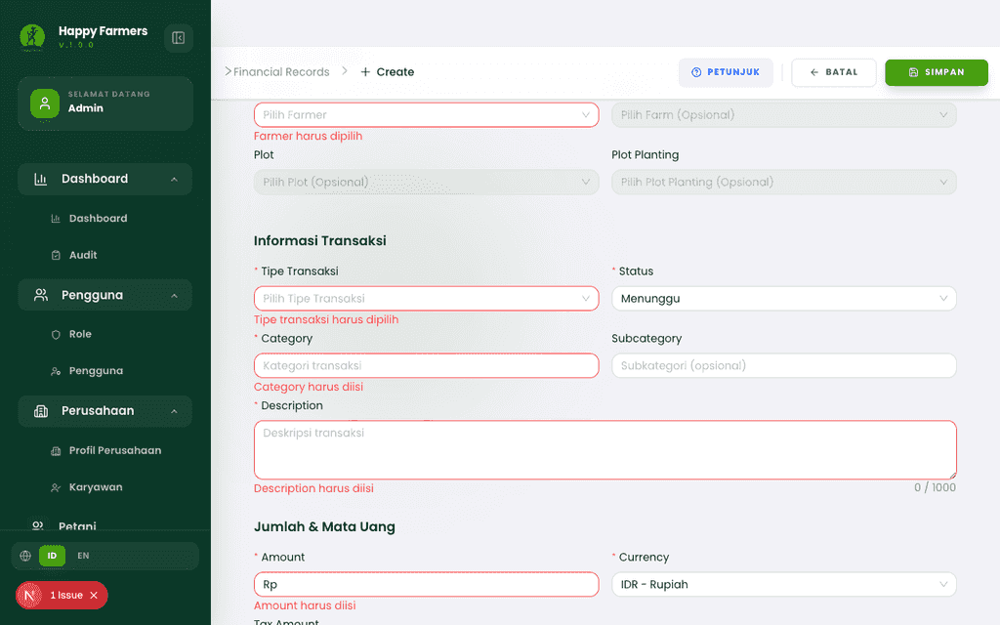
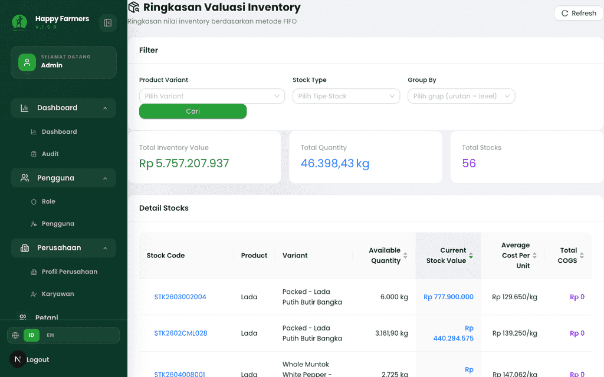
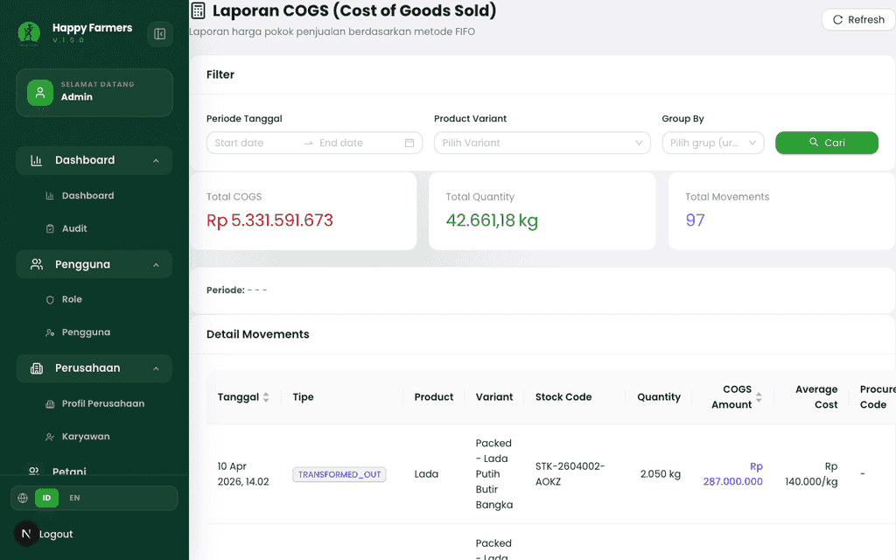
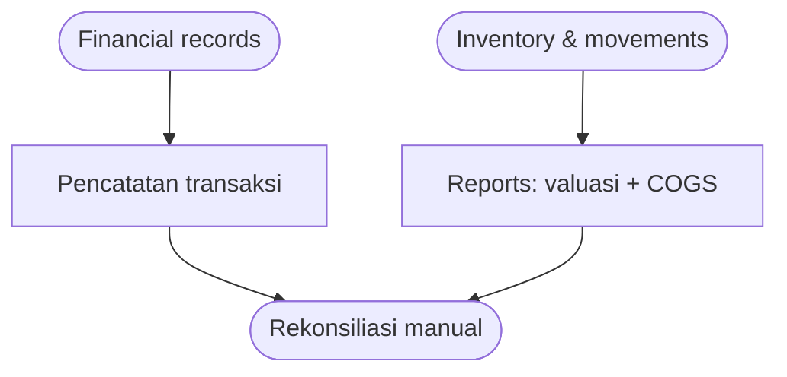

# Buku Panduan Admin Happy Farmers: Volume 9 — Finance & Reports (Keuangan & Laporan)

### 0. Daftar Isi
- [1. Kontrol Dokumen](#1-kontrol-dokumen)
- [2. Pendahuluan](#2-pendahuluan)
- [3. Memulai (Dilewati)](#3-memulai-dilewati)
- [4. Gambaran Umum (Dilewati)](#4-gambaran-umum-dilewati)
- [5. Fitur & Modul](#5-fitur--modul)
  - [Financial records](#modul-financial-records)
  - [Laporan valuasi inventori](#modul-laporan-valuasi-inventori)
  - [Laporan COGS](#modul-laporan-cogs)
- [6. Alur Kerja Modul](#6-alur-kerja-modul)
- [7. Matriks Peran & Akses](#7-matriks-peran--akses)
- [8. Pemecahan Masalah & FAQ](#8-pemecahan-masalah--faq)
- [9. Glosarium](#9-glosarium)

---

### 1. Kontrol Dokumen
| Versi | Tanggal | Penulis | Deskripsi |
|------|---------|---------|-----------|
| v1.0 | 2026-04-13 | System AI | Volume **Finance & reports**: **Financial record**, **Ringkasan valuasi inventory**, **Laporan COGS** (FIFO) |

---

### 2. Pendahuluan
Volume ini merangkum pencatatan transaksi keuangan tingkat operasional (**Financial record**) serta dua laporan stok berbasis **FIFO**: ringkasan **nilai inventory** dan **harga pokok penjualan (COGS)**. Data laporan bersumber dari posisi dan pergerakan stok yang dijelaskan di [Volume 5: Inventori & Logistik](05_inventory_and_logistics.md); alur penjualan fisik tetap berada di [Volume 7: Penjualan & Pemenuhan](07_sales_and_fulfillment.md). Filter **Product variant** pada laporan mengasumsikan master varian sudah benar — lihat [Volume 10: Master Produk](10_product_master_data.md).

Beberapa label UI memakai **Bahasa Inggris** (*Financial Record*, *Total Income*, *Category*, *Description*, *COGS*, *Refresh*) mengikuti tampilan saat ini.

---

### 3. Memulai (Dilewati)
> Anda sudah masuk sebagai Admin. Lihat [Volume 1: Masuk & Dasbor](01_entry_and_dashboard.md).

---

### 4. Gambaran Umum (Dilewati)
> Rute utama: **`/financial-records`**, **`/financial-records/create`**, **`/reports/inventory-valuation`**, **`/reports/cogs`**.

---

### 5. Fitur & Modul

#### Modul: Financial records
- **Nama fitur**: **Financial record** — daftar transaksi pemasukan/pengeluaran terkait petani/farm (opsional plot/tanaman).
- **Deskripsi**: Ringkasan angka **Total Income**, **Total Expense**, **Net Balance**, dan jumlah **Total Records**; filter berdasarkan teks, **Tipe Transaksi**, **Status**, **Farmer**, **Farm**, serta rentang **Tanggal Transaksi**. Penambahan data lewat **Tambah Financial Record**.
- **Langkah ringkas**
  1. Buka **`/financial-records`**.
  2. Sesuaikan filter; tinjau tabel kolom **Tipe**, **Category**, **Description**, **Amount**, **Currency**, **Transaction Date**, **Status**.
  3. Untuk entri baru: **`/financial-records/create`** — isi **Informasi Dasar** (minimal **Farmer**, tipe, status, kategori, deskripsi, jumlah, mata uang, tanggal transaksi) lalu simpan lewat tombol **Simpan** pada bilah aksi atas.
- **Validasi (contoh)**
  - Mengirim form kosong menampilkan pesan field wajib Ant Design, misalnya **Farmer harus dipilih**, **Category harus diisi**, **Amount harus diisi**, dan seterusnya.
- **Tangkapan layar**
  - 
  - 
  - 

> [!TIP] Tombol **Petunjuk** membuka modal panduan umum; gunakan **Mengerti, Lanjutkan** untuk menutupnya bila menghalangi tangkapan layar.

---

#### Modul: Laporan valuasi inventori
- **Nama fitur**: **Ringkasan Valuasi Inventory**
- **Deskripsi**: Menampilkan ringkasan nilai stok berdasarkan metode **FIFO**; filter **Product Variant**, **Stock Type** (*Real* / *Projected*), **Group By** (*Product* / *Variant*), lalu **Cari**. Tombol **Refresh** memuat ulang data dengan filter yang sama.
- **Langkah ringkas**
  1. Buka **`/reports/inventory-valuation`**.
  2. Atur filter dan klik **Cari**.
  3. Baca kartu ringkasan (misalnya **Total Inventory Value**, **Total Quantity**) dan tabel/detail grup sesuai UI.
- **Tangkapan layar**
  - 

---

#### Modul: Laporan COGS
- **Nama fitur**: **Laporan COGS (Cost of Goods Sold)**
- **Deskripsi**: Laporan **HPP** berbasis **FIFO** dengan filter **Periode Tanggal**, **Product Variant**, **Group By** (termasuk opsi seperti **Stock Code**), lalu **Cari**. Ringkasan menampilkan **Total COGS** dan tabel pergerakan; tautan **View** pada kolom FIFO membuka detail alokasi bila tersedia.
- **Langkah ringkas**
  1. Buka **`/reports/cogs`**.
  2. Pilih periode dan filter lain sesuai kebutuhan analisis.
  3. Klik **Cari**; gunakan **Refresh** untuk memuat ulang.
- **Tangkapan layar**
  - 

> [!NOTE] Jika API mengembalikan error, bilah **Alert** merah dapat muncul di atas konten; periksa kredensial, jaringan, dan parameter filter.

---

### 6. Alur Kerja Modul

---

### 7. Matriks Peran & Akses

| Peran | Area | Aksi |
|------|------|------|
| Admin | Financial records, laporan | Membuat/mengubah/menghapus catatan sesuai tombol aktif; menjalankan laporan dengan filter. |

---

### 8. Pemecahan Masalah & FAQ

1. **Laporan kosong atau pesan tidak ada data.**  
   Perluas **Periode Tanggal** (COGS), longgarkan filter **Variant** / **Stock Type**, atau pastikan sudah ada **stock movements** yang relevan.

2. **Angka di financial record tidak cocok dengan gudang.**  
   **Financial record** adalah pencatatan keuangan terpisah dari mutasi stok otomatis; cocokkan dengan sumber dokumen internal Anda.

---

### 9. Glosarium

| Istilah | Definisi |
|--------|-----------|
| **Financial record** | Entri transaksi (pemasukan/pengeluaran) dengan metadata petani/lokasi opsional. |
| **FIFO** | *First In, First Out* — metode penilaian yang dipakai di laporan valuasi dan COGS pada UI ini. |
| **COGS** | *Cost of Goods Sold* — harga pokok penjualan agregat/per baris pada laporan. |
