# Buku Panduan Admin Happy Farmers: Volume 10 — Product Master Data (Master Produk)

### 0. Daftar Isi
- [1. Kontrol Dokumen](#1-kontrol-dokumen)
- [2. Pendahuluan](#2-pendahuluan)
- [3. Memulai (Dilewati)](#3-memulai-dilewati)
- [4. Gambaran Umum (Dilewati)](#4-gambaran-umum-dilewati)
- [5. Fitur & Modul](#5-fitur--modul)
  - [Produk](#modul-produk)
  - [Kategori](#modul-kategori)
  - [Varietas produk](#modul-varietas-produk)
  - [Product modifier](#modul-product-modifier)
- [6. Alur Kerja Modul](#6-alur-kerja-modul)
- [7. Matriks Peran & Akses](#7-matriks-peran--akses)
- [8. Pemecahan Masalah & FAQ](#8-pemecahan-masalah--faq)
- [9. Glosarium](#9-glosarium)

---

### 1. Kontrol Dokumen
| Versi | Tanggal | Penulis | Deskripsi |
|------|---------|---------|-----------|
| v1.0 | 2026-04-13 | System AI | Volume **Product master**: **Produk**, **Kategori**, **Varietas Produk**, **Product modifier** |

---

### 2. Pendahuluan
**Master produk** menjadi fondasi data yang dipakai **Inventory** ([Volume 5](05_inventory_and_logistics.md)), **Pengolahan** ([Volume 6](06_processing_factory.md)), **Penjualan** ([Volume 7](07_sales_and_fulfillment.md)), pelaporan ([Volume 9](09_finance_and_reports.md)), dan modul lain yang merujuk **Product** / **Product variant**. Siapa yang boleh mengubah master data mengikuti **Role** pengguna — lihat [Volume 11: Pengguna & Pengaturan](11_people_org_and_settings.md).

Beberapa label UI memakai **Bahasa Inggris** (*Product Modifier*, *Add Product Modifier*, *Search product modifiers…*, *Category*, *Description* pada tabel **Financial record**, dll.) mengikuti tampilan saat ini.

---

### 3. Memulai (Dilewati)
> Anda sudah masuk sebagai Admin. Lihat [Volume 1: Masuk & Dasbor](01_entry_and_dashboard.md).

---

### 4. Gambaran Umum (Dilewati)
> Rute utama: **`/products`**, **`/categories`**, **`/product-variants`**, **`/product-modifiers`** (masing-masing dengan subpath **`/create`**, **`/view/[id]`**, **`/edit/[id]`** bila tersedia).

---

### 5. Fitur & Modul

#### Modul: Produk
- **Nama fitur**: **Daftar Produk** — katalog komoditas dengan filter status dan kategori.
- **Deskripsi**: Kartu produk menampilkan ringkasan dan akses ke detail; **Tambah Produk** membuka **`/products/create`** (**Daftarkan Produk Baru**) dengan bagian **Identitas Komoditas** dan **Klasifikasi & Satuan**.
- **Validasi (contoh)**: Mengirim form tanpa nama/kategori/satuan memunculkan pesan seperti **Nama produk harus diisi** dan **Kategori harus dipilih**.
- **Tangkapan layar**
  - 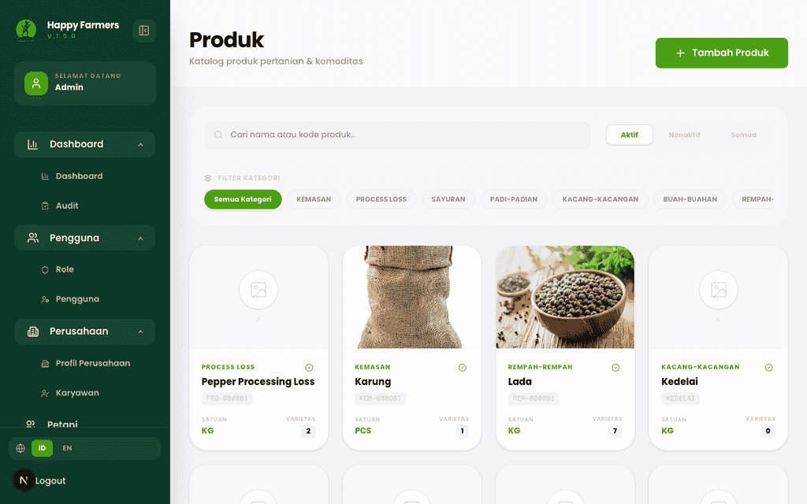
  - 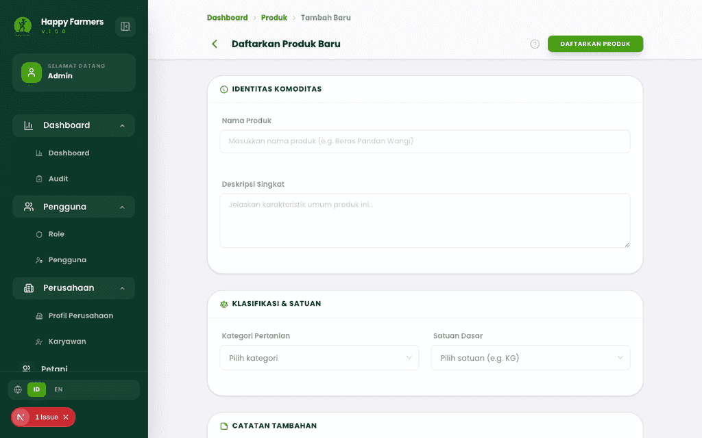
  - 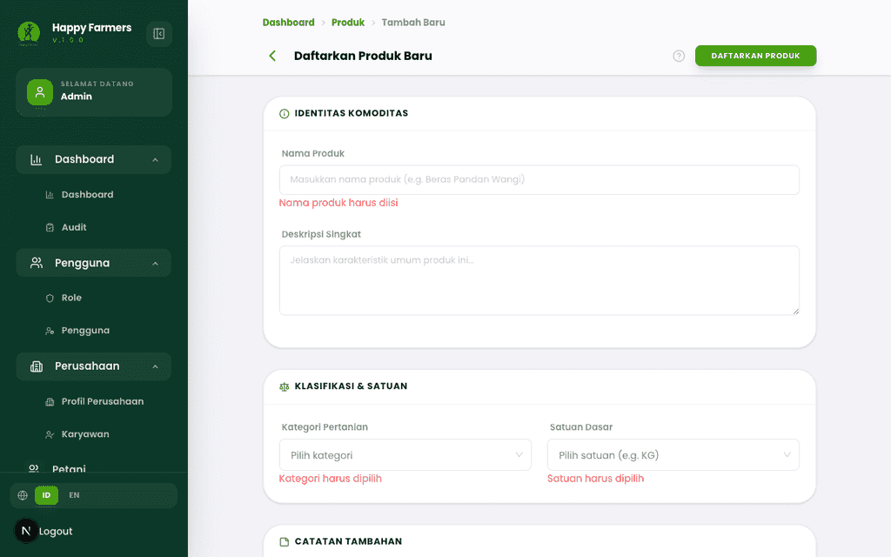

---

#### Modul: Kategori
- **Nama fitur**: **Manajemen Kategori**
- **Deskripsi**: Mengelompokkan produk untuk katalog dan pemilihan di form lain; pembuatan lewat **`/categories/create`** (**Kategori Baru**) dengan **Informasi Dasar** (nama, deskripsi, urutan, status) dan **Pengaturan Tampilan** (ikon, warna). Tombol utama penyimpanan: **Konfirmasi Kategori** (desktop) atau aksi setara di bilah atas **AppFormPageShell** pada konteks lain.
- **Validasi (contoh)**: Form kosong menampilkan ringkasan **Periksa Input Anda** dan detail pesan (misalnya **Nama kategori wajib diisi**).
- **Tangkapan layar**
  - 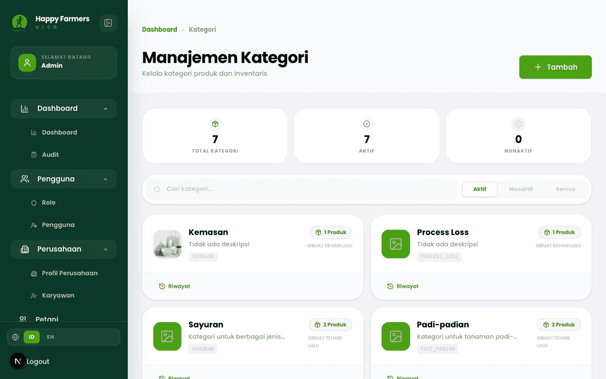
  - 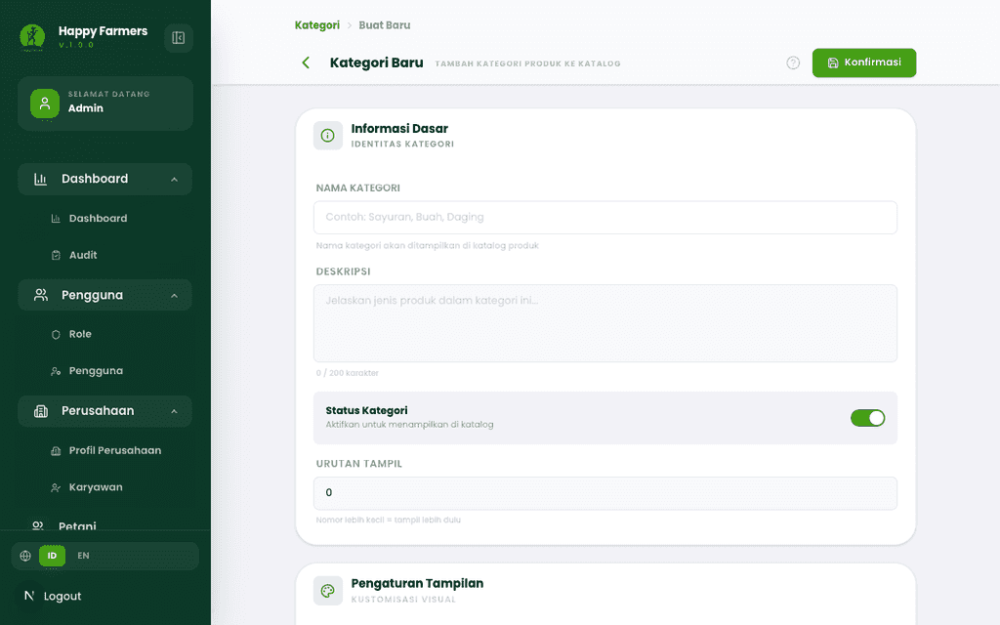
  - 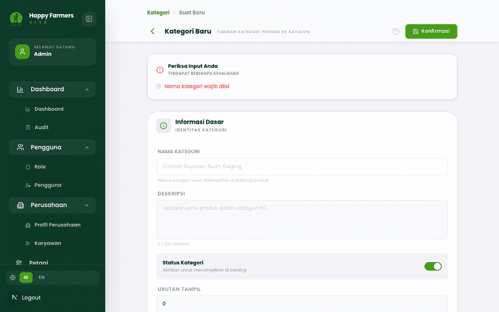

---

#### Modul: Varietas produk
- **Nama fitur**: **Varietas Produk**
- **Deskripsi**: Satu **Produk** dapat memiliki banyak **varietas** (SKU/grade kemasan); form **Tambah Varietas Baru** meminta **Produk Utama**, lalu **Detail Varietas** (nama, harga dasar, deskripsi, dll.). Penyimpanan: **Simpan Varietas**.
- **Validasi (contoh)**: Tanpa produk atau nama varian, pesan **Produk harus dipilih** / **Nama varian harus diisi** dapat muncul.
- **Tangkapan layar**
  - 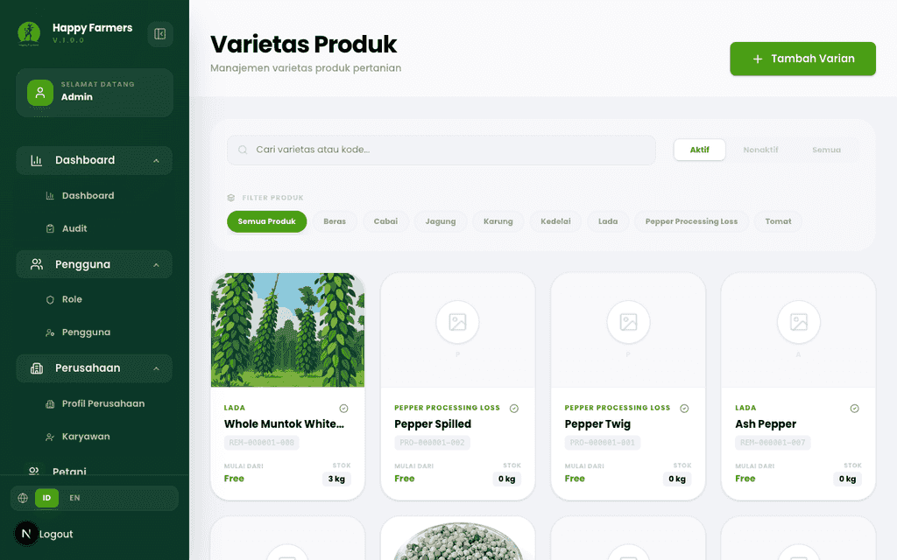
  - 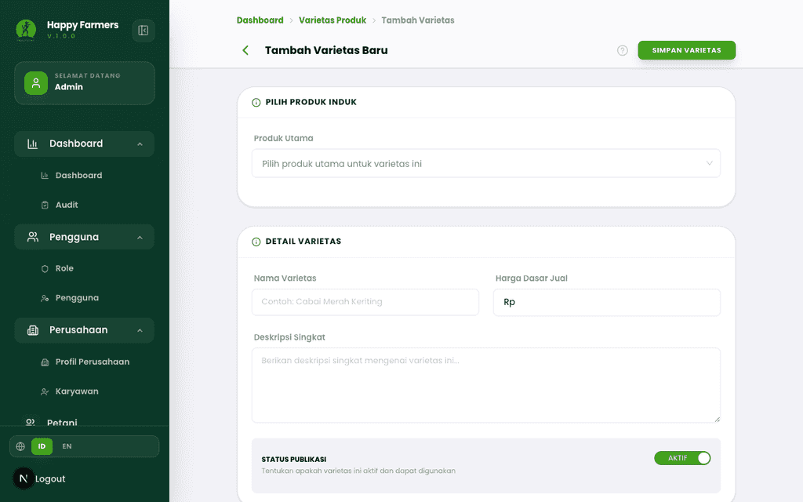
  - 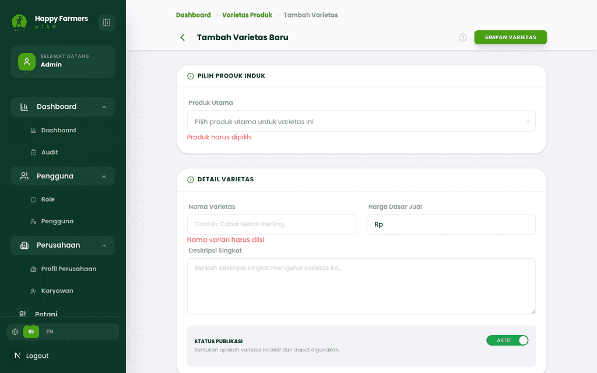

> [!NOTE] Jika referensi produk gagal dimuat, UI dapat menampilkan pesan kesalahan memuat data — periksa API dan hak akses sebelum mengisi form.

---

#### Modul: Product modifier
- **Nama fitur**: **Product modifier** — aturan harga/tambahan terikat **varian** (tipe seleksi *dropdown* / *input*, tipe nominal, dan **Aturan Harga**).
- **Deskripsi**: Daftar memakai bilah **Search product modifiers…** dan filter **Status**, **Tipe Seleksi**, **Tipe Nominal**; aksi utama **Add Product Modifier**. Form memakai pola **FormPageShell** (tombol **Simpan** / **Batal**).
- **Validasi (contoh)**: Field wajib memunculkan teks seperti **Nama modifier harus diisi**, **Kode modifier harus diisi**, **Produk harus dipilih**, **Varian produk harus dipilih**, **Tipe seleksi harus dipilih**, **Tipe nominal harus dipilih** (sesuai field yang kosong).
- **Tangkapan layar**
  - 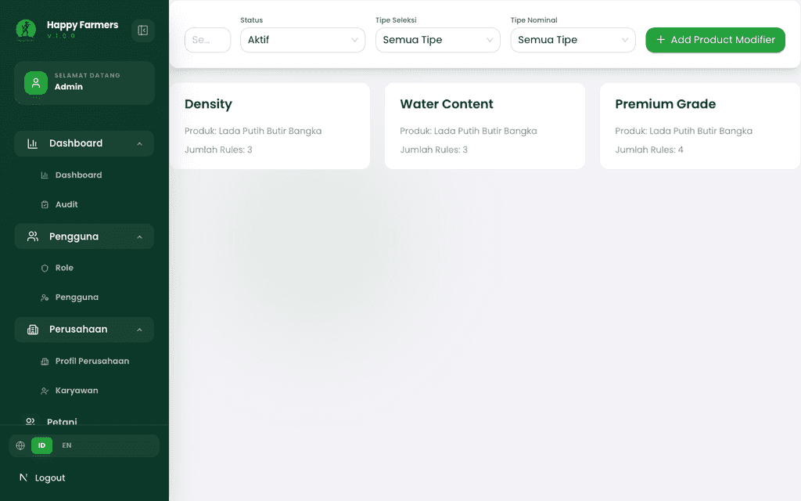
  - 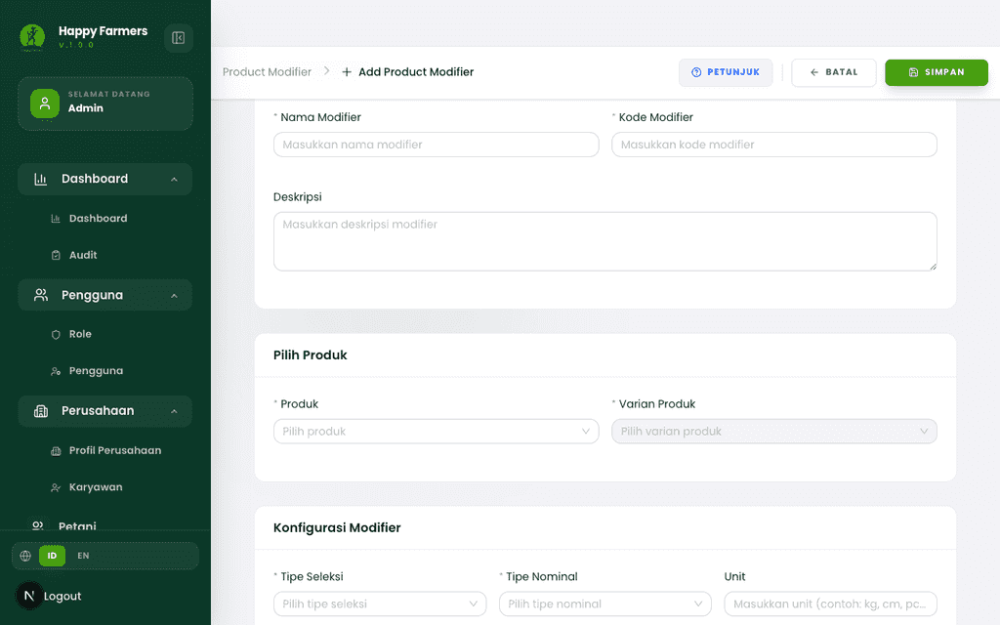
  - 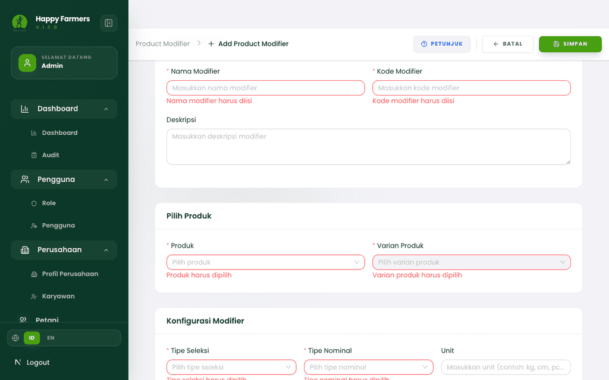

> [!TIP] Bahasa Inggris pada daftar modifier disamakan dengan UI; panduan ini memakai istilah **Product modifier** agar konsisten dengan menu aplikasi.

---

### 6. Alur Kerja Modul

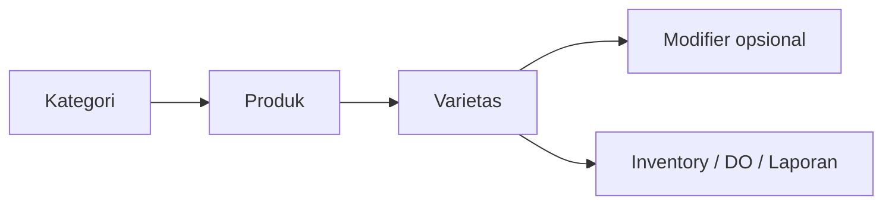

---

### 7. Matriks Peran & Akses

| Peran | Area | Aksi |
|------|------|------|
| Admin | Produk, kategori, varietas, modifier | CRUD sesuai tombol yang aktif di UI. |

---

### 8. Pemecahan Masalah & FAQ

1. **Varietas tidak bisa dibuat — daftar produk kosong.**  
   Tambah **Produk** aktif terlebih dahulu di **`/products`**.

2. **Laporan valuasi tidak menemukan variant.**  
   Pastikan **Varietas** dan **Produk** aktif; lihat [Volume 9](09_finance_and_reports.md).

---

### 9. Glosarium

| Istilah | Definisi |
|--------|-----------|
| **Product variant** | Varietas/SKU di bawah satu produk induk. |
| **Product modifier** | Opsional penyesuaian harga/atribut tambahan pada varian. |
| **FIFO** | Metode laporan yang merujuk stok — lihat Volume 9. |
