# Buku Panduan Admin Happy Farmers: Volume 11 — People, Org & Settings (Pengguna, Organisasi & Pengaturan)

### 0. Daftar Isi
- [1. Kontrol Dokumen](#1-kontrol-dokumen)
- [2. Pendahuluan](#2-pendahuluan)
- [3. Memulai (Dilewati)](#3-memulai-dilewati)
- [4. Gambaran Umum (Dilewati)](#4-gambaran-umum-dilewati)
- [5. Fitur & Modul](#5-fitur--modul)
  - [User](#modul-user)
  - [Role](#modul-role)
  - [Karyawan](#modul-karyawan)
  - [Profil perusahaan](#modul-profil-perusahaan)
  - [Tema & preferensi](#modul-tema--preferensi)
- [6. Alur Kerja Modul](#6-alur-kerja-modul)
- [7. Matriks Peran & Akses](#7-matriks-peran--akses)
- [8. Pemecahan Masalah & FAQ](#8-pemecahan-masalah--faq)
- [9. Glosarium](#9-glosarium)

---

### 1. Kontrol Dokumen
| Versi | Tanggal | Penulis | Deskripsi |
|------|---------|---------|-----------|
| v1.0 | 2026-04-13 | System AI | Volume **People & settings**: **User**, **Role**, **Karyawan**, **Profil perusahaan**, **Tema**, **Preferensi** |

---

### 2. Pendahuluan
Volume ini menjelaskan pengelolaan **identitas pengguna** (**User**), **hak akses** (**Role**), **data karyawan** (**Employee**), identitas legal/tampilan **Profil perusahaan**, serta kustomisasi **tema** dan halaman **preferensi & desain**. Ini melengkapi fondasi keamanan yang diasumsikan pada [Volume 1: Masuk & Dasbor](01_entry_and_dashboard.md). **Log audit** dan **webhook** integrasi dibahas di [Volume 12: Audit & Integrasi](12_audit_and_integrations.md).

Sebagian label memakai **Bahasa Inggris** (*Settings*, *Theme*, *Preferences*, *Preview UI Kit*, breadcrumb **Roles** / **Create**) sesuai UI.

---

### 3. Memulai (Dilewati)
> Anda sudah masuk sebagai Admin dengan izin menu terkait. Lihat [Volume 1: Masuk & Dasbor](01_entry_and_dashboard.md).

---

### 4. Gambaran Umum (Dilewati)
> Rute utama: **`/users`**, **`/roles`**, **`/employees`**, **`/company-profile`**, **`/settings/theme`**, **`/settings/preferences`**.

---

### 5. Fitur & Modul

#### Modul: User
- **Nama fitur**: **Kelola User**
- **Deskripsi**: Daftar akun dengan pencarian dan filter status; **Tambah User** membuka **User Baru** dengan bagian **Identitas Akun** (nama, email, role, WhatsApp, password, dll.).
- **Validasi (contoh)**: Pengiriman kosong memunculkan ringkasan **Periksa Input Anda** dan pesan seperti **Nama wajib diisi**, **Email valid diperlukan**, **Minimal 8 karakter** (password pada mode buat).
- **Tangkapan layar**
  - 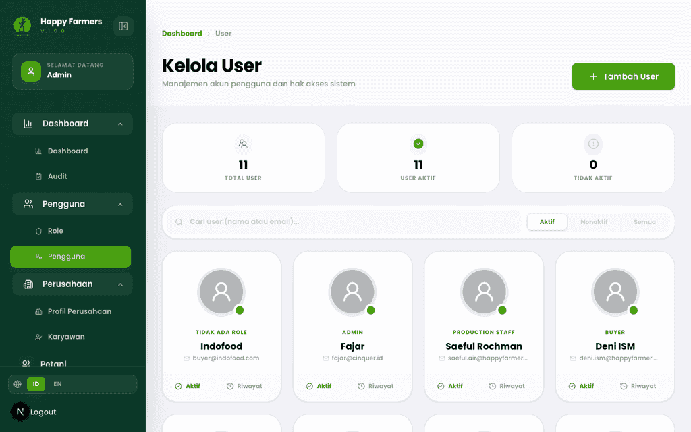
  - 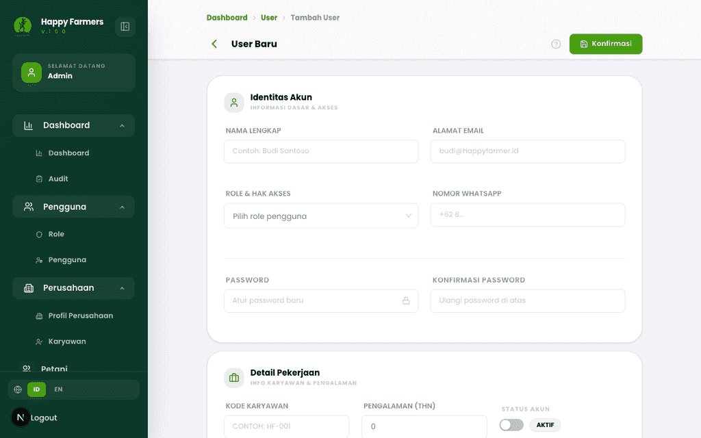
  - 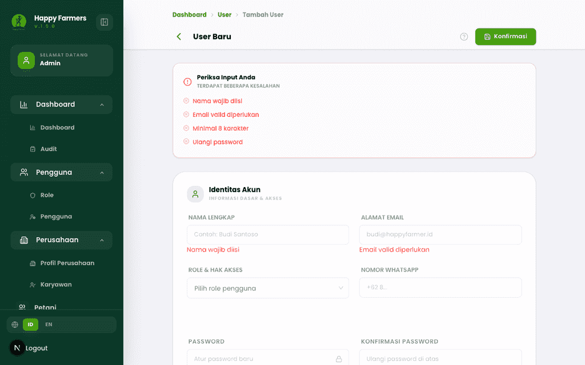

---

#### Modul: Role
- **Nama fitur**: **Manajemen Role**
- **Deskripsi**: Role mengikat **Profil Role** (nama, deskripsi, status) dengan pemetaan **hak akses per modul** (daftar modul dapat memuat banyak entri). Tombol tambah default bertuliskan **Tambah**; state kosong menampilkan **Tidak Ada Role** / **Buat Role Sekarang** bila tidak ada filter pencarian.
- **Validasi (contoh)**: Tanpa nama role, form menampilkan **Periksa Input Anda** dan **Nama role wajib diisi**.
- **Tangkapan layar**
  - 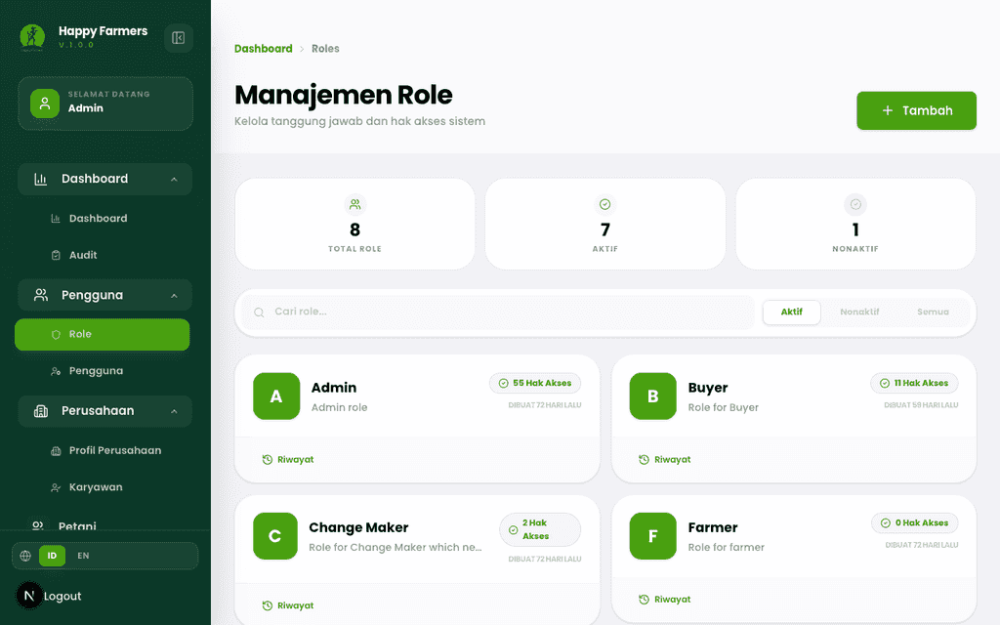
  - 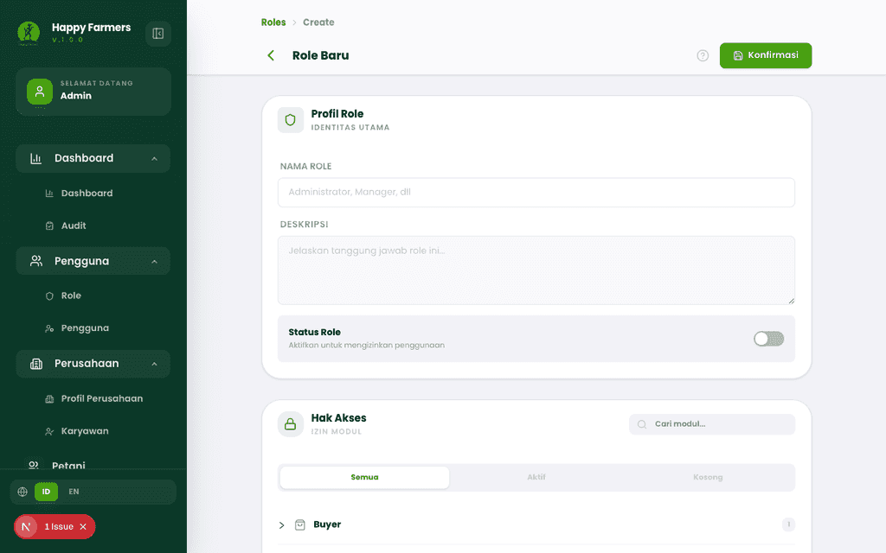
  - 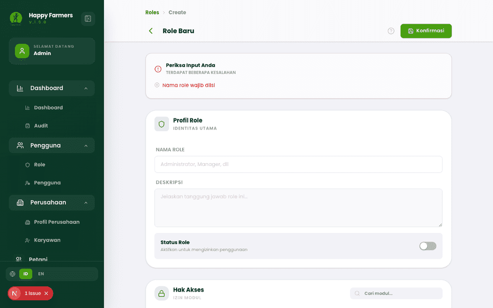

> [!TIP] Terapkan prinsip *least privilege*: hanya aktifkan izin modul yang benar-benar dibutuhkan.

---

#### Modul: Karyawan
- **Nama fitur**: **Kelola Karyawan**
- **Deskripsi**: Direktori staf dengan filter departemen dan status kepegawaian; **Tambah Karyawan** membuka form **Informasi Dasar** (nama wajib, kode opsional/auto, penautan **User** opsional, dan bagian lain sesuai layar).
- **Validasi (contoh)**: **Periksa Input Anda** dengan **Nama karyawan wajib diisi** bila nama kosong.
- **Tangkapan layar**
  - 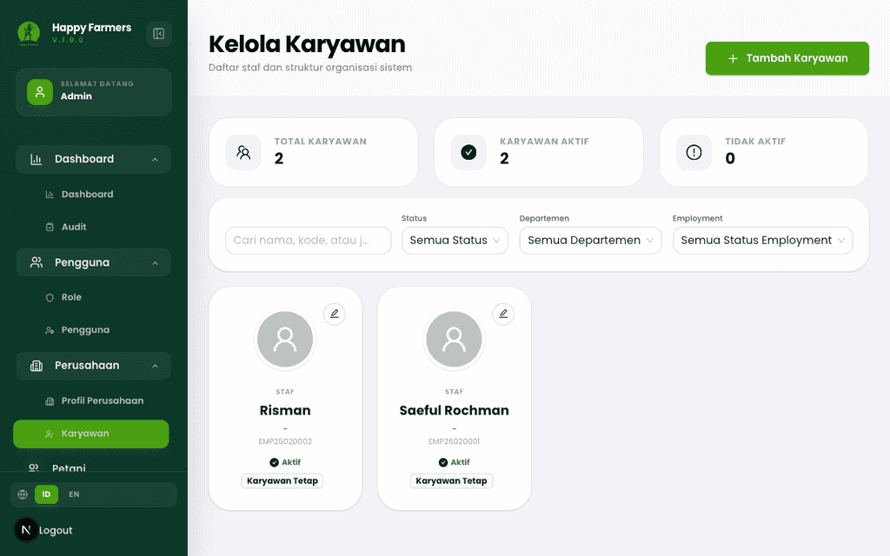
  - 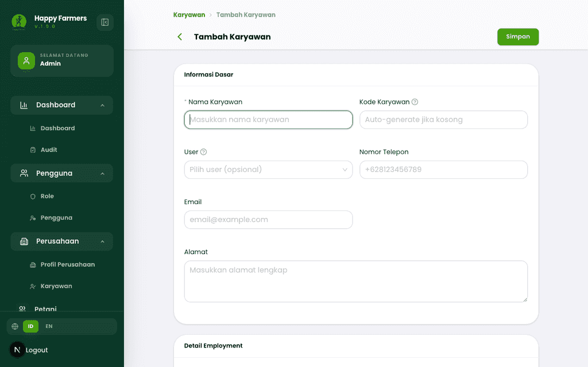
  - 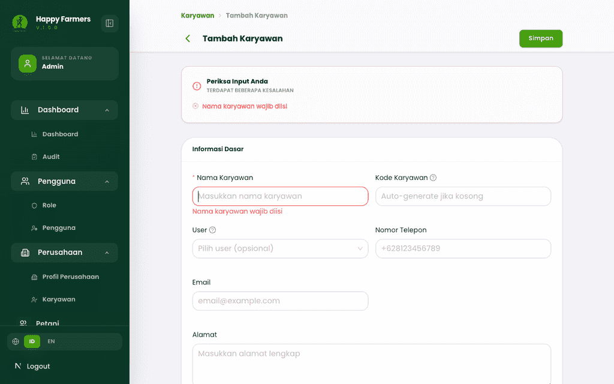

---

#### Modul: Profil perusahaan
- **Nama fitur**: **Profil Perusahaan**
- **Deskripsi**: Satu halaman profil dengan kartu **Informasi Dasar**, kontak, alamat, legal (**NPWP**, dll.), bisnis, dan tambahan. Perubahan dapat disimpan otomatis (debounce) sesuai petunjuk di layar; tersedia **Simpan Sekarang** dan indikator **Tersimpan** / **Menyimpan...** pada bilah aksi.
- **Tangkapan layar**
  - 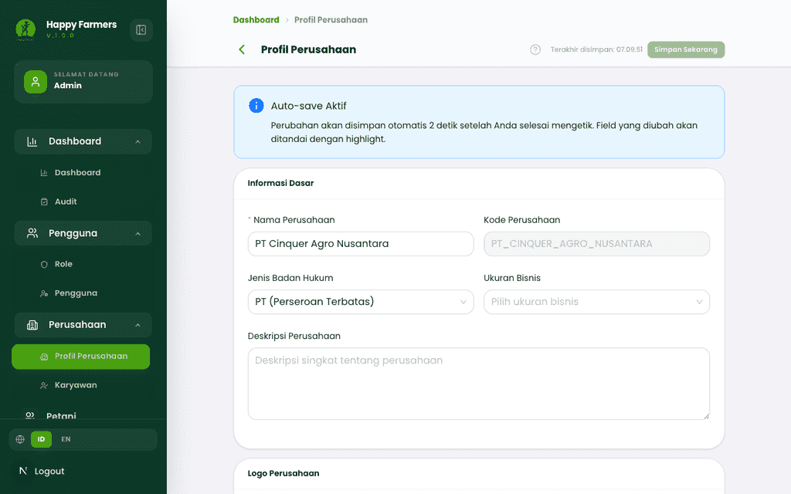

> [!NOTE] Kunjungan pertama dapat menampilkan **Profil Perusahaan Belum Dibuat** — isi form untuk menginisialisasi data.

---

#### Modul: Tema & preferensi
- **Nama fitur**: **Pengaturan Tema** (`/settings/theme`) dan **Preferensi & Desain** (`/settings/preferences`)
- **Deskripsi**: **Daftar Tema** menampilkan preset dengan aksi **Aktifkan**, **Preview Tema** / **Hentikan Preview**, serta pengelolaan tema. Halaman **Preferensi** menambahkan tab **Tema & Desain** dan **Preview UI Kit** (*ComponentGallery*) untuk meninjau komponen dengan tema aktif/pratinjau.
- **Tangkapan layar**
  - 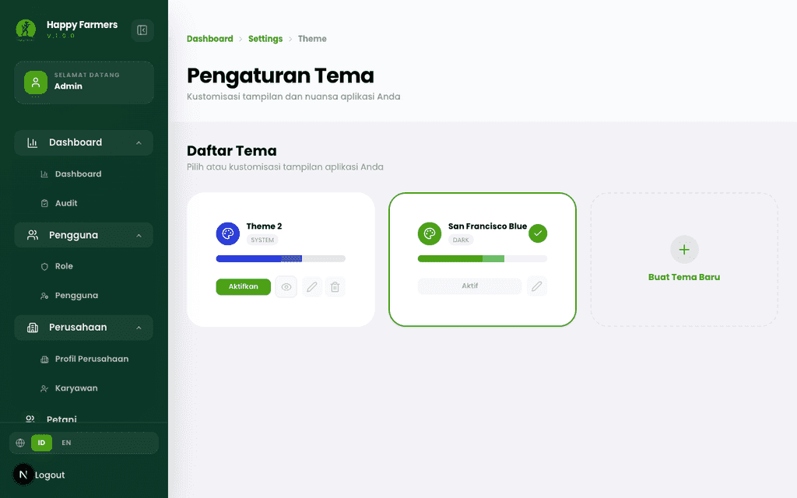
  - 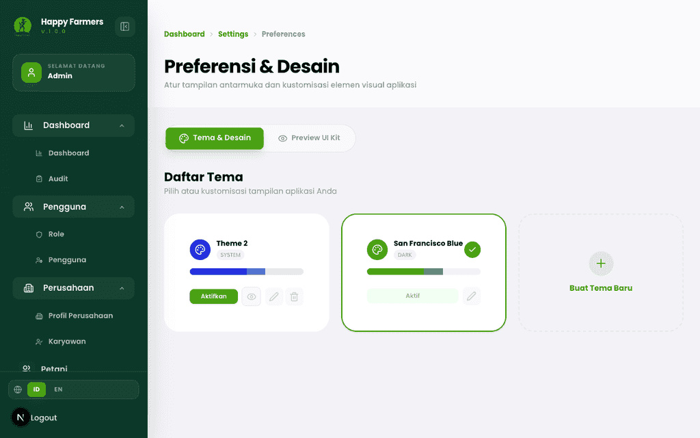

---

### 6. Alur Kerja Modul

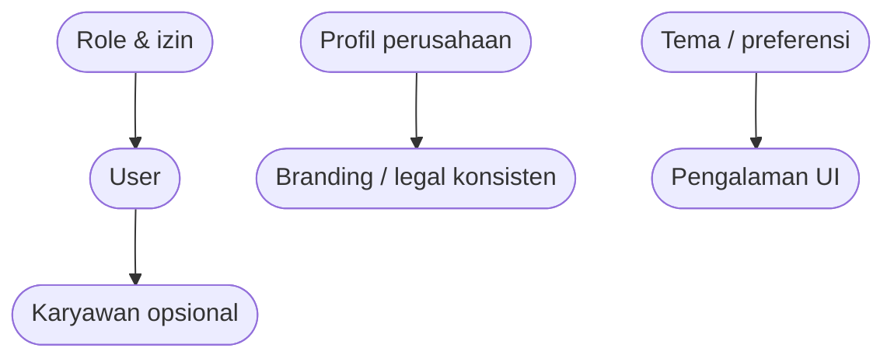

---

### 7. Matriks Peran & Akses

| Peran | Area | Aksi |
|------|------|------|
| Admin | User, role, karyawan, profil, pengaturan tampilan | Sesuai tombol aktif; modifikasi role memengaruhi seluruh pengguna dengan role tersebut. |

> [!NOTE] Izin pasti dibatasi oleh backend; jika menu tidak tampil, akun tidak memiliki modul terkait pada **Role**-nya.

---

### 8. Pemecahan Masalah & FAQ

1. **Halaman Role lambat atau tidak selesai memuat.**  
   Muat ulang; pastikan API modul hak akses merespons. Skrip tangkapan layar memakai batas navigasi lebih panjang untuk rute ini.

2. **User tidak bisa ditautkan ke karyawan.**  
   Pilih **User** yang belum terikat entitas lain sesuai tooltip pada form karyawan.

---

### 9. Glosarium

| Istilah | Definisi |
|--------|-----------|
| **Role** | Kumpulan izin modul yang diberikan ke satu atau banyak **User**. |
| **Employee** | Rekaman staf organisasi; dapat terhubung ke akun **User**. |
| **Theme preset** | Paket token warna/tampilan yang dapat diaktifkan atau diedit. |
