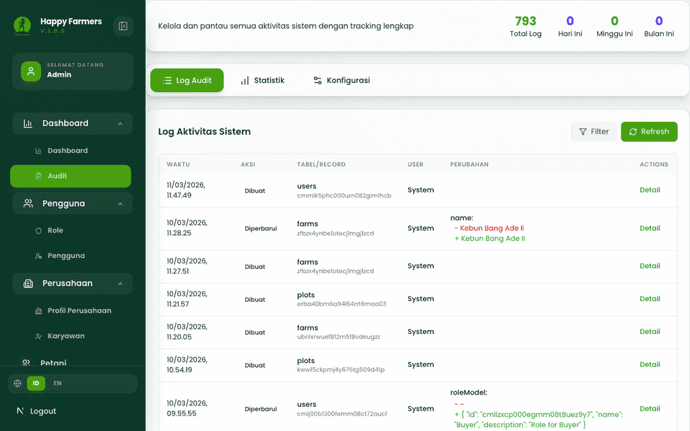
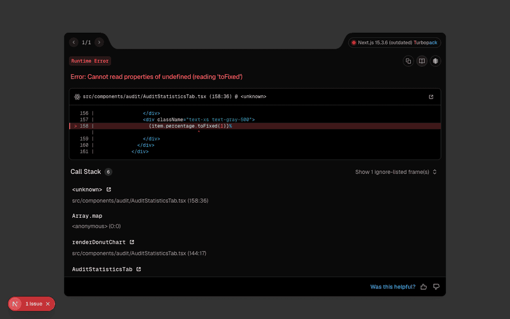
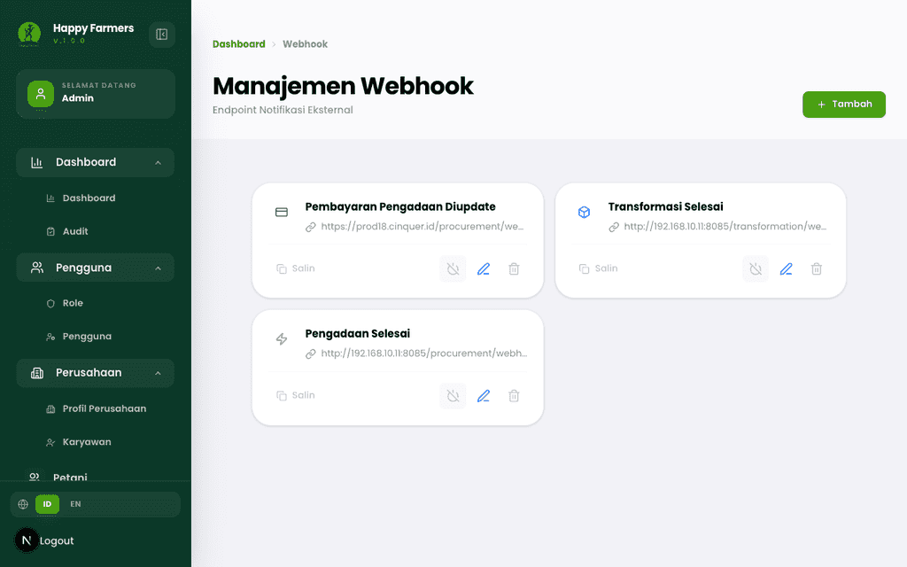
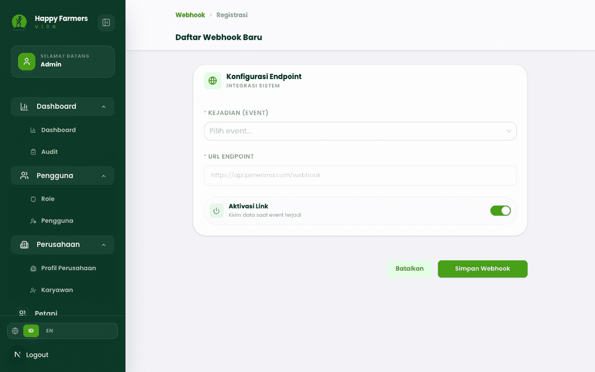
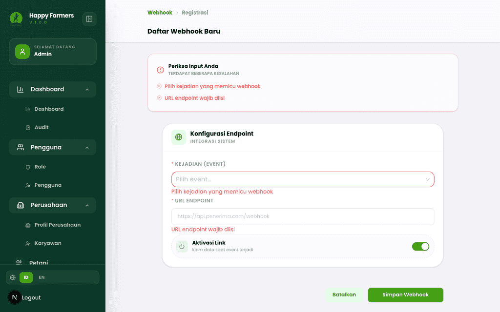
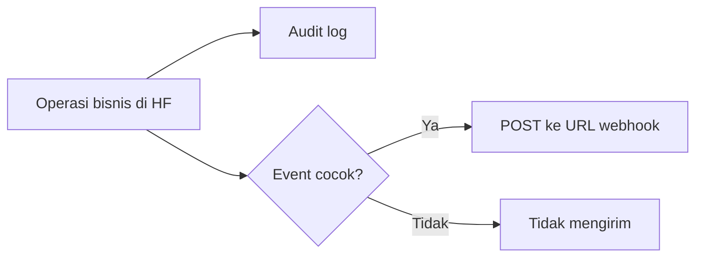

# Buku Panduan Admin Happy Farmers: Volume 12 — Audit & Integrations (Audit & Integrasi)

### 0. Daftar Isi
- [1. Kontrol Dokumen](#1-kontrol-dokumen)
- [2. Pendahuluan](#2-pendahuluan)
- [3. Memulai (Dilewati)](#3-memulai-dilewati)
- [4. Gambaran Umum (Dilewati)](#4-gambaran-umum-dilewati)
- [5. Fitur & Modul](#5-fitur--modul)
  - [Sistem audit trail](#modul-sistem-audit-trail)
  - [Manajemen webhook](#modul-manajemen-webhook)
- [6. Alur Kerja Modul](#6-alur-kerja-modul)
- [7. Matriks Peran & Akses](#7-matriks-peran--akses)
- [8. Pemecahan Masalah & FAQ](#8-pemecahan-masalah--faq)
- [9. Glosarium](#9-glosarium)

---

### 1. Kontrol Dokumen
| Versi | Tanggal | Penulis | Deskripsi |
|------|---------|---------|-----------|
| v1.0 | 2026-04-13 | System AI | Volume **Audit & integrations**: **`/audit`** (log, statistik, konfigurasi) dan **`/webhook-configs`** |

---

### 2. Pendahuluan
Volume ini menjelaskan **pelacakan aktivitas** lewat halaman **Sistem Audit Trail** serta **notifikasi HTTP keluar** melalui **Manajemen Webhook**. Keduanya mendukung kepatuhan operasional dan integrasi dengan sistem luar (ERP, gateway logistik, dll.).

Judul layout untuk audit mengikuti menu **Sistem Audit Trail**; webhook memakai **Manajemen Webhook** / **Endpoint Notifikasi Eksternal**. Hak akses pengguna tetap mengacu pada **Role** — lihat [Volume 11: Pengguna & Pengaturan](11_people_org_and_settings.md).

---

### 3. Memulai (Dilewati)
> Anda sudah masuk sebagai Admin (atau peran dengan modul audit/webhook). Lihat [Volume 1: Masuk & Dasbor](01_entry_and_dashboard.md).

---

### 4. Gambaran Umum (Dilewati)
> Rute utama: **`/audit`**, **`/webhook-configs`**, **`/webhook-configs/create`**, **`/webhook-configs/edit/[id]`**.

---

### 5. Fitur & Modul

#### Modul: Sistem audit trail
- **Nama fitur**: **Sistem Audit Trail** (`/audit`)
- **Deskripsi**: Ringkasan cepat **Total Log**, **Hari Ini**, **Minggu Ini**, **Bulan Ini** (atau **Tidak tersedia** bila statistik gagal dimuat). Tiga tab:
  1. **Log Audit** — daftar **Log Aktivitas Sistem** dengan **Filter** (tabel, aksi, role, teks, tanggal, limit), **Refresh**, dan detail per baris.
  2. **Statistik** — agregasi seperti **Trend Aktivitas**, **Detail Aktivitas Tabel** / **User**, atau pesan **Tidak ada data statistik** jika kosong.
  3. **Konfigurasi** — pengaturan perilaku pencatatan audit sesuai implementasi UI saat ini.
- **Tangkapan layar**
  - 
  - 

> [!NOTE] Beberapa pesan error API dapat tampil dalam **Bahasa Inggris** pada bilah error ringkasan statistik.

---

#### Modul: Manajemen webhook
- **Nama fitur**: **Manajemen Webhook** (`/webhook-configs`)
- **Deskripsi**: Mendaftarkan URL HTTPS yang dipanggil saat **event** bisnis terjadi (misalnya **Pengadaan Selesai**, **Transformasi Selesai**, **Pengiriman Selesai**, pembaruan pembayaran, dll.). Daftar menampilkan kartu per webhook dengan **Salin** URL, **Aktifkan** / **Nonaktifkan**, dan aksi edit/hapus. State kosong: **Belum Ada Webhook** + **Buat Webhook Baru**.
- **Form buat** (`/webhook-configs/create`): judul **Daftar Webhook Baru**, bagian **Konfigurasi Endpoint** — field **KEJADIAN (EVENT)**, **URL ENDPOINT**, **Aktivasi Link**; tombol **Simpan Webhook** / **Batalkan**.
- **Validasi (contoh)**: Mengirim form kosong memunculkan ringkasan **Periksa Input Anda** dan pesan **Pilih kejadian yang memicu webhook** / **URL endpoint wajib diisi** (dan aturan format URL bila diisi tidak valid).
- **Tangkapan layar**
  - 
  - 
  - 

> [!TIP] Jika layar menampilkan **Akses Terbatas**, akun tidak memiliki izin modul webhook — hubungi administrator dan sesuaikan **Role** ([Volume 11](11_people_org_and_settings.md)). Tangkapan validasi form hanya dihasilkan jika form benar-benar tersedia.

---

### 6. Alur Kerja Modul

---

### 7. Matriks Peran & Akses

| Peran | Area | Aksi |
|------|------|------|
| Admin (konfigurasi penuh) | Audit, webhook | Membaca log/statistik; CRUD webhook sesuai tombol aktif. |
| Terbatas | Webhook | Hanya pesan **Akses Terbatas** pada daftar/form bila API mengembalikan *forbidden*. |

---

### 8. Pemecahan Masalah & FAQ

1. **Webhook tidak pernah terpanggil.**  
   Pastikan **Aktivasi Link** aktif, URL dapat dijangkau dari internet (bila lingkungan produksi), dan event yang dipilih memang terjadi di sistem.

2. **Log audit kosong.**  
   Pastikan backend mencatat perubahan; periksa filter **Tabel** / rentang tanggal di tab **Log Audit**.

---

### 9. Glosarium

| Istilah | Definisi |
|--------|-----------|
| **Audit log** | Rekaman peristiwa (siapa, apa, kapan) terhadap data. |
| **Webhook** | HTTP callback ke URL eksternal saat event tertentu terjadi. |
| **Event** | Jenis peristiwa bisnis yang memicu pengiriman webhook. |
