# Buku Panduan Happy Farmers: Volume 13 — Program Affiliator (Komisi Referral)

### 0. Daftar Isi
- [1. Kontrol Dokumen](#1-kontrol-dokumen)
- [2. Pendahuluan](#2-pendahuluan)
- [3. Memulai](#3-memulai)
- [4. Gambaran Umum](#4-gambaran-umum)
- [5. Fitur & Modul](#5-fitur--modul)
  - [Platform Superadmin — Affiliator](#modul-platform-superadmin--affiliator)
  - [Platform Superadmin — Pembayaran komisi](#modul-platform-superadmin--pembayaran-komisi)
  - [Platform Superadmin — Referral saat onboarding tenant](#modul-platform-superadmin--referral-saat-onboarding-tenant)
  - [Portal Affiliator — Dashboard](#modul-portal-affiliator--dashboard)
  - [Portal Affiliator — Tenant referral, komisi & pembayaran](#modul-portal-affiliator--tenant-referral-komisi--pembayaran)
  - [Portal Affiliator — Profil & rekening](#modul-portal-affiliator--profil--rekening)
- [6. Alur Kerja Modul](#6-alur-kerja-modul)
- [7. Matriks Peran & Akses](#7-matriks-peran--akses)
- [8. Pemecahan Masalah & FAQ](#8-pemecahan-masalah--faq)
- [9. Glosarium](#9-glosarium)

---

### 1. Kontrol Dokumen
| Versi | Tanggal | Penulis | Deskripsi |
|------|---------|---------|-----------|
| v1.0 | 2026-09-01 | System AI | Volume **Program Affiliator**: portal mitra, manajemen superadmin, komisi berulang, dan batch pembayaran bulanan |

---

### 2. Pendahuluan
Volume ini menjelaskan **Program Affiliator** Happy Farmers: mitra eksternal yang merekrut tenant (perusahaan pelanggan) dan memperoleh **komisi persentase dari setiap tagihan langganan** yang tenant tersebut bayar — tidak hanya pembayaran pertama, tetapi juga setiap perpanjangan.

**Dua antarmuka terpisah:**

| Peran | URL utama | Fungsi |
|-------|-----------|--------|
| **Platform Superadmin** | `/admin/affiliates`, `/admin/affiliate-settlements` | Mendaftarkan affiliator, mengatur rate, membayar komisi |
| **Affiliator (mitra)** | `/affiliate` | Melihat kode referral, tenant yang direkrut, komisi, dan riwayat pembayaran |

Panduan tenant operasional (petani, stok, dll.) ada di volume lain. Volume ini hanya membahas **affiliator** dan **onboarding tenant dengan kode referral**.

**Aturan bisnis utama (MVP):**

- Komisi = **rate % × total tagihan** (termasuk pajak) pada saat invoice dibayar.
- Rate yang disepakati **disnapshot** per komisi; perubahan rate hanya berlaku untuk invoice berikutnya.
- Pembayaran komisi ke affiliator: **bulanan**, minimum **Rp 50.000**; jika di bawah minimum, saldo **digulung** ke bulan berikutnya.
- Pajak komisi menjadi tanggung jawab affiliator.
- Invoice tenant yang di-refund membatalkan (void) komisi terkait jika belum dibayarkan ke affiliator.

---

### 3. Memulai

#### Platform Superadmin
1. Masuk di `/login` dengan akun **Platform Superadmin** (`isSystemAdmin`).
2. Anda diarahkan ke **Dashboard Platform** (`/admin`).
3. Di sidebar, buka **Affiliator** atau **Pembayaran Komisi**.

#### Affiliator (mitra)
1. Masuk di `/login` dengan email dan kata sandi yang diberikan oleh platform saat affiliator didaftarkan.
2. Setelah berhasil masuk, Anda diarahkan ke **Dashboard Affiliator** (`/affiliate`).
3. Affiliator **tidak** memiliki akses ke modul tenant (`/dashboard`, `/farmers`, dll.) atau halaman admin platform.

---

### 4. Gambaran Umum

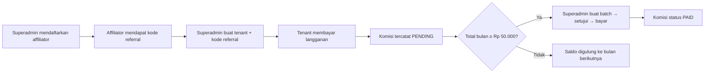

---

### 5. Fitur & Modul

#### Modul: Platform Superadmin — Affiliator
- **Nama fitur**: **Kelola Affiliator**
- **Rute**: `/admin/affiliates`, `/admin/affiliates/create`, `/admin/affiliates/[id]`
- **Deskripsi**: Daftar mitra affiliator, pencarian nama/email/kode referral, filter status (Aktif / Ditangguhkan / Diberhentikan).
- **Panduan langkah demi langkah — menambah affiliator**
  1. Buka **Affiliator** di sidebar platform.
  2. Klik **Tambah Affiliator**.
  3. Isi **Data affiliator**: nama lengkap, email (untuk login portal), telepon (opsional).
  4. Isi **Kode referral** (opsional) — kosongkan untuk generate otomatis dari nama.
  5. Atur **Rate komisi (%)** — default 5%; persentase dari setiap tagihan langganan tenant.
  6. Buat **Akun portal**: password minimal 6 karakter.
  7. (Opsional) Isi **Rekening pembayaran** — bank, NPWP, e-wallet.
  8. Klik **Simpan**.
- **Panduan — detail affiliator**
  1. Dari daftar, klik **Lihat** pada baris affiliator.
  2. Ringkasan menampilkan status, total komisi, tenant referral, dan komisi terbaru.
  3. Anda dapat mengubah rate, status, data rekening, dan **Reset Password** portal.
  4. Tombol **Pembayaran** membuka halaman batch pembayaran dengan filter affiliator tersebut.
- **UI Berbasis Peran**
  > [!NOTE] Terlihat oleh: **Platform Superadmin** saja. Tenant admin tidak melihat menu ini.
- **Tangkapan layar**
  - 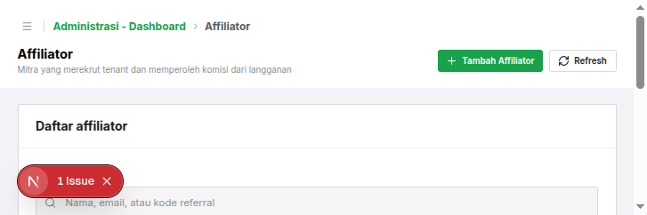
  - 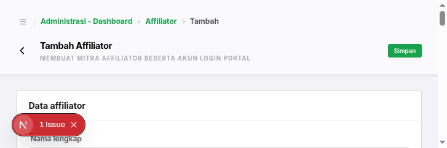
  - 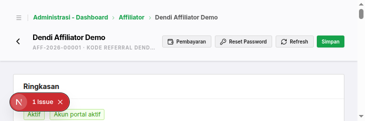

---

#### Modul: Platform Superadmin — Pembayaran komisi
- **Nama fitur**: **Batch Pembayaran Komisi**
- **Rute**: `/admin/affiliate-settlements`
- **Deskripsi**: Mengelompokkan komisi `PENDING` per affiliator per bulan kalender, lalu menyetujui dan menandai sebagai dibayar secara manual.
- **Panduan langkah demi langkah**
  1. Buka **Pembayaran Komisi** di sidebar.
  2. Klik **Buat Batch**.
  3. Pilih **Affiliator**, **Tahun periode**, dan **Bulan periode** (bulan saat komisi diperoleh).
  4. Klik **Hitung** untuk melihat pratinjau total dan apakah memenuhi minimum Rp 50.000.
  5. Jika memenuhi minimum, klik **Buat Batch** — status batch menjadi **Draft**.
  6. Buka detail batch, klik **Setujui** (status **Approved**).
  7. Klik **Tandai Dibayar**, isi metode dan referensi pembayaran.
  8. Komisi dalam batch berubah status menjadi **Paid**.
- **Status batch**
  | Status | Arti |
  |--------|------|
  | Draft | Batch dibuat, menunggu persetujuan |
  | Approved | Disetujui, siap dibayar |
  | Paid | Sudah dibayar ke affiliator |
  | Cancelled | Dibatalkan; komisi kembali ke Pending |
- **Tangkapan layar**
  - 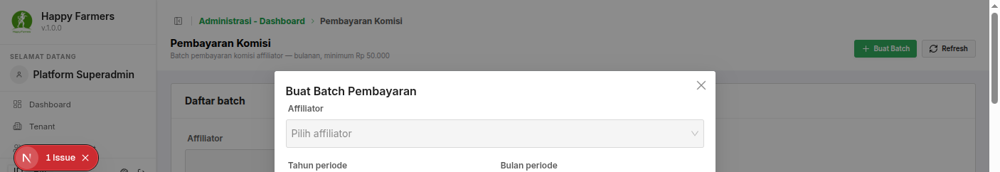
  - 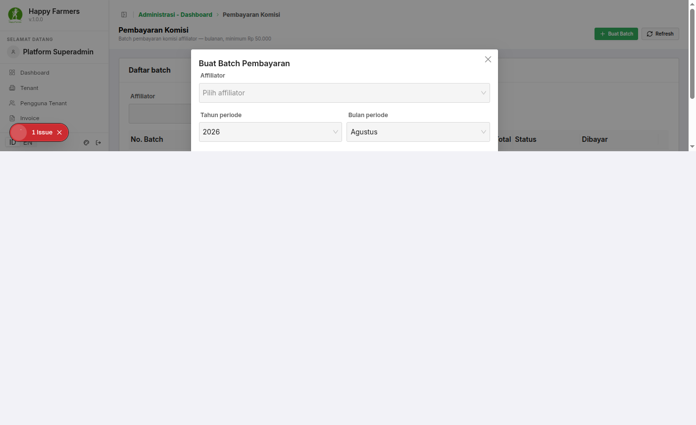

---

#### Modul: Platform Superadmin — Referral saat onboarding tenant
- **Nama fitur**: **Kode referral affiliator**
- **Rute**: `/admin/tenants/create`
- **Deskripsi**: Saat superadmin membuat tenant baru, kode referral opsional menghubungkan tenant ke affiliator. Affiliator kemudian memperoleh komisi dari setiap invoice langganan tenant tersebut.
- **Panduan langkah demi langkah**
  1. Buka **Tenant** → **Tambah Tenant**.
  2. Di bagian **Referral affiliator**, ketik **Kode referral** mitra.
  3. Sistem memvalidasi kode secara langsung — nama affiliator ditampilkan jika valid.
  4. Lengkapi data tenant dan admin pertama, lalu **Simpan**.
  5. Tenant yang dibuat tanpa kode valid tetap berhasil dibuat (tidak terhubung ke affiliator).
- **Tangkapan layar**
  - 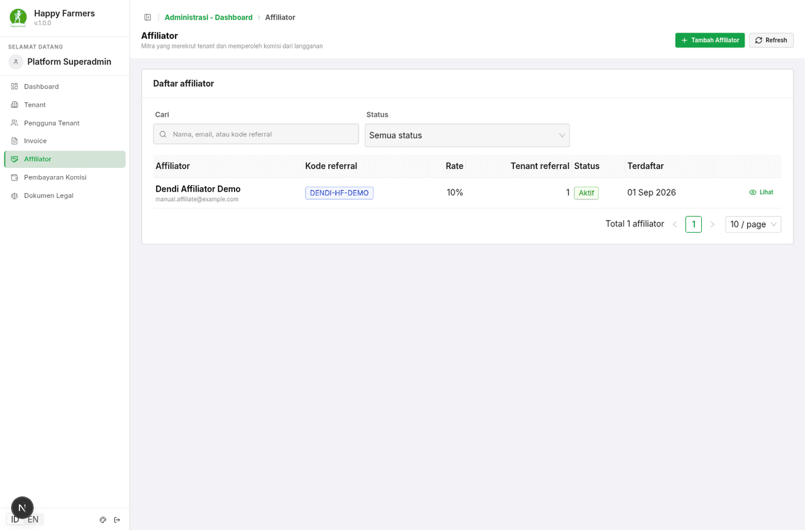

---

#### Modul: Portal Affiliator — Dashboard
- **Nama fitur**: **Dashboard Affiliator**
- **Rute**: `/affiliate`
- **Deskripsi**: Halaman utama mitra — kode referral, rate komisi, dan ringkasan finansial.
- **Panduan langkah demi langkah**
  1. Setelah login, Anda melihat **Kode referral Anda** dengan tombol **Salin**.
  2. **Ringkasan komisi** menampilkan: total lifetime, belum dibayar, sudah dibayar, komisi bulan ini, jumlah tenant referral, tenant aktif.
  3. **Navigasi cepat** ke Tenant Referral, Rincian Komisi, dan Riwayat Pembayaran.
- **UI Berbasis Peran**
  > [!NOTE] Terlihat oleh: akun dengan flag **Affiliator** (`isAffiliate`). Superadmin tidak dapat membuka portal ini.
- **Tangkapan layar**
  - 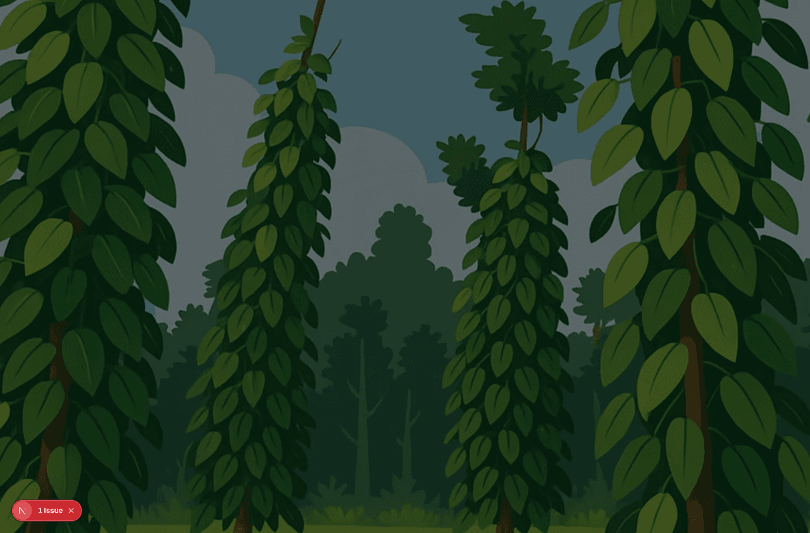

---

#### Modul: Portal Affiliator — Tenant referral, komisi & pembayaran
- **Nama fitur**: **Tenant Referral**, **Komisi**, **Pembayaran**
- **Rute**: `/affiliate/referrals`, `/affiliate/commissions`, `/affiliate/settlements`
- **Deskripsi**:
  - **Tenant Referral**: daftar perusahaan yang didaftarkan dengan kode Anda, paket, status langganan, dan total komisi per tenant.
  - **Komisi**: ledger per invoice — nomor invoice, tenant, rate snapshot, jumlah komisi, status (`Pending` / `Included` / `Paid` / `Void`).
  - **Pembayaran**: riwayat batch yang sudah dibuat platform; detail menampilkan komisi dalam batch.
- **Tangkapan layar**
  - 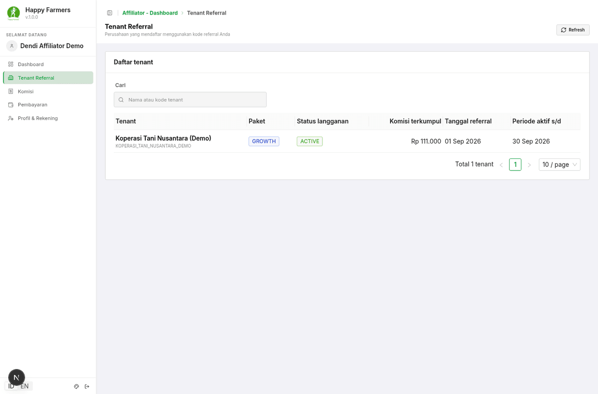
  - 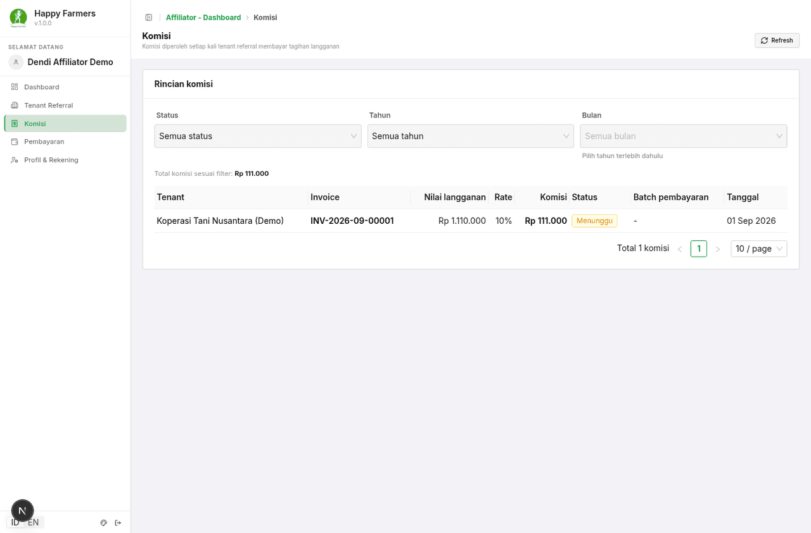
  - 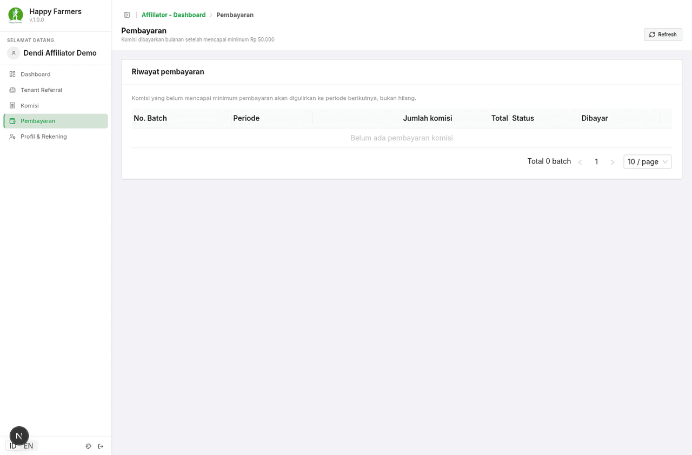

---

#### Modul: Portal Affiliator — Profil & rekening
- **Nama fitur**: **Profil & Rekening**
- **Rute**: `/affiliate/profile`
- **Deskripsi**: Affiliator dapat memperbarui rekening bank, e-wallet, alamat, dan NPWP. Nama, email, rate komisi, dan status **hanya dapat diubah oleh superadmin**.
- **Tangkapan layar**
  - 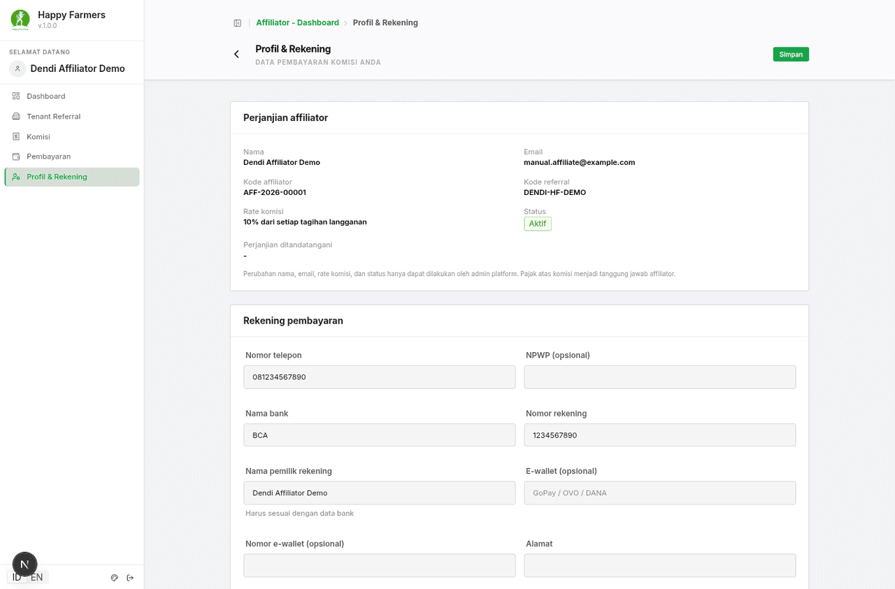

---

### 6. Alur Kerja Modul

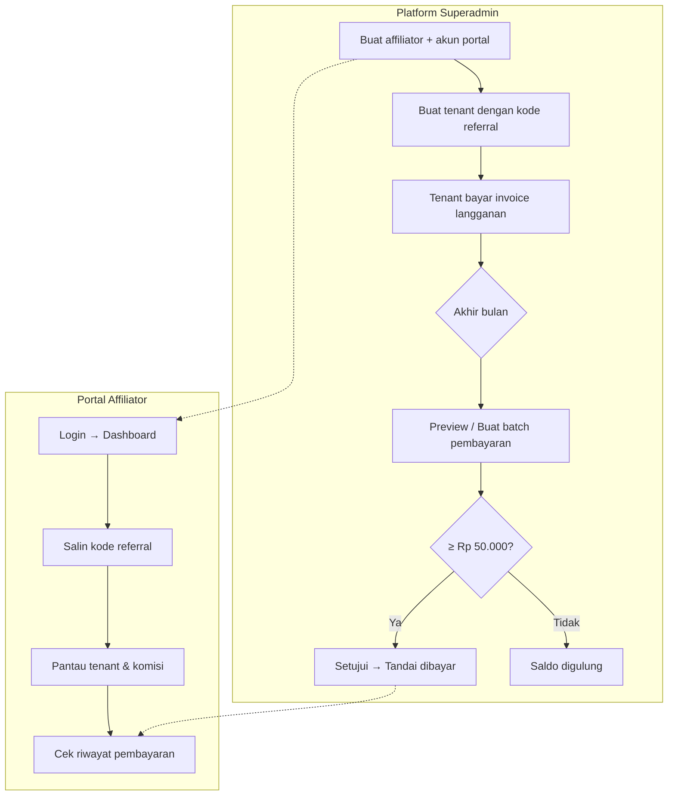

---

### 7. Matriks Peran & Akses

| Fitur | Platform Superadmin | Affiliator | Tenant Admin |
|-------|---------------------|------------|--------------|
| Daftar / buat affiliator | ✅ | ❌ | ❌ |
| Batch pembayaran komisi | ✅ | ❌ (hanya lihat milik sendiri) | ❌ |
| Kode referral pada buat tenant | ✅ | ❌ | ❌ |
| Portal `/affiliate/*` | ❌ | ✅ | ❌ |
| Ubah rate komisi sendiri | ❌ | ❌ | ❌ |
| Ubah rekening payout sendiri | ✅ (semua) | ✅ (milik sendiri) | ❌ |

---

### 8. Pemecahan Masalah & FAQ

**Q: Affiliator dapat komisi hanya sekali atau setiap tenant bayar?**
A: **Setiap kali** tenant membayar tagihan langganan (pembayaran pertama dan setiap perpanjangan).

**Q: Bagaimana jika rate komisi affiliator diubah?**
A: Komisi yang sudah tercatat mempertahankan rate lama. Rate baru hanya berlaku untuk invoice yang dibayar setelah perubahan.

**Q: Kenapa batch pembayaran ditolak?**
A: Kemungkinan total komisi bulan tersebut di bawah **Rp 50.000**. Saldo tetap `Pending` dan digulung ke bulan berikutnya.

**Q: Invoice tenant di-refund — apa yang terjadi dengan komisi?**
A: Komisi terkait menjadi **Void** dan tidak masuk perhitungan batch. Jika komisi sudah dibayarkan ke affiliator, sistem menandai void tanpa clawback otomatis.

**Q: Kode referral salah saat buat tenant — apakah tenant gagal dibuat?**
A: **Tidak.** Tenant tetap dibuat tanpa atribusi affiliator.

**Q: Affiliator ditangguhkan — apa efeknya?**
A: Tidak ada komisi baru; login portal diblokir. Komisi `Pending` yang sudah ada tetap dapat dibayarkan oleh superadmin.

**Q: Affiliator tidak bisa login — pesan login gagal?**
A: Periksa status affiliator (harus **Aktif**) dan pastikan menggunakan email portal affiliator, bukan akun tenant.

---

### 9. Glosarium

| Istilah | Definisi |
|---------|----------|
| **Affiliator** | Mitra yang merekrut tenant dan memperoleh komisi |
| **Kode referral** | Kode unik (mis. `DENDI-HF`) untuk menghubungkan tenant ke affiliator |
| **Rate komisi** | Persentase dari total tagihan langganan tenant |
| **Komisi Pending** | Sudah diperoleh dari invoice dibayar, belum masuk batch |
| **Komisi Included** | Sudah masuk batch draft/approved |
| **Komisi Paid** | Sudah dibayarkan ke affiliator |
| **Komisi Void** | Dibatalkan (mis. invoice di-refund) |
| **Batch pembayaran** | Pengelompokan komisi per affiliator per bulan kalender |
| **Minimum payout** | Rp 50.000 — ambang batas sebelum batch dapat dibuat |
