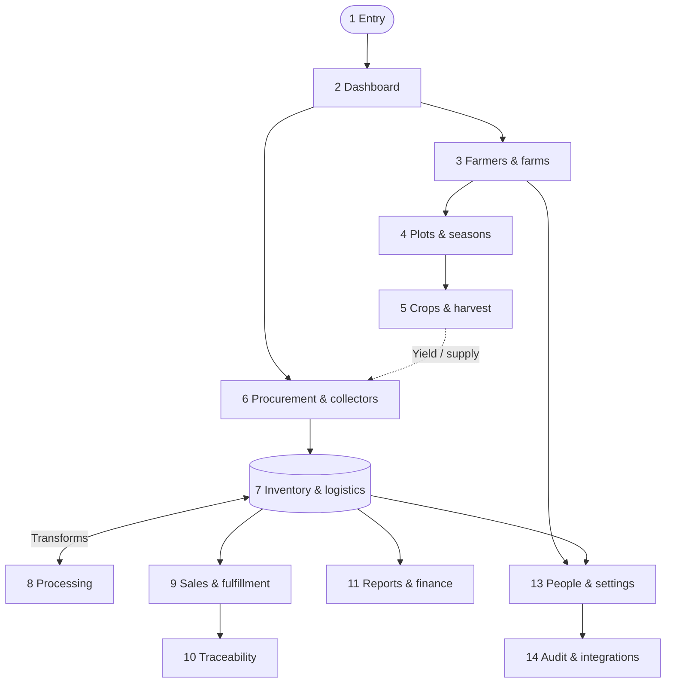

# Happy Farmers: Documentation Outline

### Document control (this outline)

| Property | Value |
|----------|--------|
| Outline version | **v2.0** |
| Last aligned to codebase | **2026-04-13** — route inventory checked against `fe-hf-nextjs/src/app/(modules)/**/page.tsx` |
| Purpose | Single reference for **what** to document, **in what order**, and **which app routes** each manual chapter owns. |
| Audience | Technical writers / implementers generating manuals under `happy-farmer-manual/pages/`. |

**v2.0 changes:** Added manual-to-chapter mapping, explicit coverage of all top-level `(modules)` route segments, maintenance rules, and a full **Route segment inventory** appendix so the outline stays usable as the app grows.

---

### 1. Application Summary

**Happy Farmers** is a comprehensive agricultural resource, supply chain, and farm management system. It is designed to track the entire agricultural lifecycle: from registering farmers and managing their farm plots, planning crop seasons, recording harvests, to processing procurements, managing complex multi-warehouse inventory, tracking product transformations, and facilitating delivery orders.

**Target user role**

- **Admin:** Full system access (CRUD across modules). Manuals use the **Admin** UX perspective unless a future outline adds other roles.

---

### 2. Module inventory (chapters ↔ routes ↔ manuals)

Use this table as the **authoritative map** when creating or updating user manuals.  
**Primary routes** are the URLs admins typically open; nested paths (e.g. `/farmers/[id]/farms/create`) belong to the same **#** unless the outline says otherwise.

| # | Module name / area | Primary routes (Next.js) | Planned manual (VitePress) | Status |
|---|--------------------|---------------------------|-----------------------------|--------|
| 1 | Entry & Onboarding | `/login`, `/register` | `pages/modules/01_entry_and_dashboard.md` (login); register when implemented | Partial |
| 2 | Dashboard | `/dashboard` | Same volume as **1** (header + metrics) | Partial |
| 3 | Farmer & farm profiles | `/farmers`, `/farms` (incl. nested `farmers/.../farms`, `farmers/.../plots` where applicable) | `pages/modules/02_farmer_management.md` | Draft |
| 4 | Plot planning & seasons | `/plots`, `/plot-seasons`, `/plot-plantings`, `/seasons`, `/locations` | `pages/modules/03_plot_planning_and_harvest.md` | Draft |
| 5 | Crops, varieties, inputs & harvest | `/crops`, `/crop-varieties`, `/farm-inputs`, `/harvests` | Same file as **4** today, or split to a dedicated `05_…` when scope grows | Partial |
| 6 | Procurement & sourcing | `/procurements`, `/collectors` | `pages/modules/04_procurement_and_sourcing.md` | Draft |
| 7 | Inventory & logistics | `/stocks`, `/stock-movements`, `/internal-transfer`, `/warehouses`, `/stock-locations`, `/stock-groups`, `/accounts` | `pages/modules/05_inventory_and_logistics.md` | Draft |
| 8 | Processing (factory) | `/product-transformation/...` (templates, transforms) | `pages/modules/06_processing_factory.md` | Draft |
| 9 | Sales & fulfillment | `/buyers`, `/delivery-orders` | `pages/modules/07_sales_and_fulfillment.md` | Draft |
| 10 | Traceability | `/traceability` | `pages/modules/08_traceability.md` | Draft |
| 11 | Finance & reports | `/financial-records`, `/reports/inventory-valuation`, `/reports/cogs` | `pages/modules/09_finance_and_reports.md` | Draft |
| 12 | Product master data | `/products`, `/categories`, `/product-variants`, `/product-modifiers` | `pages/modules/10_product_master_data.md` | Draft |
| 13 | People, org & settings | `/users`, `/roles`, `/employees`, `/company-profile`, `/settings/theme`, `/settings/preferences` | `pages/modules/11_people_org_and_settings.md` | Draft |
| 14 | Audit & integrations | `/audit`, `/webhook-configs` | `pages/modules/12_audit_and_integrations.md` | Draft |

**Notes**

- **Row 4 vs 5:** Production data spans multiple route roots; one manual file is fine until length forces a **Crop & harvest**–only volume.
- **Deep links:** Screens such as `/stocks/view/[id]/procurement/view/[procurementId]` are documented in **chapter 6 (Procurement)** for the procurement journey and **chapter 7 (Inventory)** for stock context—use cross-links; do not duplicate full workflows in both places.

---

### 3. Feature breakdown per module

#### 1. Entry & Onboarding

- Feature 1: User login (`/login`).
- Feature 2: User registration (`/register`) — **skip detailed UX until product implements it**; outline still lists the route for inventory completeness.
- Target role: Admin.
- Constraints: Valid authentication.

#### 2. Dashboard

- Feature 1: High-level statistics.
- Feature 2: Primary navigation (sidebar/header).
- Forms: Read-only.

#### 3. Farmer & farm profiles

- Farmer directory (list, filter, sort).
- Farmer detail, create, edit; nested farms/plots from farmer context where exposed in UI.
- Farm list and farm detail outside farmer context (`/farms`).
- Forms: Farmer CRUD, farm CRUD.

#### 4. Plot planning & seasons

- Plots on farms; plot seasons; plot plantings.
- Supporting reference data: **Seasons**, **Locations** as needed for UI flows.
- Forms: Plot registration, season association, planting logs.

#### 5. Crops, varieties, inputs & harvest

- Crop master and crop varieties.
- Farm inputs (e.g. fertilizers/pesticides).
- Harvest logging (linkage to plot/farmer as enforced by UI).

#### 6. Procurement & sourcing

- Collectors directory and verification-oriented UI.
- Procurement list, dashboard tab, create/edit/detail, receipt/stock deep links as present in UI.
- Key actions: payments and goods receipt **as shown to the user** (wording from UI, not API names).

#### 7. Inventory & logistics

- Stock list and stock detail (incl. embedded views for procurement/transformation/farmer where applicable).
- Stock movements; internal transfers.
- Warehouses, stock locations, stock groups; chart-of-accounts style **Accounts** if used for money movement in UI.

#### 8. Processing (factory)

- Transformation templates and transform runs under `product-transformation`.

#### 9. Sales & fulfillment

- Buyers; delivery orders (create, edit, view).

#### 10. Traceability

- Standalone traceability experience (`/traceability`).

#### 11. Finance & reports

- Manual: `pages/modules/09_finance_and_reports.md`.
- Financial records CRUD.
- Reports: inventory valuation, COGS (paths under `/reports/...`).

#### 12. Product master data

- Manual: `pages/modules/10_product_master_data.md`.
- Products, categories, product variants, product modifiers.

#### 13. People, org & settings

- Manual: `pages/modules/11_people_org_and_settings.md`.
- Users, roles, employees, company profile, theme and preferences.

#### 14. Audit & integrations

- Manual: `pages/modules/12_audit_and_integrations.md`.
- Audit log / timeline UI (`/audit`).
- Webhook configuration (`/webhook-configs`).

---

### 4. Shared UI components

| Component | Used in (examples) | Description |
|-----------|-------------------|-------------|
| `AppListPageShell` / list toolbars | Collectors, procurements, many index pages | Standard list shell, filters, primary action |
| `AppFormPageShell` / `AppGenericForm` | Create/edit flows | Form layout, validation summary, save |
| Tables / grouped tables | Procurements, stocks | Pagination, grouping, row navigation to detail |
| Status chips / tags | Procurements, delivery orders | Workflow state visualization |

*(Adjust names when auditing components; this row is indicative, not an exhaustive design-system audit.)*

---

### 5. Cross-module dependency map



---

### 6. Suggested documentation order

**Strategy:** Farm-to-table narrative, then reporting, master data, and platform tools.

1. **Entry & dashboard** — Access and orientation.
2. **Farmers & farms** — Foundational parties and land.
3. **Plots, seasons, locations** — Field structure.
4. **Crops, varieties, inputs, harvest** — Production records.
5. **Procurement & collectors** — Upstream buying.
6. **Inventory & logistics** — What the organization holds and moves.
7. **Processing** — Factory transforms.
8. **Sales & fulfillment** — Downstream shipping.
9. **Traceability** — Chain visibility (standalone module).
10. **Finance & reports** — Money and analytical reports.
11. **Product master data** — SKU/catalog maintenance (often after core ops are documented).
12. **People, org & settings** — RBAC and branding/preferences.
13. **Audit & integrations** — Compliance-style views and webhooks.

---

### 7. Rules for writers (keep manuals consistent with this outline)

1. **Source of truth for “is there a page?”** — Top-level segments under `fe-hf-nextjs/src/app/(modules)` (see appendix). If a new segment appears, add a row to appendix and assign an **owner #** from section 2.
2. **One narrative chapter per #** — Prefer one manual file per chapter until size forces a split; then update section 2 with the new filename.
3. **Nested routes** — Document under the chapter that matches the **user’s primary task**; use internal links for the other chapter.
4. **Frontend-only** — Manual text describes UI and user-visible outcomes; avoid API/database internals unless needed for a visible error message.
5. **Outline updates** — Bump **Outline version** in document control when you add/remove a chapter, reassign routes, or change suggested order.

---

### 8. Open items & pre-documentation questions

- Registration UX remains **deferred** until implemented.
- **Row 4 vs 5 split:** Decide explicitly when `03_plot_planning_and_harvest.md` becomes too long; then add `05_crop_harvest.md` (or similar) and update section 2.
- *Role-based questions:* Admin-only for now.

---

### Appendix A — Route segment inventory (`(modules)`)

Each **segment** is the first path part under the authenticated module tree (URL `/<segment>/...`). **Owner** refers to the **#** column in section 2.

| Segment | Typical base URL | Owner # |
|---------|------------------|--------|
| `accounts` | `/accounts` | 7 |
| `audit` | `/audit` | 14 |
| `buyers` | `/buyers` | 9 |
| `categories` | `/categories` | 12 |
| `collectors` | `/collectors` | 6 |
| `company-profile` | `/company-profile` | 13 |
| `crop-varieties` | `/crop-varieties` | 5 |
| `crops` | `/crops` | 5 |
| `dashboard` | `/dashboard` | 2 |
| `delivery-orders` | `/delivery-orders` | 9 |
| `employees` | `/employees` | 13 |
| `farm-inputs` | `/farm-inputs` | 5 |
| `farmers` | `/farmers` | 3 |
| `farms` | `/farms` | 3 |
| `financial-records` | `/financial-records` | 11 |
| `harvests` | `/harvests` | 5 |
| `internal-transfer` | `/internal-transfer` | 7 |
| `locations` | `/locations` | 4 |
| `plot-plantings` | `/plot-plantings` | 4 |
| `plot-seasons` | `/plot-seasons` | 4 |
| `plots` | `/plots` | 4 |
| `procurements` | `/procurements` | 6 |
| `product-modifiers` | `/product-modifiers` | 12 |
| `product-transformation` | `/product-transformation` | 8 |
| `product-variants` | `/product-variants` | 12 |
| `products` | `/products` | 12 |
| `reports` | `/reports/...` | 11 |
| `roles` | `/roles` | 13 |
| `seasons` | `/seasons` | 4 |
| `settings` | `/settings/...` | 13 |
| `stock-groups` | `/stock-groups` | 7 |
| `stock-locations` | `/stock-locations` | 7 |
| `stock-movements` | `/stock-movements` | 7 |
| `stocks` | `/stocks` | 7 |
| `users` | `/users` | 13 |
| `warehouses` | `/warehouses` | 7 |
| `webhook-configs` | `/webhook-configs` | 14 |

**Routes outside `(modules)`** (still in scope for manuals):

| Path | Owner # |
|------|--------|
| `/login`, `/register` | 1 |
| `/traceability` | 10 |
| `/` (marketing or redirect — document only if user-facing) | 1 or 2 |

---

### Appendix B — Regenerating the segment list (optional)

From the repository root, you can list current top-level segments with:

```bash
find fe-hf-nextjs/src/app/\(modules\) -name 'page.tsx' | \
  sed 's|fe-hf-nextjs/src/app/(modules)/||' | cut -d/ -f1 | sort -u
```

Reconcile the output with **Appendix A** whenever you add or remove a module.
