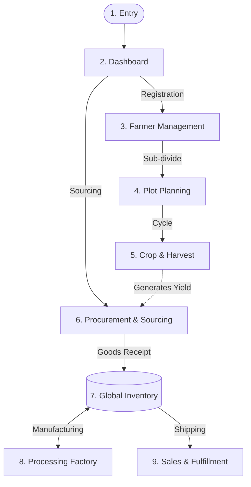

# Happy Farmers: Documentation Outline

### 1. Application Summary

**Happy Farmers** is a comprehensive agricultural resource, supply chain, and farm management system. It is designed to track the entire agricultural lifecycle: from registering farmers and managing their farm plots, planning crop seasons, recording harvests, to processing procurements, managing complex multi-warehouse inventory, tracking product transformations, and facilitating delivery orders.

**Target User Role:**
- **Admin**: Has full system access (CRUD operations across all modules). This documentation is written exclusively from the perspective of the Admin role.

---

### 2. Module Inventory

| #   | Module Name / Area     | Route / Page                                                            | Target Role(s) | Complexity | Priority | Key Components/Files                     |
| --- | ---------------------- | ----------------------------------------------------------------------- | -------------- | ---------- | -------- | ---------------------------------------- |
| 1   | Entry & Onboarding     | `/login`, `/register`                                                   | Admin          | Low        | High     | `src/app/login`, `src/app/register`      |
| 2   | Dashboard              | `/dashboard`                                                            | Admin          | Medium     | High     | `src/app/(modules)/dashboard`            |
| 3   | Farmer Management      | `/(modules)/farmers`, `/(modules)/farms`                                | Admin          | High       | High     | `src/app/(modules)/farmers`, `farms`     |
| 4   | Plot Planning          | `/(modules)/plots`, `plot-seasons`, `plot-plantings`                    | Admin          | High       | High     | `(modules)/plots`, `plot-seasons`        |
| 5   | Crop & Harvest         | `/(modules)/crops`, `harvests`, `farm-inputs`                           | Admin          | Medium     | High     | `(modules)/harvests`, `crops`            |
| 6   | Procurement & Sourcing | `/(modules)/procurements`, `collectors`                                 | Admin          | High       | High     | `(modules)/procurements`, `collectors`   |
| 7   | Global Inventory       | `/(modules)/stocks`, `stock-movements`, `internal-transfer`             | Admin          | High       | High     | `(modules)/stocks`, `stock-movements`    |
| 8   | Processing (Factory)   | `/(modules)/product-transformation`                                     | Admin          | High       | Medium   | `(modules)/product-transformation`       |
| 9   | Sales & Fulfillment    | `/(modules)/buyers`, `delivery-orders`                                  | Admin          | Medium     | Medium   | `(modules)/delivery-orders`, `buyers`    |
| 10  | Traceability           | `/traceability`                                                         | Admin          | Low        | Medium   | `src/app/traceability`                   |
| 11  | Finance & Reports      | `/(modules)/financial-records`, `reports`                               | Admin          | Medium     | Medium   | `(modules)/financial-records`, `reports` |
| 12  | Product Master Data    | `/(modules)/products`, `categories`, `variants`, `modifiers`            | Admin          | Medium     | Low      | `(modules)/products` (and related)       |
| 13  | System & CRM           | `/(modules)/users`, `roles`, `employees`, `company-profile`, `settings` | Admin          | Medium     | Low      | `(modules)/users`, `roles`, `settings`   |

_(Note: Minor master data routes are grouped into broader conceptual areas for documentation efficiency)._

---

### 3. Feature Breakdown per Module

#### 1. Entry & Onboarding

- Feature 1: User Login
- Feature 2: User Registration (not implemented yet for now)
- Target Role: Admin
- Key actions: Login
- Constraints: Authentication must be valid.

#### 2. Dashboard

- Feature 1: High-level system statistics
- Feature 2: Navigation sidebar and header
- Forms: None (Read-only view)

#### 3. Farmer Management

- Feature 1: Farmer Directory (List, Filter, Sort)
- Feature 2: Farmer Detail View & Registration
- Feature 3: Farm Profile Management
- Forms: Create/Edit Farmer Form, Create/Edit Farm boundaries/details
- Key actions: Create, View Details, Update, Delete

#### 4. Plot Planning

- Feature 1: Define individual plots inside a farm.
- Feature 2: Assign plot seasons.
- Feature 3: Record plot plantings (Crop tracking).
- Forms: Plot Registration, Associate Season, Log Planting.

#### 5. Crop & Harvest

- Feature 1: Master list of crops and varieties.
- Feature 2: Farm Input tracking (fertilizers, pesticides).
- Feature 3: Harvest Entry Logging.
- Forms: Log Harvest Form (Product, Yield, Quality/Grade, Origin).
- Constraints: Harvest must be linked to a valid Plot and Farmer.

#### 6. Procurement & Sourcing

- Feature 1: Managing collectors (aggregators).
- Feature 2: Creating and processing Procurement Transactions.
- Forms: Procurement Entry (Supplier, Items, Prices, Weights).
- Key actions: Process Payment, Receive Goods into Warehouse.

#### 7. Global Inventory

- Feature 1: Central Stock View (across Warehouses & Locations).
- Feature 2: Stock Movements logging (In/Out records).
- Feature 3: Internal Transfers (moving stock between warehouses).
- Forms: Dispatch Transfer Form, Receive Transfer Form.

#### 8. Processing (Factory)

- Feature 1: Product Transformations (Converting raw materials to finished goods).
- Forms: Work Order / Transformation rule execution.

#### 9. Sales & Fulfillment

- Feature 1: Delivery Orders (shipping goods out to buyers).
- Feature 2: Buyer Directory.
- Forms: Generate Delivery Order Form.

---

### 4. Shared UI Components

| Component               | Used In Modules               | Description                                                        |
| ----------------------- | ----------------------------- | ------------------------------------------------------------------ |
| `PageHeader` (assumed)  | All internal modules          | Standard header with title and breadcrumbs                         |
| `DataTable` (assumed)   | Farmer, Procurements, Stocks  | Standard table layout with pagination, search, filter              |
| `StatusBadge` (assumed) | Procurements, Delivery Orders | Color-coded chips for workflow states (Draft, Approved, Completed) |

---

### 5. Cross-Module Dependency Map

---

### 6. Suggested Documentation Order

**Ordering strategy:** **Business Journey (Farm-to-Table)**  
I recommend documenting the system in the natural flow of the agricultural supply chain, starting from setup and moving through production, sourcing, inventory, and sales.

1. **Entry & Dashboard** — Entry point for all roles.
2. **Farmer Management** — The foundational entity.
3. **Plot Planning & Crop/Harvest** — The agricultural production phase.
4. **Procurement & Sourcing** — Moving produce from farm to the business.
5. **Global Inventory & Processing** — Managing what the business owns.
6. **Sales & Fulfillment** — Moving goods out.
7. **Traceability & Reports** — Analytics on the completed cycle.
8. **System Configurations** — Master data setup.

---

### 7. Open Items & Pre-Documentation Questions

*All role-based questions resolved. Focusing purely on Admin UX.*
